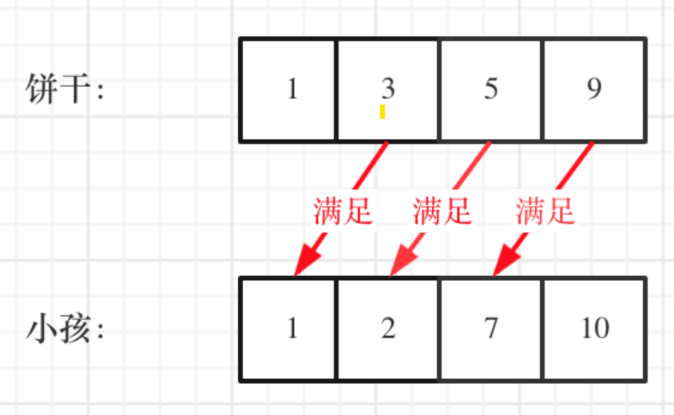
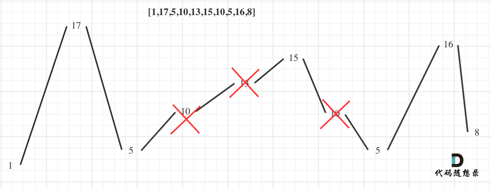

# 贪心算法（greedy algorithm）
## 思路：自顶向下，从局部最优到全局最优。需要证明的是从局部最优能到全局最优。用来逼近NP问题。
## 练习  
- [分发饼干leetcode455](https://leetcode-cn.com/problems/assign-cookies/)  
 
      1. 大饼干分配给胃口大的小孩。
      2. 小饼干先分配给胃口小的孩子。

      
    ```
    class Solution {
        public int findContentChildren(int[] g, int[] s) {
        Arrays.sort(g);
        Arrays.sort(s);
        int count = 0;
        int start = s.length - 1;
        for (int index = g.length - 1; index >= 0; index--) {
            if (start >= 0 && g[index] <= s[start]) {
                start--;
                count++;
            }
        }
        return count;
        }
    }
    ```
- [摆动序列leetcode376](https://leetcode-cn.com/problems/wiggle-subsequence/)
    
      1. 只找到波峰和波谷的值
      2. 前后的差值，一个为正一个为负  
      3. 左边端点处，需要

      

    ```
    class Solution {
        public int wiggleMaxLength(int[] nums) {
            if (nums.length <= 1) {
                return nums.length;
            }
            int prediff = 0;    // 前一对差值
            int currdiff = 0;   // 当前差值
            int res = 1;        // 默认序列右边有一个峰值
            for (int i = 0; i < nums.length - 1; i++) {
                currdiff = nums[i+1] - nums[i];
                if ((currdiff > 0 && prediff <= 0) || (currdiff < 0 && prediff >= 0)) {
                    res++;
                    prediff = currdiff;
                }
            }
            return res;
        }
    }
    ```

- [最大子数组和leetcode53](https://leetcode-cn.com/problems/maximum-subarray/)
  
      1. 当-2，1为头时肯定时以1开始子数组
      2. 局部最优，当前子数组和为负数，则从下一个开始
    ```
    class Solution {
        /*
        // 暴力方法
        public int maxSubArray(int[] nums) {
            int count = 0;
            int res = Integer.MIN_VALUE;
            for (int i = 0; i < nums.length; i++) {
                count = 0;
                for (int j = i; j < nums.length; j++) {
                    count += nums[j];
                    if (count > res) {
                        res = count;
                    }
                }
            }
            return res;
        }
        */
        // 贪心解法
        public int maxSubArray (int[] nums) {
            if (nums.length == 1) {
                return nums[0];
            }
            int res = Integer.MIN_VALUE;
            int count = 0;
            for (int i = 0; i < nums.length; i++) {
                count += nums[i];
                res = Math.max(res,count);
                if (count <= 0) {
                    count = 0;
                    // continue; 不能时continue，因为是和，所以把count置为0即可
                }
            }
            return res;
        }
    }
    ```
- [买股票的最佳时机leetcode122](https://leetcode-cn.com/problems/best-time-to-buy-and-sell-stock-ii/)

      1. 低的时候买，高的时候卖
      2. 只有一直股票，只有卖了才能买
      3. 加入第一天买，第三天卖，则收益 = price[3] - price[1] = (price[3] - price[2]) + (price[2] - price[1])
      4. 因此我们只需要关心每天的正利润即可  
   
      
    ```
    class Solution {
        public int maxProfit(int[] prices) {
            if (prices.length == 1) {
                return 0;
            }
            int sum = 0;
            for (int i = 0; i < prices.length - 1; i++) {
                int count = prices[i+1] - prices[i];
                if (count >= 0) {
                    sum += count;
                }
            }
            return sum;
        }
    }
    ```
- [跳跃游戏1 leetcode55](https://leetcode-cn.com/problems/jump-game/)
 
      1. 不用关心每一次跳几步，应该关注覆盖的范围
      2. 考察覆盖范围是否能到最后一步
      3. 局部：每次取最大覆盖范围；整体：得到最大覆盖范围，是否能到最后
   
   
    ```
    class Solution {
        public boolean canJump(int[] nums) {
            if (nums.length == 1) {
                return true;
            }
            int cover = 0;
            for (int i = 0; i <= cover; i++) {  // 在cover范围之中进行遍历
                int curr = i + nums[i];
                cover = Math.max(curr,cover);
                if (cover >= nums.length - 1) { // 只要length-1就行了
                    return true;
                }
            }  
            return false;
        }
    }
    ```
- [跳跃游戏2 leetcode45](https://leetcode-cn.com/problems/jump-game-ii/)  

      1. 总可以到达最后一个位置
      2. 目标是用最少的步数
      3. 局部，每一步尽可能多走，如果没到就加1；整体：最小步数
      4. 每次在上次能跳到的范围内选择一个最远的位置作为下一次的起跳点。

    ```
    class Solution {
        public int jump(int[] nums) {
            int curr_max_far_index = 0;
            int step = 0;
            int next_index = 0;
            for (int i = 0; i < nums.length - 1; i++) {
                next_index = Math.max(next_index, nums[i] + i);
                if (i == curr_max_far_index) {
                    curr_max_far_index = next_index;
                    step++;
                }
            }
            return step;
        }
    }
    ```

- [K次取反后最大化的数组和 leetcode1005](https://leetcode-cn.com/problems/maximize-sum-of-array-after-k-negations/)

      1. 先把负数中绝对值最大的求反，同时K--
      2. 如果K还是大于0，将最小的数反复取反，直到用完K
    **代码注意**
    ```
    class Solution {
        public int largestSumAfterKNegations(int[] nums, int k) {
            if (nums.length == 1) {
                if (k % 2 == 0) {
                    return nums[0];
                } else {
                    return -nums[0];
                }
            }
            Arrays.sort(nums);
            int sum = 0;
            int idx = 0;
            for (int i = 0; i < k; i++) {  // 循环K次
                if (i < nums.length - 1 && nums[idx] < 0) { // 负数的时候
                    nums[idx] = -nums[idx];
                    if (nums[idx] >= Math.abs(nums[idx+1])) { // 因为nums[idx]已经为正，所以判断下一个是否为负
                        idx++;
                    }
                    continue;
                }
                // 剩下的都是正数，反复反转最小的即可
                nums[idx] = -nums[idx];
            }
            for (int i = 0; i < nums.length; i++) {
                sum += nums[i];
            }
            return sum;
        }
    }
    ```
- [加油站leetcode134](https://leetcode-cn.com/problems/gas-station/)
  
      1. 暴力方法：（1）保证能开到下一点；（2）保证能到起点
      2. 环形数组用（i+1）% length求
      3. 贪心方法，如果gas>cost,肯定能走通
      4. 从0开始累加剩余油量的和（cursum），一旦cursum < 0;说明[0,i]不能作为起始位置，起始位置应该从i+1开始算起，再计算cursum。
   
    ```
    class Solution {
        /*
        // 1. 暴力解法超时
        public int canCompleteCircuit(int[] gas, int[] cost) {
            int len = gas.length;
            for (int i = 0; i < len; i++) {
                int rest = gas[i] - cost[i]; // 初始剩余油量
                int index = (i + 1) % len;  //  初始标签
                while (rest >= 0 && index != i) { //模拟循环数组用while
                    rest = rest + gas[index] - cost[index];
                    index = (index + 1) % len;
                }
                if (rest >= 0 && index == i) {
                    return i;
                }
            }
            return -1;
        }
        */
        public int canCompleteCircuit(int[] gas, int[] cost) {
            int totalsum = 0;
            int cursum = 0;
            int start = 0;
            for (int i = 0; i < gas.length; i++) {
                int rest = gas[i] - cost[i];
                totalsum = rest + totalsum;
                cursum = rest + cursum;
                if (cursum < 0) {
                    start = i + 1;
                    cursum = 0;
                }
            }
            if (totalsum  < 0) {
                return -1;
            }
            return start;
        }
    }
    ```
- [分发糖果leetcode135](https://leetcode-cn.com/problems/candy/)
  
1. 每个孩子至少分配到 1 个糖果。 
2. 相邻的孩子中，评分高的孩子必须获得更多的糖果。
3. 左右分开考虑，局部最优：右边孩子比左边孩子得分高，则多一个糖果；全局最优：相邻的孩子，右边的比左边的孩子更多的糖果。
4. 分别从左往右遍历一遍，再从右往左遍历一遍（**注意遍历边界值**）

  

```
class Solution {
    public int candy(int[] ratings) {
        int sum = 0;
        int n = ratings.length;
        int[] temp = new int[n];
        // 从左往右
        temp[0] = 1;
        // 顺序遍历，前后相减，从1开始，前一个设置为i-1
        for (int i = 1; i < ratings.length; i++) {
            if (ratings[i] > ratings[i-1]) {
                temp[i] = temp[i-1] + 1;
            } else {
                temp[i] = 1;
            }
        }
        for (int i = ratings.length - 2; i >= 0; i--) {
            if (ratings[i] > ratings[i+1]) {
                temp[i] = Math.max(temp[i], temp[i+1] + 1);
            }
        }

        for (int s : temp) {
            sum += s;
        }
        return sum;
    }
}
```

- [柠檬水找零leetcode860](https://leetcode-cn.com/problems/lemonade-change/)
    1. 一共有三种面额，5，10，20，给5直接收下，给10，10++，5--；给20分两种，一个10一个5，或者三个5。
    2. 定一个然后看其他的。

```
class Solution {
    public boolean lemonadeChange(int[] bills) {
        int five = 0;
        int ten = 0;
        for (int i = 0; i < bills.length; i++) {
            if (bills[i] == 5) {
                five++;
            } 
            if (bills[i] == 10) {
                if (five <= 0) {
                    return false;
                } else {
                    five--;
                    ten++;
                }            
            }
            if (bills[i] == 20) {
                if (ten > 0 && five > 0) {
                    ten--;
                    five--;
                } else if (five >= 3) {
                    five = five - 3;
                } else return false;              
            }
        }
        return true;
    }
}
```
- [根据身高重建队列leetcode406](https://leetcode-cn.com/problems/queue-reconstruction-by-height/)
    1. 两个位置排序，先排一个位置，再排另一个
    2. 按照身高从大到小排（代码注意）
    3. 局部最优：按照身高高的people的K来插入，因为在k位置前面K个大于他的身高的
```
class Solution {
    public int[][] reconstructQueue(int[][] people) {
        Arrays.sort(people, (a,b) -> { // a,b表示前后相邻两个people中的元素
            // 第一位相同，按照第二位从小到大排列
            if (a[0] == b[0]) return a[1] - b[1];
            // 第一位不同，按照按照第一位从大到小排列
            return b[0] - a[0]; 
        });
        LinkedList<int []> que = new LinkedList<>();
        for (int[] p : people) {
            que.add(p[1],p);
        }
        return que.toArray(new int[people.length][]);
    }
}
```

- [用最少的数量引爆气球leetcode452](https://leetcode-cn.com/problems/minimum-number-of-arrows-to-burst-balloons/)
    1. 先排序，然后设置最小的边界，初始为第一个气球的有边界
    2. 看下一个和当前的是否重叠，不重叠，加1，重叠，最小边界为这两个边界的最小值
```
class Solution {
    public int findMinArrowShots(int[][] points) {
        if (points.length == 0) return 0;
        Arrays.sort(points,(a,b) -> Integer.compare(a[0],b[0]));

        int count = 1;
        for (int i = 1; i < points.length; i++) {
            if (points[i][0] > points[i-1][1]) {
                count++;
            } else {  
            // 每次往前遍历，最小的边界应该是这两个边界的最小值，
            // 然后再看下一个是不是也可以包括在里面
                points[i][1] = Math.min(points[i-1][1],points[i][1]);
            }
        }
        return count;
    }
}
```

- [无重叠区间leetcode435](https://leetcode-cn.com/problems/non-overlapping-intervals/)

```
class Solution {
    public int eraseOverlapIntervals(int[][] intervals) {
        Arrays.sort(intervals,(a,b) -> Integer.compare(a[0],b[0]));
        int remove = 0;
        int pre = intervals[0][1];
        for (int i = 1; i < intervals.length; i++) {
            if (pre > intervals[i][0]) {
                remove++;
                pre = Math.min(pre,intervals[i][1]);
            } else {
                pre = intervals[i][1];
            }
        }
        return remove;
    }
}
```
- [划分字母区间leetcode763](https://leetcode-cn.com/problems/partition-labels/)
```
class Solution {
    public List<Integer> partitionLabels(String s) {
        int[] edge = new int[26];
        char[] chars = s.toCharArray();
        for (int i = 0; i < chars.length; i++) {
            edge[chars[i] - 'a'] = i;
        }

        List<Integer> res = new LinkedList<>();
        int last = -1;
        int idx = 0;
        for (int i = 0; i < chars.length; i++) {
            idx = Math.max(idx,edge[chars[i] - 'a']);
            if (i == idx) {
                res.add(i - last);
                last = i;
            }
        }
        return res;
    }
}
```
- [合并区间leetcode56](https://leetcode-cn.com/problems/merge-intervals/)
```
class Solution {
    public int[][] merge(int[][] intervals) {
        Arrays.sort(intervals, (a,b) -> Integer.compare(a[0],b[0]));
        int start = intervals[0][0];
        List<int[]> res = new LinkedList<>();

        for (int i = 1; i < intervals.length; i++) {
            if (intervals[i-1][1] < intervals[i][0]) {
                // 前一个右边界 < 当前左边界。需要断开，下一次开始为当前的左边界
                res.add(new int[]{start,intervals[i-1][1]});
                start = intervals[i][0];
            } else {
                // 重叠，右边边界取最大的
                intervals[i][1] = Math.max(intervals[i-1][1], intervals[i][1]);
            }
        }
        res.add(new int[]{start,intervals[intervals.length-1][1]});
        return res.toArray(new int[res.size()][]);
    }
}
```
- [单调递增的数字leetcode738](https://leetcode-cn.com/problems/monotone-increasing-digits/)
    1. 98，一旦出现strNum[i - 1] > strNum[i]的情况（非单调递增），首先想让strNum[i - 1]--，然后strNum[i]给为9，这样这个整数就是89，即小于98的最大的单调递增整数。
    2. 局部最优：遇到strNum[i - 1] > strNum[i]的情况，让strNum[i - 1]--，然后strNum[i]给为9，可以保证这两位变成最大单调递增整数。
    3. 全局最优：得到小于等于N的最大单调递增的整数。
    4. 但这里局部最优推出全局最优，还需要其他条件，即遍历顺序，和标记从哪一位开始统一改成9。
```
class Solution {
    public int monotoneIncreasingDigits(int n) {
        // 数字转字符串列表
        String[] strings = (n+"").split("");
        int start = strings.length;
        for (int i = strings.length - 1; i > 0; i--) {
            if (Integer.parseInt(strings[i]) < Integer.parseInt(strings[i-1])) {
                strings[i - 1] = (Integer.parseInt(strings[i - 1]) - 1) + "";
                start = i;
            }
        }
        for (int i = start; i < strings.length; i++) {
            strings[i] = "9";
        }
        // 字符串转数字
        return Integer.parseInt(String.join("",strings));
    }
}
```
