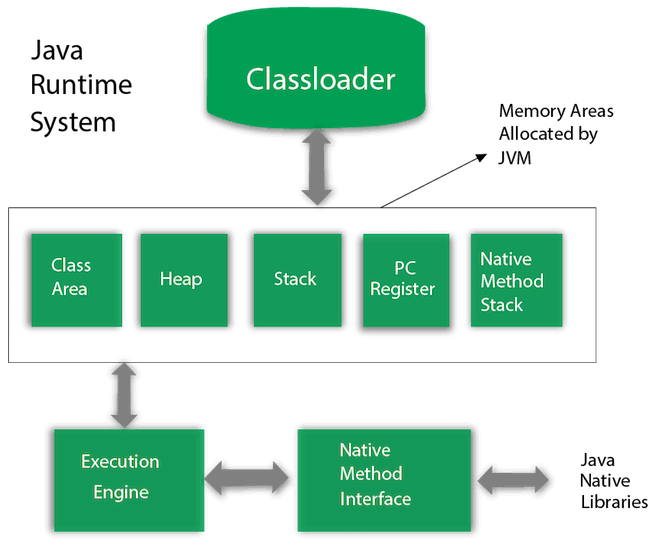

# JVM
## JVM architecture

### Classloader
jvm 当执行.class文件时，装进类加载器中，搬进jvm
ClassLoader只负责class文件的加载，而是否能够运行则由 Execution Engine 来决定
1. Bootstrap ClassLoader:the super of the Extension ClassLoader; java.lang,java.util
2. Extension ClassLoader:child classloader of Bootstrap ClassLoader
3. System/Application ClassLoader:This is the child classloader of extension classloader. It loads the classfies from classpath.   
类加载顺序为Bootstrap——》extension ——》application ——》自定义
- 类加载流程       
  加载，连接，初始化，使用，卸载
    -- 加载，class加载到内存，静态数据转化到方法区，堆中生成数据访问入口
    -- 链接，验证，准备（为类变量分配内存，实例变量对象初始化时分配内存），解析（符号引用转化成直接引用）
    -- 初始化，执行类构造器方法clinit(),顺序执行所有类变量，显式初始化和静态代码语句
    -- 使用
    -- 卸载，垃圾回收机制回收（1.该类的所有的实例对象都已被 GC，也就是说堆不存在该类的实例对象。2.该类没有在其他任何地方被引用3.该类的类加载器的实例已被GC）
- 双亲委派机制
  当一个类需要被加载时，它会先委派给父类加载，比如自己new的Person，先会委派给application classloader去加载，只要父类无法加载，子类才会自行加载。
  好处：隔离，防止我们的代码影响jdk代码
### Class(Method) Area
存放元数据信息区域，比如类信息，常量，静态变量，编译后代码
### Heap
存储一些数据，对象实例，数组等，**和方法区一样属于线程共享区域，线程不安全**。
### Stack
代码运行空间，每一个方法都会放到栈中。8种基本类型，对象的引用，实例方法在栈里分配内存
- 堆管存储，栈管运行
- 如果线程请求的栈的深度大于虚拟机栈的最大深度，就会报 StackOverflowError （这种错误经常出现在递归中）。Java虚拟机也可以动态扩展，但随着扩展会不断地申请内存，当无法申请足够内存时就会报错 OutOfMemoryError
- 如果栈的内存大小可以动态扩展， 如果虚拟机在动态扩展栈时无法申请到足够的内存空间，则抛出OutOfMemoryError异常。
- 栈帧随着方法调用而创建，随着方法结束而销毁。无论方法正常完成还是异常完成都算作方法结束。
### Program counter register
1. 类似于指针，指示下一行运行哪个代码。和stack一样，都是线程独享的，因此是线程安全的。
2. 多线程情况下，程序计数器记录当前的线程执行的位置
JVM调优一般是对堆和栈进行。

线程私有：程序计数器，虚拟机栈，本地方法栈
线程共享：堆，方法区，直接内存
### jvm垃圾回收机制
1. 判断对象死亡的方式？
   - 引用计数法，给对象一个引用，使用就+1，引用失效-1，当为0时就是不再使用。（但无法解决循环引用）
   - 可达性分析算法，当一个对象到 GC Roots 没有任何引用链相连的话，则证明此对象是不可用的，需要被回收。
2. 强引用，软引用，弱引用，虚引用
   - 强引用：垃圾回收器不回收，会提醒OutOfMemoryError 
   - 软引用：空间足够，不回收，不够就回收，软引用可以加速 JVM 对垃圾内存的回收速度，可以维护系统的运行安全，防止内存溢出（OutOfMemory）等问题的产生。
   - 弱引用：当垃圾回收线程扫描时，发现弱引用就回收，不管内存是否足够
   - 虚引用：任何时候都可能被回收
3. 如何判断一个常量是废弃常量
   -  假如在字符串常量池中存在字符串 "abc"，如果当前没有任何 String 对象引用该字符串常量的话，就说明常量 "abc" 就是废弃常量，如果这时发生内存回收的话而且有必要的话，"abc" 就会被系统清理出常量池了。
4. 如何判断一个类是无用类
   1. 该类的所有的实例对象都已被 GC，也就是说堆不存在该类的实例对象。
   2. 该类没有在其他任何地方被引用
   3. 该类的类加载器的实例已被GC
5. 垃圾回收算法和特点
   - 标记-清除算法，标记不回收，清楚未标记
   - 标记-复制算法，内存分为两块，一块用完，将存活的放到另一块，这一块就回收，每次回收一半
   - 标记-整理算法，标记所有存活的，移到一端，清理另一端
   - 分代收集算法，目前使用的多。**在新生代中，每次收集都会有大量对象死去，所以可以选择”标记-复制“算法，只需要付出少量对象的复制成本就可以完成每次垃圾收集。而老年代的对象存活几率是比较高的，而且没有额外的空间对它进行分配担保，所以我们必须选择“标记-清除”或“标记-整理”算法进行垃圾收集。**
6. hotspot为什么分为新生代和老年代
   同上
7. 常见的垃圾回收器
   Serial 收集器，单线程，新生代，标记复制，老年代，标记整理
   ParNew 收集器，多线程
   CMS （Concurrent Mark Sweep）收集器，采用标记清除法
   G1 收集器，面向服务器的垃圾收集器。G1 收集器在后台维护了一个优先列表，每次根据允许的收集时间，优先选择回收价值最大的 Region(这也就是它的名字 Garbage-First 的由来) 【初始标记，并发标记，最终标记，筛选回收】
8. minor GC 和 full GC?
   minor gc发生在新生代的垃圾回收，当eden满时触发，survivor满不会触发
   Major gc 发生在老年代的垃圾回收
   full gc 清理整个堆空间
9.  堆内存对象的分配和回收？
    
    - eden和survivor是新生代，Tenured是老年代，permanent Generation是永久代
    - 对象优先在eden区分配内存，当内存不足，发起一次minor GC，执行后，如果可以，在eden区分配，不行的话，就通过分配担保机制转移到老年代中（空间分配担保是为了确保在 Minor GC 之前老年代本身还有容纳新生代所有对象的剩余空间。）
    - 大对象直接进入老年代。大对象就是需要大量连续内存空间的对象（字符串，数组）
    - 长期存活的对象进入老年代
    - 部分收集 (Partial GC)：
        - 新生代收集（Minor GC / Young GC）：只对新生代进行垃圾收集；
        - 老年代收集（Major GC / Old GC）：只对老年代进行垃圾收集。需要注意的是 Major GC 在有的语境中也用于指代整堆收集；
        - 混合收集（Mixed GC）：对整个新生代和部分老年代进行垃圾收集。
    - 整堆收集 (Full GC)：收集整个 Java 堆和方法区。

