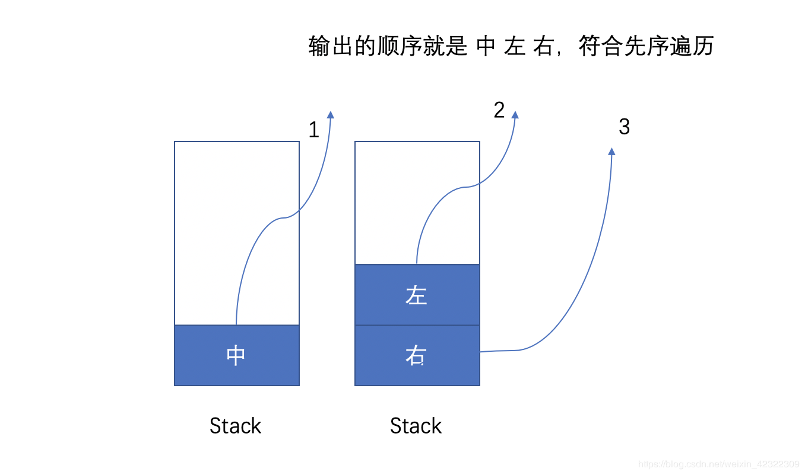
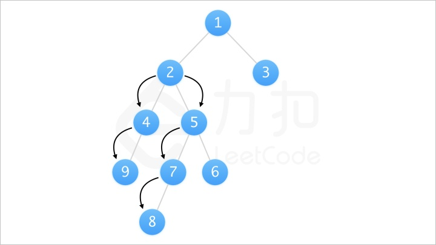

# Tree（树）
## 树的基本概念
- 一个根节点，若干子树
- 每个结点分裂出的个数为度
- 最深的层代表树的深度 

  


## 树的种类
### 1. 二叉树
二叉树是n(n>=0)个结点的有限集合，该集合或者为空集（称为空二叉树），或者由一个根结点和两棵互不相交的、分别称为根结点的左子树和右子树组成。
#### 1.1 二叉树的特点
- 每个结点最多两颗子树，所以二叉树不存在度大于2的结点
- 左子树和右子树有顺序，不能颠倒
- 只有一个结点也分左右
#### 1.2 二叉树的性质
- 在二叉树的i层最多有$2^{i-1}$
- 二叉树的深度为k，最多有$2^k-1$个结点
- $n_0 = n_2 + 1$;$n_0$代表度数为0的结点数;$n_2$代表度数为2的结点数
- 在完全二叉树中，具有n个节点的完全二叉树的深度为$[log_2n]+1$，其中$[log_2n]$是向下取整
### 2. 满二叉树
#### 2.1 满二叉树特点
- 叶子在最下层
- 非叶子结点的度为2
- 同样深度的二叉树中，满二叉树的结点个数最多，叶子结点最多  


### 3. 完全二叉树
#### 3.1 概念
- 对一颗具有n个结点的二叉树按层编号，如果编号为i(1<=i<=n)的结点与同样深度的满二叉树中编号为i的结点在二叉树中位置完全相同，则这棵二叉树称为完全二叉树。  


#### 3.2 特点
- 叶子结点只出现在最下层和次下层
- 最下层叶子结点出现在树的左部
- 倒数第二层如存在叶子结点，一定在右边连续位置
- 如果结点度为1，则该结点的孩子结点一定是左孩子
- 同样结点数目的二叉树，完全二叉树深度最小
- **满二叉树一定是完全二叉树，反之不一定**
## 树的关键题目
### *一.二叉树的前中后序遍历（深度优先搜索）*  
1. 前序位置代码在刚进入一个二叉树结点的时候执行； 

2. 后序位置代码在将离开一个二叉树结点的时候执行；  

3. 中序位置的代码在一个二叉树左子树都遍历完，即将遍历右子树时候执行。   
4. **二叉树题目解决方式：1.能否通过遍历一遍二叉树获得；2.定义一个递归函数，通过子问题（子树）的答案推导出原问题的答案。**
5. **前序位置的代码只能从函数参数中获取父节点传递来的数据，而后序位置的代码不仅可以获取参数数据，还可以获取到子树通过函数返回值传递回来的数据**
6. **只有后序位置才能通过返回值获取子树的信息，发现题目和子树有关，那大概率要给函数设置合理的定义和返回值，在后序位置写代码**  
   
- 每一个结点所在的层数
```
public void traverse(TreeNode root, int level) {
    if (root == null) {
        return;
    }
    // 前序遍历位置
    printf("结点 %s 在第%d层",root, level);
    traverse(root.left, level+1);
    traverse(root.right, level+1);
}
```
- 每个结点左右子树包含的结点数
```
public int count(TreeNode root){
    if (root == null) {
        return 0;
    }

    int leftcount = count(root.left);
    int rightcount = count(root.right);
    // 后序位置
    printf("结点 %s 的左右子树包括的节点数分别为%d,%d",root.val,left,right);

    return leftcount+rightcount+1;
}
```


**前序遍历**（根节点——>左子树——>右子树）
A->B->D->E->C->F
**中序遍历**（左子树——>根节点——>右子树）
D->B->E->A->F->C
**后序遍历**（左子树——>右子树——>根节点）
D->E->B->F->C->A
###### 递归：
- 二叉树实际上是由根节点和左右子树构成的，无论从哪一个结点的视角
- 除根节点外每一个结点都是某棵树的左子树或者右子树
- 因此递归的方法三种遍历区别不大

[前序 leetcode 144](https://leetcode-cn.com/problems/binary-tree-preorder-traversal/)
```
<!-- 前序遍历 -->
class Solution {
    public List<Integer> preorderTraversal(TreeNode root) {
        List<Integer> res = new ArrayList<Integer>();
        preorder(root, res);
        return res;
    }
    
    public void preorder(TreeNode root, List<Integer> res) {
        if (root == null) {
            return; 
        }
        res.add(root.val);
        preorder(root.left, res);
        preorder(root.right, res);
    }
}
```
[中序 leetcode 94](https://leetcode-cn.com/problems/binary-tree-inorder-traversal/)
```
<!-- 中序遍历 -->
class Solution {
    public List<Integer> inorderTraversal(TreeNode root) {
        List<Integer> res = new ArrayList<Integer>();
        inorder(root, res);
        return res;
    }
    public void inorder(TreeNode root, List<Integer> res) {
        if (root == null) {
            return;
        }
        inorder(root.left, res);
        res.add(root.val);
        inorder(root.right, res);
    }
}
```
[后序 leecode 145](https://leetcode-cn.com/problems/binary-tree-postorder-traversal/)
```
<!-- 后序遍历 -->
class Solution {
    public List<Integer> postorderTraversal(TreeNode root) {
        List<Integer> res = new ArrayList<Integer>();
        postorder(root, res);
        return res;
    }
    public void postorder(TreeNode root, List<Integer> res) {
        if (root == null) {
            return;
        }
        postorder(root.left, res);
        postorder(root.right, res);
        res.add(root.val);
    }
}
```
###### 迭代：
- 迭代的方法一般是显式的维护一个栈

前序：  



- 初始化栈，将根节点入栈
- 当栈不为空时
- 弹出栈顶元素，加入到结果中，如果右子树非空，入栈右子树，如果左子树非空，入栈左子树
- 因为之后先打印左子树，后打印右子树，所以先加入右子树，后加入左子树
```
class Solution {
    // 迭代解法
    public List<Integer> preorderTraversal(TreeNode root) {

        if (root == null) {
            return res;
        }

        List<Integer> res = new ArrayList<Integer>();
        Stack<TreeNode> stack = new Stack<TreeNode>();

        stack.push(root);   // 先加入进去

        while (!stack.isEmpty()) {
            TreeNode node = stack.pop(); // 立马pop()
            res.add(node.val);
            if (node.right != null) {
                stack.push(node.right);
            }
            if (node.left != null) {
                stack.push(node.left);
            }
        }
        return res;
    }
}
```
中序：  


- 按照 左——>中——>右的顺序输出结点
- 尽量把一个结点的左子树都压入栈，栈顶则是最左边的元素
- 当做左边处理完，返回到上层处理中间结点
- 如果存在右节点，也按照中序遍历
```
class Solution {
    // 迭代法
    public List<Integer> inorderTraversal(TreeNode root) {
        Stack<TreeNode> stack = new Stack<TreeNode>();
        List<Integer> res = new ArrayList<Integer>();
         if (root == null) {
            return res;
        }
        TreeNode curr = root;
        while (!stack.isEmpty() || curr != null) {
            while (curr != null) {
                stack.push(curr);  // 一直push到左子树为空为止
                curr = curr.left;
            }
            TreeNode node = stack.pop();
            res.add(node.val);
            if (node.right != null) {
                curr = node.right; // 右节点不为空，让右节点也进行中序遍历（不断寻找左边的值）
            }
        }
        return res;
    }
}
```
后序：

- 先序遍历是 中——> 左 ——> 右，先序在入栈的时候是 中，右，左
- 把先序改成 中——> 左 ——> 右，然后倒过来就是后序遍历 左 ——> 右 ——> 中
  
```
    public List<Integer> postorderTraversal(TreeNode root) {
        Stack<TreeNode> stack1 = new Stack<TreeNode>();
        Stack<Integer> stack2 = new Stack<Integer>();
        List<Integer> res = new ArrayList<Integer>();

        stack1.push(root);
        while (!stack1.isEmpty()) {
            TreeNode node = stack1.pop();
            stack2.push(node.val);
            if (node.left != null) {  // 不同于先序，先左后右
                stack1.push(node.left);
            }
            if (node.right != null) {
                stack1.push(node.right);
            }
        }
        
        while (!stack2.isEmpty()) {
            res.add(stack.pop().val);
        }
        return res;
    }
```
### 二. 二叉树的层序遍历（广度优先搜索）
遍历方法：
**DFS vs BFS**  

  

BFS通常用来求层序遍历和最短路径  

  

层序遍历用队列
- 先入队根节点，如果左子树为空，入队左子树，如果右子树为空入队右子树
```
public List<Integer> levelOrder(TreeNode root) {
        List<Integer> res = new ArrayList<Integer>();
        Deque<TreeNode> queue = new ArrayDeque<TreeNode>();
        if (root == null) {
            return null;
        }

        queue.add(root);
        // 每次其实就是把一个结点出队列，并将该结点的两个左右结点入队列
        while (!queue.isEmpty()) {
            TreeNode node = queue.poll();
            res.add(node.val);
            if (node.left != null) {
                queue.add(node.left);
            }
            if (node.right != null) {
                queue.add(node.right);
            }
        }
        return res;
    }
```
- 将下层和上层分离  
  


层序遍历相关题目 

- [层序遍历 leetcode 102](https://leetcode-cn.com/problems/binary-tree-level-order-traversal/)  


```
class Solution {
    public List<List<Integer>> levelOrder(TreeNode root) {
        List<List<Integer>> res = new ArrayList<>();
        Deque<TreeNode> queue = new ArrayDeque<TreeNode>();
        if (root == null) {
            return res;
        }
        queue.add(root);
        while (!queue.isEmpty()) {
            int n = queue.size();
            List<Integer> level = new ArrayList<>();
            for (int i = 0; i < n; i++) { // i没有具体含义，只是每一层开始前，将循环n次
                TreeNode node = queue.poll();
                level.add(node.val);
                if (node.left != null) {
                    queue.add(node.left);
                }
                if (node.right != null) {
                    queue.add(node.right);
                }
            }
            res.add(level);
        }
        
        return res;
    }
}
```
- [之字形层序遍历 leetcode103](https://leetcode-cn.com/problems/binary-tree-zigzag-level-order-traversal/)

```
class Solution {
    public List<List<Integer>> zigzagLevelOrder(TreeNode root) {
        // 双端队列，用LinkedList
        // 普通队列，用ArrayList
        Queue<TreeNode> queue = new LinkedList<TreeNode>();
        List<List<Integer>> res = new LinkedList<List<Integer>>();
        if (root == null) {
            return res;
        }
        queue.add(root);
        boolean flag = true;
        while (!queue.isEmpty()) {
            int n = queue.size();
            Deque<Integer> level = new LinkedList<>();
            for (int i = 0; i < n; i++) {
                TreeNode node = queue.poll();
                if (flag) {
                    level.addLast(node.val);
                } else {
                    level.addFirst(node.val);
                }

                if (node.left != null) {
                    queue.add(node.left);
                }
                if (node.right != null) {
                    queue.add(node.right);
                }
            }
            res.add(new LinkedList<Integer>(level));
            flag = !flag;
        }
        return res;
    }
}
```
- [找每一层最右边结点](https://leetcode-cn.com/problems/binary-tree-right-side-view/) 
```
class Solution {
    public List<Integer> rightSideView(TreeNode root) {
        List<Integer> res = new ArrayList<>();
        Deque<TreeNode> queue = new ArrayDeque<TreeNode>();
        if (root == null) {
            return res;
        }
        queue.add(root);
        while (!queue.isEmpty()) {
            int n = queue.size();
            Deque<Integer> level = new LinkedList<>();
            for (int i = 0; i < n; i++) {
                TreeNode node = queue.poll();
                level.add(node.val);

                if (node.left != null) {
                    queue.add(node.left);
                }
                if (node.right != null) {
                    queue.add(node.right);
                }
            }
            res.add(level.getLast());
        }
        return res;
    }
}
```
- [计算每一层的最大值 leetcode515](https://leetcode-cn.com/problems/find-largest-value-in-each-tree-row/)
- [计算每一层的平均值 leetcode637](https://leetcode-cn.com/problems/average-of-levels-in-binary-tree/)
- *队列相关补充*   


```
Queue queue = new LinkedList();//普通队列
ArrayDeque和LinkedList实现了双端队列接口
Deque<Integer> queue = new LinkedList<>(); //addLast(); addFirst(); peekLast(); peekFirst(); pollLast();
Deque<Integer> queue = new ArrayList<>();
```
最短路径相关题目

- 图按照每一层遍历，处理无权重最短路问题  


- [离开陆地的最远距离 leetcode1162](https://leetcode-cn.com/problems/as-far-from-land-as-possible/)
- [01矩阵 leetcode542](https://leetcode-cn.com/problems/01-matrix/)
- [腐烂的橘子 leetcode994](https://leetcode-cn.com/problems/rotting-oranges/)
- [最小高度树 leetcode310](https://leetcode-cn.com/problems/minimum-height-trees/)


### 树的其他题目
- [树的最大深度leetcode104](https://leetcode-cn.com/problems/maximum-depth-of-binary-tree/)  
BFS:就是每一层记一次数  
DFS:左右子树的最大深度+1（1是指根节点）  
****首先利用递归函数的定义算出左右子树的最大深度，然后推出原树的最大深度，主要逻辑自然放在后序位置
```
// DFS
public int maxDepth(TreeNode root) {
        if (root == null) { //终止条件
            return 0;
        }

        int leftMax = maxDepth(root.left);
        int rightMax = maxDepth(root.right);

        int res = Math.max(leftMax,rightMax) + 1;
        return res;
    }
```  
```
// BFS
public int maxDepth(TreeNode root) {
        Queue<TreeNode> queue = new LinkedList<TreeNode>();
        int res = 0;
        if (root == null) {
            return 0;
        }
        queue.add(root);
        while (!queue.isEmpty()) {
            int n = queue.size();
            for (int i = 0; i < n; i++) {
                TreeNode node = queue.poll();
                if (node.left != null) {
                    queue.add(node.left);
                }
                if (node.right != null) {
                    queue.add(node.right);
                }
            }
            res++;
        }
        return res;
    }
```  
- [二叉树直径leetcode543](https://leetcode-cn.com/problems/diameter-of-binary-tree/)&&[递归视频讲解](https://leetcode-cn.com/problems/diameter-of-binary-tree/solution/er-cha-shu-de-zhi-jing-by-leetcode-solution/)  
  1. 树的直径指任意两个结点之间路径的最大值，并不一定通过根节点  

  
  1. **树的直径 == 该链路的结点个数 - 1 == 左子树深度+右子树深度**   
  2. 结点个数 = 该结点左子树深度（4->9） + 该结点右子树深度(5->7->8)  
  3. DFS遍历了以每个结点的最大直径
```
int ans;
public int diameterOfBinaryTree(TreeNode root) {
    ans = 1;
    depth(root);
    return ans - 1;
}
// 该节点经过结点数的最大值
public int depth(TreeNode root) {
    if (root != null) {
        return 0;
    }
    int L = depth(root.left);
    int R = depth(root.right);
    ans = Math.max(ans,L + R + 1); //当前结点直径的最大值和前一个比较
    return Math.max(L,R) + 1; //返回子树的深度
}
```
```
int ans = 0;
public int dianeterOfBinaryTree(TreeNode root) {
    maxDepth(root);
    return ans;
}
public void maxDepth(TreeNode root) {
    if(root == null) {
        return 0;
    }

    int leftMax = maxDepth(root.left);
    int rightMax = maxDepth(root.right);
    // 每个结点的左右子树的深度和
    int total = leftMax + rightMax;
    // 最大的深度和即为所求
    ans = Math.max(ans, total);
    // 返回深度
    return Math.max(leftMax, rightMax) + 1;
}
```
- [对称二叉树leetcode101](https://leetcode-cn.com/problems/symmetric-tree/)   
  1. 根节点的值相同
  2. 左子树和右子树镜像对称 
  3. 左右镜像对称，也就是判断完当前的值，下一步p和q分别进入不同的左右子树
  4. 基本条件是当p,q为空时,返回true（叶子结点），有一不为空，返回false
```
class Solution {
    public boolean isSymmetric(TreeNode root) {
        return check(root,root);
    }
    public boolean check(TreeNode p, TreeNode q) {
        if (p == null && q == null){
            return true;
        }
        if (p == null || q == null) {
            return false;
        }
        return p.val == q.val && check(p.left,q.right) && check(p.right,q.left);
    }
}
```
- [相同的树leetcode100](https://leetcode-cn.com/problems/same-tree/solution/)  
  1. 两棵树相同的条件为根节点相同，且两棵树的子树也相同。
```
class Solution {
    public boolean isSameTree(TreeNode p, TreeNode q) {
        if (p == null && q == null) {
            return true;
        }
        if (p == null || q == null) {
            return false;
        }
        return p.val == q.val && isSameTree(p.left, q.left) && isSameTree(p.right, q.right);
    }
}
```
- [另一颗树的子树leetcode572](https://leetcode-cn.com/problems/subtree-of-another-tree/)  
  1. 从某一个结点等于子树的根节点，其他的后代结点也相同。
  2. 两个递归，一个是判断是否两树相同，另一个是dfs遍历父树的左右结点。
```
class Solution {
    public boolean isSubtree(TreeNode root, TreeNode subRoot) {
        if (subRoot == null) { // 子树为空，肯定为真
            return true; 
        }
        if (root == null) {  // 父树为空，必定为假
            return false;
        }
        // 判断是否相等，以及分别递归父树的左右子树
        return isSameTree(root,subRoot) || isSubtree(root.left, subRoot) || isSubtree(root.right, subRoot);
    }

    public boolean isSameTree(TreeNode root, TreeNode subRoot) {
        if (root == null && subRoot == null) {
            return true;
        }
        if (root == null || subRoot == null) {
            return false;
        }
        return root.val == subRoot .val && isSameTree(root.left,subRoot.left) && isSameTree(root.right, subRoot.right);
    }
}
```
- [翻转二叉树leetcode226](https://leetcode-cn.com/problems/invert-binary-tree/)
    1. 终止条件，当前结点为空
    2. 交换当前结点的左右结点，递归交换当前结点的左节点，递归交换当前结点的右节点
    3. 后序遍历，因为当前交换基于已经交换的基础上
```
class Solution {
    /*
    // 递归
    public TreeNode invertTree(TreeNode root) {
        if (root == null) {
            return null;
        }
        TreeNode left = invertTree(root.left);
        TreeNode right = invertTree(root.right);
        root.left = right;
        root.right = left;
        return root;
    }
    */
    // 层序遍历
    public TreeNode invertTree(TreeNode root) {
        Queue<TreeNode> queue = new LinkedList<>();
        if(root == null) {
            return null;
        }
        queue.add(root);
        while (!queue.isEmpty()) {
            TreeNode node = queue.poll();
            TreeNode temp = node.left;
            node.left = node.right;
            node.right = temp;
            if (node.left != null) {
                queue.add(node.left);
            }   
            if (node.right != null) {
                queue.add(node.right);
            }
        }
        return root;
    }
}
```
- [填充二叉树结点的右侧指针leetcode116,117](https://leetcode-cn.com/problems/populating-next-right-pointers-in-each-node/)  


```
class Solution {
    public Node connect(Node root) {
        if (root == null) {
            return null;
        }
        connectLeftToRight(root.left, root.right);
        return root;
    }
    
    public void connectLeftToRight(Node node1, Node node2) {
        if (node1 == null || node2 == null) {
            return;
        }

        node1.next = node2;

        connectLeftToRight(node1.left, node1.right);
        connectLeftToRight(node2.left, node2.right);
        connectLeftToRight(node1.right, node2.left);
    }
        
}
```
- [将二叉树展开为链表leetcode114](https://leetcode-cn.com/problems/flatten-binary-tree-to-linked-list/)  
    1. 最基本的：(1)左边的变成root.right, 将left置为空；(2)把原来右边的append末尾  
    2. 从底向上递归  
   
  
```
class Solution {
    public void flatten(TreeNode root) {
        if (root == null) {
            return;
        }

        flatten(root.left);
        flatten(root.right);

        // 后序遍历位置
        TreeNode left = root.left;
        TreeNode right = root.right;

        // 把left放在右边，left置为空
        root.right = left;
        root.left = null;

        // 找到二叉树右端叶子，将原来的right append到后面
        TreeNode p = root;
        while(p.right != null) {
            p = p.right;
        }
        p.right = right;
    }
}
```
- [验证二叉搜索树leetcode98](https://leetcode-cn.com/problems/validate-binary-search-tree/)  
    1. 二叉搜索树(Binary search tree,简称BST)定义：节点的左子树只包含小于当前节点的数，节点的右子树只包含大于当前节点的数。
    2. 所有的左子树和右子树都是二叉搜索树。
    3. ***二叉搜索树的中序遍历是递增的。***  
   

```
class Solution {
    /*
    //递归
    public boolean isValidBST(TreeNode root) {
        return helper(root, Long.MIN_VALUE, Long.MAX_VALUE);
    }
    public boolean helper(TreeNode root,long lower,long upper) {
        if (root == null) {
            return true;
        }
        // 边界条件
        if (root.val <= lower || root.val >= upper) {
            return false;
        }
        return helper(root.left, lower, root.val) && helper(root.right, root.val, upper);
    }
    */

    /*
    public boolean isValidBST(TreeNode root) {
        Stack<TreeNode> stack = new Stack<>();
        if (root == null) {
            return true;
        }
        double temp = -Double.MAX_VALUE;
        TreeNode curr = root;
        while (!stack.isEmpty() || curr != null) {
            while (curr != null) {
                stack.push(curr);
                curr = curr.left;
            }
            curr = stack.pop();
            if (curr.val <= temp) {
                return false;
            }
            temp = curr.val;
            curr = curr.right;
        }
        return true;
    }
    */
    // 中序遍历一遍，保证当前结点必定小于之前的结点
    long pre = Long.MIN_VALUE;
    public boolean isValidBST(TreeNode root) {
        if (root == null) {
            return true;
        }
        boolean l = isValidBST(root.left);
        if (root.val <= pre) {
            return false;
        }
        pre = root.val;
        boolean r = isValidBST(root.right);
        return l && r;
    }
}
```
- 二叉搜索树的增删改查
- BST遍历框架
```
void BST(TreeNode root, int target) {
    if (root.val == target)
        // 找到目标，做点什么
    if (root.val < target) 
        BST(root.right, target);
    if (root.val > target)
        BST(root.left, target);
}
```
- 查
```
public TreeNode searchBST(TreeNode root, int target){
    if (root == null) {
        return null;
    }
    if (root.val > target) {
        return searchBST(root.left, target);
    }
    if (root.val < target) {
        return searchBST(root.right, target);
    }
    return root;
}
```
- 增
```
class Solution {
    public TreeNode insertIntoBST(TreeNode root, int val) {
        if (root == null) {
            return new TreeNode(val);
        }
        if (root.val > val) {
            root.left = insertIntoBST(root.left,val);
        }
        if (root.val < val) {
            root.right = insertIntoBST(root.right,val);
        }
        return root;
    }
}
```
- 改
```
class Solution {
    public TreeNode deleteNode(TreeNode root, int key) {
        if (root == null) {
            return null;
        } 
        if (root.val == key) {
            // 删除操作
            // 1. 叶子结点，删除就为空
            if (root.left == null && root.right == null) {
                return null;
            }
            // 2. 删除当前结点，需要子节点去补，如果有一边是空，则肯定另一边去补
            if (root.left == null) {
                return root.right;
            }
            if (root.right == null) {
                return root.left;
            }
            // 有左右子树，则找到左边最大的或者右边最小的来代替
            if (root.left != null && root.right != null) {
                TreeNode rightMin = getRightMin(root.right);
                root.val = rightMin.val;
                root.right = deleteNode(root.right, rightMin.val);
            }
        } else if (root.val > key) {
            root.left = deleteNode(root.left, key);
        } else if (root.val < key) {
            root.right = deleteNode(root.right, key);
        }
        return root;
    }
    public TreeNode getRightMin(TreeNode node) {
        while (node.left != null) {
            node = node.left;
        }
        return node;
    }
}
```
- [二叉搜索树的两树之和leetcode653](https://leetcode-cn.com/problems/two-sum-iv-input-is-a-bst/)   
    1. 深度或者广度优先遍历，找到k-root.val,如果在set中返回true，不在返回false
```
class Solution {
    public boolean findTarget(TreeNode root, int k) {
        Set<Integer> set = new HashSet<>();
        return find(root, k, set);
    }

    public boolean find(TreeNode root, int k, Set<Integer> set) {
        if (root == null) {
            return false;
        }
        if (set.contains(k - root.val)) {
            return true;
        }else{
            set.add(root.val);
        }

        return find(root.left, k, set) || find(root.right, k, set);
    }
}
```
- [二叉树的最近公共祖先](https://leetcode-cn.com/problems/er-cha-shu-de-zui-jin-gong-gong-zu-xian-lcof/)
    1. 祖先定义  
   
    
    1. 最近祖先成立条件：（1）p和q在root的子树中，且分列在异侧；（2）p=root，q在root的子树；（3）q=root, p在root的子树。
```
class Solution {
    public TreeNode lowestCommonAncestor(TreeNode root, TreeNode p, TreeNode q) {
        // base条件，根节点为空，或者根节点等于一个结点
        if (root == null) {
            return null;
        }
        if (root == p || root == q) {
            return root;
        }

        // 对左右子树深度遍历
        TreeNode left = lowestCommonAncestor(root.left, p, q);
        TreeNode right = lowestCommonAncestor(root.right, p, q);

        // 左右子树为空，root的左右子树都不包含p q
        if (left == null && right == null) {
            return null;
        }
        // p q在root子树，且在两侧
        if (left != null && right != null) {
            return root;
        }
        // pq不在左子树，在右子树中
        if (left == null && right != null) {
            return right;
        }
        // pq不在右子树，在左子树中
        if (left != null && right == null) {
            return left;
        }
        return root;
    }
}
```
- [二叉搜索树的最近公共祖先](https://leetcode-cn.com/problems/er-cha-sou-suo-shu-de-zui-jin-gong-gong-zu-xian-lcof/)
    1. 二叉搜索树左子树一定小于根节点，右子树大于根节点
    2. 所以当两个都大于根节点，必在右子树
```
class Solution {
    public boolean findTarget(TreeNode root, int k) {
        Set<Integer> set = new HashSet<>();
        return find(root, k, set);
    }

    public boolean find(TreeNode root, int k, Set<Integer> set) {
        if (root == null) {
            return false;
        }
        if (set.contains(k - root.val)) {
            return true;
        }else{
            set.add(root.val);
        }

        return find(root.left, k, set) || find(root.right, k, set);
    }
}
```
- [二叉搜索树中第K小的结点元素](https://leetcode-cn.com/problems/kth-smallest-element-in-a-bst/solution/)
```
class Solution {
    public int kthSmallest(TreeNode root, int k) {
        ArrayList<Integer> res = new ArrayList<>();
        res = inorder(root, res);
        return res.get(k-1);
    }
    public ArrayList<Integer> inorder(TreeNode root, ArrayList<Integer> res) {
        if (root == null) {
            return null;
        }
        inorder(root.left, res);
        res.add(root.val);
        inorder(root.right, res);
        return res;
    }
}
```
- [二叉搜索树与双向链表](https://leetcode-cn.com/problems/er-cha-sou-suo-shu-yu-shuang-xiang-lian-biao-lcof/)
    1. 排序链表，中序遍历
    2. 双向链表，钱去结点pre,当前节点cur。pre.right = cur; cur.left = pre;
    3. 循环链表，链表头节点head，尾结点为tail。tail.right = head; head.left = tail; 
   
     
```
class Solution {
    Node pre, head;
    public Node treeToDoublyList(Node root) {
        if (root == null) {
            return null;
        }
        dfs(root);
        head.left = pre;
        pre.right = head;
        return head;
    }
    // 深度优先遍历
    public void dfs(Node cur) {
        if (cur == null) {
            return;
        }
        dfs(cur.left);
        // pre当为空时，为头节点
        if (pre == null) {
            head = cur;
        } else { // pre非空，cur左侧有pre，则需要将pre指向cur
            pre.right = cur; 
        }
        // 当前的左边肯定是pre
        cur.left = pre;
        // pre指向当前cur
        pre = cur;

        dfs(cur.right);
    }
}
```
- [最大二叉树leetcode654](https://leetcode-cn.com/problems/maximum-binary-tree/)
    1. 构建二叉树，先找根节点，然后根据区间边界构建根节点的左子树和右子树
```
class Solution {
    // 先把根节点确定(找到最大的)，进入左子树需要从0-根节点中找最大的
    public TreeNode constructMaximumBinaryTree(int[] nums) {
        int n = nums.length;
        TreeNode res = construct(nums, 0, n-1);
        return res;
    }
    public TreeNode construct(int[] nums, int left, int right) {\
        if (right < left) {
            return null;
        }
        int ans = Integer.MIN_VALUE;
        int index = -1;
        for (int i = left; i <= right; i++) {
            if (nums[i] > ans) {
                ans = nums[i];
                index = i;
            }
        }
        TreeNode root = new TreeNode(ans);
        root.left = construct(nums, left, index-1);
        root.right = construct(nums, index+1, right);
        return root;
    }
}
```
- [BST转化成累加树leetcode538](https://leetcode-cn.com/problems/convert-bst-to-greater-tree/solution/)  
  

|  0 | 1  | 2 | 3 | 4 | 5 | 6 | 7 | 8 |  
| ---- | ---- | ---- | ---- | ---- | ---- | ---- | ---- | ----|  
| 36  | 36  | 35 | 33 | 30 | 26 | 21 | 15 | 8 |   

1. 每一个数的值等于前一个数的值+当前索引
2. 如果降序排列。先遍历8，然后7，然后6。则每个值就是前一和+当前索引。
```
class Solution {
    public TreeNode convertBST(TreeNode root) {
        traverse(root);
        return root;
    }
    int ans = 0;
    public void traverse(TreeNode root) {
        if (root == null) {
            return;
        }
        // 中序遍历
        traverse(root.right);
        root.val = ans + root.val;
        ans = root.val;

        traverse(root.left);
    }
}
```
- [前序遍历和中序遍历构造二叉树](https://leetcode-cn.com/problems/construct-binary-tree-from-preorder-and-inorder-traversal/)  
    1. 逆向操作，知道遍历，反推二叉树
    2. 前序总是【【根节点, 【左子树的前序遍历结果】, 【右子树的前序遍历结果】】
    3. 中序总是【【左子树中序遍历结果】，根节点，【右子树的中序遍历结果】】
    4. 前序遍历的第一个值必定是根节点，中序遍历中根节点左右两边分别是左子树和右子树，因此每次划分前序遍历就可以得到树
    5. 其实就是找到前序遍历的左右边界，然后递归  

    
```
class Solution {
    public TreeNode buildTree(int[] preorder, int[] inorder) {
        int prelen = preorder.length;
        int inlen = inorder.length;

        Map<Integer,Integer> map = new HashMap<>();
        for (int i = 0; i < inlen; i++) {
            map.put(inorder[i],i);
        }

        return build(preorder, map, 0, prelen-1, 0, inlen-1);
    }

    public TreeNode build(int[] preorder,Map<Integer,Integer> map, int preleft, int preright, int inleft, int inright) {
        if (preleft > preright || inleft > inright) {
            return null;
        }
        // 在前序遍历中拿到根节点的值
        int preroot = preorder[preleft];
        // 在中序遍历中拿到根节点的索引
        int pindex = map.get(preroot);

        TreeNode root = new TreeNode(preroot);

        root.left = build(preorder, map, preleft+1, pindex+preleft-inleft, inleft, pindex-1);
        root.right = build(preorder, map, pindex+preleft-inleft+1, preright, pindex+1, inright);
        return root;
    }
}
```
- 中序和后序倒推二叉树也类似，***前序和后序不能推出唯一二叉树***
```
class Solution {
    public TreeNode buildTree(int[] inorder, int[] postorder) {
        int inlen = inorder.length;
        int polen = postorder.length;

        Map<Integer,Integer> map = new HashMap<>();
        for (int i = 0; i < inlen; i++) {
            map.put(inorder[i],i);
        }

        return build(postorder, map, 0, polen-1, 0, inlen-1);
    }

    public TreeNode build(int[] postorder, Map<Integer,Integer> map, int poleft, int poright, int inleft, int inright) {
        //边界条件
        if (poleft > poright || inleft > inright) {
            return null;
        }
                
        int rootval = postorder[poright];
        int pindex = map.get(rootval);
        TreeNode root = new TreeNode(rootval);

        root.left = build(postorder, map, poleft, poright-inright+pindex-1, inleft, pindex-1);
        root.right = build(postorder, map, poright-inright+pindex, poright-1, pindex+1, inright);
        return root;
    }
}
```
- [寻找重复的子树leetcode652](https://leetcode-cn.com/problems/find-duplicate-subtrees/solution/)  
  
  
图中重复的子树有叶子结点4，以及两个子树（2—>4）  
1. 要知道是否有重复，首先得知道所在结点的子树长什么样（后序遍历）
2. 其次要知道别的结点的子树长什么样。（序列化表示该节点的子树的样子）
```
class Solution {
    HashMap<String, Integer> map = new HashMap<>();
    LinkedList<TreeNode> res = new LinkedList<>();

    public List<TreeNode> findDuplicateSubtrees(TreeNode root) {
        traverse(root);
        return res;
    }
    String traverse(TreeNode root) {
        if (root == null) {
            return "#";
        }

        String left = traverse(root.left);
        String right = traverse(root.right);

        //后序遍历写代码，因为需要获取子树的信息
        String subTree = left + "," + right + "," + root.val;

        int freq = map.getOrDefault(subTree, 0);// getOrDefault(key,value);如果没有这个key,则值为value
    
        if (freq == 1) {
            res.add(root);
        }
        map.put(subTree, freq + 1);
        return subTree;
    }

}
```


