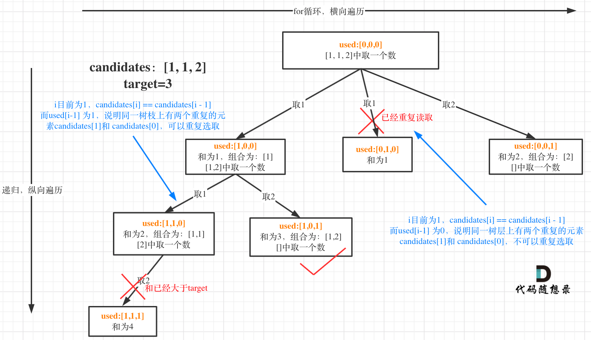

# 回溯算法
    组合问题：N个数里面按一定规则找出k个数的集合
    排列问题：N个数按一定规则全排列，有几种排列方式
    切割问题：一个字符串按一定规则有几种切割方式
    子集问题：一个N个数的集合里有多少符合条件的子集
    棋盘问题：N皇后，解数独等等
## 导航
#### 题目大纲

1. 回溯算法的问题可以抽象为树形问题——>递归在集合中查找子集，集合的大小构成了树的宽度，递归的深度构成树的深度。
2. (1)递归函数的返回值及参数 （2）回溯函数终止条件 （3）回溯搜索的遍历过程  


## 组合问题
- [组合leetcode77](https://leetcode-cn.com/problems/combinations/)

```
class Solution {
    List<List<Integer>> res = new ArrayList<>();
    LinkedList<Integer> path = new LinkedList<>();
    void backtracking (int n, int k, int startIndex) { // 参数中包括开始的结点标签
        // 终止条件
        if (path.size() == k) {
            res.add(new ArrayList<>(path));
            return;
        }
        // 横向遍历
        for (int i = startIndex; i <= n; i++) { // 控制横向遍历 
            path.add(i); // 处理结点
            // 纵向递归
            backtracking(n, k, i+1); // 控制树的纵向遍历，注意下一层搜索要从i+1开始
            path.removeLast(); // 撤销本次处理的结点
        }
    }
    public List<List<Integer>> combine(int n, int k) {
        backtracking(n, k, 1);
        return res;
    }
}
```
- [组合总和leetcode216](https://leetcode-cn.com/problems/combination-sum-iii/)
- 
```
class Solution {
    List<List<Integer>> res = new ArrayList<>();
    LinkedList<Integer> path = new LinkedList<>();
    void backtracking (int n, int k, int startIndex) {
        int sum = 0;
        for (int i = 0; i < path.size(); i++) {
            sum += path.get(i);
        }
        if (sum == n && k == path.size()) {
            res.add(new ArrayList<>(path));
            return;
        }

        for (int i = startIndex; i <= 9; i++) {
            path.add(i);
            backtracking(n, k, i+1);
            path.removeLast();
        }
    }
    public List<List<Integer>> combinationSum3(int k, int n) {
        backtracking(n, k, 1);
        return res;
    }
}
```
- [电话号码的字母组合leetcode17](https://leetcode-cn.com/problems/letter-combinations-of-a-phone-number/)

```
class Solution {
    List<String> res = new ArrayList<>();
    StringBuilder temp = new StringBuilder(); // 注意字符串
    String [] numString = {"","","abc","def","ghi","jkl","mno","pqrs","tuv","wxyz"};
    void backtracking (String digits, int index) { //控制的纵向的递归。index为书的深度也是遍历字母的个数 
        if (index == digits.length()) {
            res.add(temp.toString());
            return;
        }   

        String str = numString[digits.charAt(index) - '0']; // 找到数字对应的字符集
        for (int i = 0; i < str.length(); i++) { // 水平展开
            temp.append(str.charAt(i));
            backtracking(digits, index + 1);
            temp.deleteCharAt(temp.length() - 1);
        }
    }
    public List<String> letterCombinations(String digits) {
        if (digits == null || digits.length() == 0) {
            return res;
        }
        backtracking(digits, 0);
        return res;
    }
}
```
- [组合总和leetcode39](https://leetcode-cn.com/problems/combination-sum/)

```
class Solution {
    List<List<Integer>> res = new ArrayList<>();
    LinkedList<Integer> path = new LinkedList<>();
    void backtracking (int[] candidates, int target, int startIndex) {
        int sum = 0;
        for (int i = 0; i < path.size(); i++) {
            sum += path.get(i);
        }
        if (sum == target) {
            res.add(new ArrayList<>(path));
            return;
        }
        if (sum > target) {
            return;
        }

        for (int i = startIndex; i < candidates.length; i++) {
            path.add(candidates[i]);
            backtracking(candidates, target, i); // 此处是i，表示可以重复读取当前的的数
            path.removeLast();
        }
    }
    public List<List<Integer>> combinationSum(int[] candidates, int target) {
        backtracking(candidates, target, 0);
        return res;
    }
}
```
- [组合问题2](https://leetcode-cn.com/problems/combination-sum-ii/)

```
class Solution {
    List<List<Integer>> res = new ArrayList<>();
    LinkedList<Integer> path = new LinkedList<>();
    void backtracking (int[] candidates, int target, int index, boolean[] used) {
        int sum = 0;
        for (int i = 0; i < path.size(); i++) {
            sum += path.get(i);
        }
        if (sum == target) {
            res.add(new ArrayList<>(path));
            return;
        }
        if (sum > target) {
            return;
        }

        for (int i = index; i < candidates.length; i++) {
            if (i > 0 && candidates[i] == candidates[i - 1] && used[i - 1] == false) {
                continue;
            }
            used[i] = true;
            path.add(candidates[i]);
            // 每个结点选择一次，所以从下一次开始
            backtracking(candidates, target, i + 1, used);
            used[i] = false;
            path.removeLast();
        }
    }
    public List<List<Integer>> combinationSum2(int[] candidates, int target) {
        // 把重复的数都放到一起
        Arrays.sort(candidates);
        boolean [] flag = new boolean[candidates.length];
        backtracking(candidates, target, 0, flag);
        return res;
    }
}
```
- [分割回文串leetcode131](https://leetcode-cn.com/problems/palindrome-partitioning/)

1. 切割问题
2. 回文串问题
```
class Solution {
    List<List<String>> res = new ArrayList<>();
    LinkedList<String> path = new LinkedList<>();

    void backtracking (String s, int startIndex) {
        // 起始位置大于s的大小，说明找到一组分割
        if (startIndex >= s.length()) {
            res.add(new ArrayList(path));
            return;  
        }

        for (int i = startIndex; i < s.length(); i++) {
            if (isPalindrome(s, startIndex,i)) {
                String str = s.substring(startIndex, i + 1);
                path.add(str);
            } else {
                continue;
            }
            // 起始位置后移保证不重复
            backtracking(s, i + 1);
            path.removeLast();
        }
    }
    // 判断是否是回文串，p代表起始，q代表终点
    public boolean isPalindrome (String s, int p, int q) {
        while (p < q) {
            if (s.charAt(p) == s.charAt(q)) {
                p++;
                q--;
            } else {
                return false;
            }
        }
        return true;
    }

    public List<List<String>> partition(String s) {
        backtracking(s, 0);
        return res;
    }
}
```
- [复原IP地址leetcode93](https://leetcode-cn.com/problems/restore-ip-addresses/)

1. IP地址一定被分为4段
2. 每一段不能超过255
```
class Solution {
    List<String> res = new ArrayList<>();

    void backtracking(String s, int startIndex, int pointNum) {
        // 被分为4段，每段合法即可，因此分割数为3 && 最后一位不能超过255
        if (pointNum == 3) {
            if (isValid(s, startIndex, s.length()-1)) {
                res.add(s);
            }
            return;
        }

        for (int i = startIndex; i < s.length(); i++) {
            if (isValid(s, startIndex, i)) {
                s = s.substring(0, i+1) + "." + s.substring(i+1);
                pointNum++;
                backtracking(s, i+2, pointNum);
                pointNum--;
                s = s.substring(0, i+1) + s.substring(i+2);
            } else {
                break;
            }
        }
    }
    // 验证数字是否合法，初始位不等于0，且不能超过255
    public boolean isValid (String s, int start, int end) {
        if (start > end) {
            return false;
        }
        if (s.charAt(start) == '0' && start != end) { // 0开头的数字不合法
            return false;
        }
        int num = 0;
        for (int i = start; i <= end; i++) {
            if (s.charAt(i) > '9' || s.charAt(i) < '0') { // 遇到⾮数字字符不合法
                return false;
            }
            num = num * 10 + (s.charAt(i) - '0');
            if (num > 255) { // 如果⼤于255了不合法
                return false;
            }
        }
        return true;
    }
    public List<String> restoreIpAddresses(String s) {
        if (s.length() > 12) return res; // 算是剪枝了
        backtracking(s, 0, 0);
        return res;
    }
}
```
- [子集1 leetcode](https://leetcode-cn.com/problems/subsets/)
1. 不需要返回值

```
class Solution {
    List<List<Integer>> res = new ArrayList<>();
    LinkedList<Integer> path = new LinkedList<>();

    void backtracking (int[] nums, int index) {
        res.add(new ArrayList<>(path));

        for(int i = index; i < nums.length; i++) {
            path.add(nums[i]);
            backtracking(nums, i + 1);
            path.removeLast();
        }    
    }

    public List<List<Integer>> subsets(int[] nums) {
        if (nums.length == 0) {
            res.add(new ArrayList<>());
        }
        backtracking(nums, 0);
        return res;
    }
}
```
- [子集2 leetcode90](https://leetcode-cn.com/problems/subsets-ii/)
1. 要去重元素必须先排序
2. 去重需要使用的判断条件


```
class Solution {
    List<List<Integer>> res = new ArrayList<>();
    LinkedList<Integer> path = new LinkedList<>();

    void backtracking (int[] nums, int index, boolean[] used) {
        res.add(new ArrayList<>(path));
        if (index > nums.length) {
            return;
        }

        for (int i = index; i < nums.length; i++) {
            if (i > 0 && nums[i] == nums[i-1] && used[i-1] == false) { // 去重的判断条件
                continue;
            }
            used[i] = true;
            path.add(nums[i]);
            backtracking(nums, i+1, used);
            used[i] = false;
            path.removeLast();
        }
    }
    public List<List<Integer>> subsetsWithDup(int[] nums) {
        Arrays.sort(nums);
        boolean [] flag = new boolean[nums.length];
        backtracking(nums, 0, flag);
        return res;
    }
}
```
- [递增子序列leetcode491](https://leetcode-cn.com/problems/increasing-subsequences/)
1. 去重

```
class Solution {
    List<List<Integer>> res = new ArrayList<>();
    LinkedList<Integer> path = new LinkedList<>();

    void backtracking (int[] nums, int startIndex) {
        // LinkedList 用size()
        if (path.size() > 1) {
            res.add(new ArrayList<>(path));
            // return; // 此处不需要返回，要不然一到2就返回
        }
        int[] used = new int[201]; // 因为nums[i] = (-100 ~ 100) 之间
        for (int i = startIndex; i < nums.length; i++) {
            // nums[i] 代表取的那个数，不能跟已经取的数重复。且不能小于path的末尾的元素
            if (!path.isEmpty() && nums[i] < path.getLast() || (used[nums[i] + 100] == 1)) {
                continue;
            }
            // used+100后就是独一无二的值
            used[nums[i] + 100] = 1;
            path.add(nums[i]);
            backtracking(nums, i + 1);
            path.removeLast();
        }
    }
    public List<List<Integer>> findSubsequences(int[] nums) {
        backtracking(nums, 0);
        return res;
    }
}
```
- [全排列leetcode46](https://leetcode-cn.com/problems/permutations/)
1. 全排列跟顺序有关
```
class Solution {
    List<List<Integer>> res = new ArrayList<>();
    LinkedList<Integer> path = new LinkedList<>();

    void backtracking (int[] nums, boolean[] used) {
        if (path.size() == nums.length) {
            res.add(new ArrayList<>(path));
            return;
        }

        for (int i = 0; i < nums.length; i++) {
            if (used[i]) {
                continue;
            }
            path.add(nums[i]);
            used[i] = true;
            backtracking(nums, used);
            used[i] = false;
            path.removeLast();
        }
    }
    public List<List<Integer>> permute(int[] nums) {
        boolean[] flag = new boolean[nums.length]; 
        backtracking(nums, flag);
        return res;
    }
}
```
- [全排列去重leetcode47](https://leetcode-cn.com/problems/permutations-ii/)

1. 去重关键代码(对于排列问题，树层上去重和树枝上去重都可以)

```
// 树层去重
if (i > 0 && nums[i] == nums[i - 1] && used[i - 1] == false) {
    continue;
}
```

```
// 树枝去重
if (i > 0 && nums[i] == nums[i - 1] && used[i - 1] == true) {
    continue;
}
```

```
class Solution {
    List<List<Integer>> res = new ArrayList<>();
    LinkedList<Integer> path = new LinkedList<>();

    void backtracking (int[] nums, boolean[] used) {
        if (path.size() == nums.length) {
            res.add(new ArrayList<>(path));
            return;
        }

        for (int i = 0; i < nums.length; i++) {

            if (i > 0 && nums[i] == nums[i-1] && used[i - 1] == false) {
                continue;
            }
            if (used[i] == false) {
                used[i] = true;
                path.add(nums[i]);
                backtracking(nums, used);
                path.removeLast();
                used[i] = false;
            }
        }
    }
    public List<List<Integer>> permuteUnique(int[] nums) {
        Arrays.sort(nums);
        boolean[] flag = new boolean [nums.length];
        backtracking(nums, flag);
        return res;
    }
}
```
