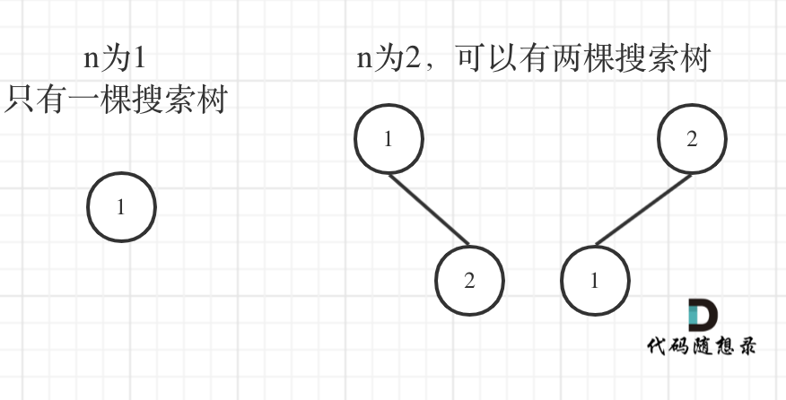

# 动态规划
## 动态规划五部曲
1. 确定dp数组及以及下标的含义
2. 确定递推关系
3. dp数组初始化
4. 确定遍历顺序
5. 举例推导dp数组  
## 注意事项
[斐波那契数列leetcode509](https://leetcode-cn.com/problems/fibonacci-number/)
```
class Solution {
    public int fib(int n) {
        if (n < 2) {
            return n;
        }
        // dp数组及dp[i]的含义表示当前的数值
        int[] dp = new int[n+1];
        // 初始化
        dp[0] = 0;
        dp[1] = 1;
        // 遍历方向
        for (int i = 2; i <= n; i++) {
            // 递推关系
            dp[i] = dp[i-2] + dp[i-1];
        }
        return dp[n];
    }
}
```

## 题目
[爬楼梯leetcode70](https://leetcode-cn.com/problems/climbing-stairs/)
思路：  
1. 数组表示目前爬到i楼需要的方法为dp[i]
2. 递推关系：1楼1种方式，2楼两种方式，3楼在1楼和2楼基础上推导，dp[i] = dp[i-1] + dp[i-2] 
3. 初始化，dp[1] = 1; dp[2] = 2;
4. 从前向后
```
class Solution {
    public int climbStairs(int n) {
        if (n < 3) {
            return n;
        }
        int[] dp = new int[n+1];
        dp[1] = 1;
        dp[2] = 2;
        for (int i = 3; i <= n; i++) {
            dp[i] = dp[i-1] + dp[i-2];
        }
        return dp[n];
    }
}
```
[最小花费爬楼梯leetcode746](https://leetcode-cn.com/problems/min-cost-climbing-stairs/)
思路：
1. 数组表示爬到i层时的最小花费为dp[i]
2. 递推关系： 只关心最小花费，不关心走了多少步 dp[i] = min(dp[i-1],dp[i-2]) + cost[i]
3. 初始化，dp[0]和dp[1]
4. 从前向后
5. 最后一步不花钱，因为倒数第二步和倒数第一步的最小值已经交钱了
```
class Solution {
    public int minCostClimbingStairs(int[] cost) {
        
        int n = cost.length;
        if (n < 2) {
            return cost[n];
        }
        int[] dp = new int[n];
        dp[0] = cost[0];
        dp[1] = cost[1];
        for (int i = 2; i < n; i++) {
            dp[i] = Math.min(dp[i-1],dp[i-2]) + cost[i];
        }
        // 最后一步不用花钱
        return Math.min(dp[n-1],dp[n-2]);
    }
}
```
[不同路径leetcode62](https://leetcode-cn.com/problems/unique-paths/)
思路:
1. 类似于找二叉树的叶子结点，用dfs，**超时**
2. 数组d[i][j]表示走到这(i,j)有几种不同路径
3. 递推关系：d[i][j] = d[i-1][j] + d[i][j-1]
4. 初始化：上边界和左边界没有上届和左界，且只有一条路，置为1
5. 返回到m，n时刚好是结果
```
class Solution {
    public int uniquePaths(int m, int n) {
        int[][] dp = new int[m][n];
        for (int i = 0; i < m; i++) {
            dp[i][0] = 1;
        } 
        for (int i = 0; i < n; i++) {
            dp[0][i] = 1;
        }
        for (int i = 1; i < m; i++) {
            for (int j = 1; j < n; j++) {
                dp[i][j] = dp[i-1][j] + dp[i][j-1];
            }
        }
        return dp[m-1][n-1];
    }
}
```
[有遮挡不同路径leetcode63](https://leetcode-cn.com/problems/unique-paths-ii/)
思路：
1. d[i][j]表示走到(i,j)有几种路径
2. 递推关系：当该点为障碍，跳过；dp[i][j] = dp[i-1][j] + dp[i][j-1];
3. 初始化：如果边界出现，则边界该位置之后的都不可到达，全为1
```
class Solution {
    public int uniquePathsWithObstacles(int[][] obstacleGrid) {
        int m = obstacleGrid.length;
        int n = obstacleGrid[0].length;
        int[][] dp = new int[m][n];
        for (int i = 0; i < m; i++) {
            if (obstacleGrid[i][0] == 1) {
                break;
            }
            dp[i][0] = 1;
        }
        for (int i = 0; i < n; i++) {
            if (obstacleGrid[0][i] == 1) {
                break;
            }
            dp[0][i] = 1;
        }
        for (int i = 1; i < m; i++) {
            for (int j = 1; j < n; j++) {
                if (obstacleGrid[i][j] == 1) {
                    continue;
                }
                dp[i][j] = dp[i-1][j] + dp[i][j-1];
            }
        }
        return dp[m-1][n-1];
    } 
}
```
[整数拆分leetcode343](https://leetcode-cn.com/problems/integer-break/)   
思路：
1. dp[i]表示拆分i所得到的最大乘积
2. 递推公式：将一个整数i分成两份的乘积，为j x (i-j), j 属于1~i-1  
            将一个整数拆分成多份的乘积，只需要将i-j继续拆分，即 j x dp[i-j];因此当j固定，dp[i] = max(jx(i-j),max(j x (i-j),j x dp[i-j])) 
3. 遍历顺序，j应该从1~i-1;
4. 初始化，dp[2] = 2;
```
class Solution {
    public int integerBreak(int n) {
        int [] dp = new int[n+1];
        dp[2] = 1;
        for (int i = 3; i <= n; i++) {
            int curmax = 0;
            for (int j = 1; j < i; j++) {
                curmax = Math.max(curmax, Math.max(j * (i-j), j * dp[i-j]));
            }
            dp[i] = curmax;
        }
        return dp[n];
    }
}
```
[不同的二叉搜索树leetcode96](https://leetcode-cn.com/problems/unique-binary-search-trees/)
思路：


元素1为头结点搜索树的数量 = 右子树有2个元素的搜索树数量 * 左子树有0个元素的搜索树数量

元素2为头结点搜索树的数量 = 右子树有1个元素的搜索树数量 * 左子树有1个元素的搜索树数量

元素3为头结点搜索树的数量 = 右子树有0个元素的搜索树数量 * 左子树有2个元素的搜索树数量  

dp[3] = dp[2]Xdp[0] + dp[1]Xdp[1] + dp[0]Xdp[2]
1. dp[i]表示i个结点包含的二叉搜索树的数量
2. 递推公式：dp[i] += dp[j-1]Xdp[i-j] 
3. 初始条件：dp[0] = 1;(防止变为0) dp[1] = 1;
4. 遍历方向，从前往后，j从1~i;
## 背包问题
  
基础背包问题：
有n件物品和一个最多能背重量为w 的背包。第i件物品的重量是weight[i]，得到的价值是value[i] 。每件物品只能用一次，求解将哪些物品装入背包里物品价值总和最大。  
### 二维dp数组01背包
1. 确定dp数组及下标的含义  
   
    **dp[i][j] 表示从下标为[0~i]的物品中任意取，放进背包容量为j的背包，价值总和最大**为多少  

    
2. 确定递推公式  
   每次都有两种情况：放或不放入背包，不放 = 上一次的状态；放入时，背包需要留出这个物品i的容量才可以放物品i

   背包不放物品：d[i][j] = dp[i-1][j]; 即背包大小为j时，背包里无法放入物品，因此和上一次相同   

   放物品i:dp[i-1][j-weight[i]]为背包容量为j-weight[i]的时候不放物品i的最大价值；  

   当加入物品i时，dp[i-1][j-weight[i]]+value[i]\(物品i的价格) 即为背包放入i时的最大价值   

   状态转移方程 dp[i][j] = max(dp[i-1][j], dp[i-1][j-weight[i]] + value[i]);
3. 初始化  
   ***初始化一定要和dp数组的定义吻合，否则递推公式会乱***   

      

   如果背包容量为0，背包总价值肯定为0   

   根据状态转移方程，状态i由i-1推到出来，因此i=0的时候一定要初始化   

   dp[0][j],即i为0，存放编号0的物品的时候，各个背包容量的存放的最大价值  

   因此，当j<weight[0]的时候，dp[0][j] = 0, 因为背包放不下物品0；  
   当j >= weight[0]时，dp[0][j] = value[0];    

```
for (int j = 0; j < weight[0]; j++) {
    dp[0][j] = 0;
}
for (int j = weight[0]; j <= bagweight; j++>) {
    dp[0][j] = value[0];
}
```
   其他下标初始化，由递推公式可知，dp[i][j]是从左上方数值推导出来的，因此其他下标什么数值都可以。统一设置为0。  

   
   
4. 遍历方向：
   两个方向，物品和背包重量   
   一般先遍历物品，再遍历背包重量  
```
for (int j = 0; j <= bagweight; j++) {
    for (int i = 1; i < weight.size(); i++) {
        if (j < weight[i]) {
            dp[i][j] = dp[i-1][j];
        } else {
            dp[i][j] = Math.max(dp[i-1][j], dp[i-1][j-weight[i]] + value[i]);
        }
    }
}
```
```
public static void main(string[] args){
    int[] weight = {1,3,4};
    int[] value = {15,20,30};
    int bagsize = 4;
    weightbagproblem(weight, value, bagsize);
}

public static void weightbagproblem(int[] weight, int[] value, int bagsize){
    int wlen = weight.length;
    int value0 = 0;

    // 定义dp数组，dp[i][j]表示背包容量为j时，前i个物品获得的最大价值
    int[][] dp = new int[wlen+1][bagsize+1];

    // 初始化，背包容量为0时，能获得的价值都为0
    for (int i = 0; i <= wlen; i++) {
        dp[i][0] = value0;
    }

    // 遍历顺序，先遍历物品，再遍历背包容量
    for (int i = 1; i < wlen; i++) {
        for (int j = 1; j <= bagsize; j++) {
            if (j < weight[i-1]) {
                dp[i][j] = dp[i-1][j]; 
            } else {
                dp[i][j] = Math.max(dp[i-1][j], dp[i-1][j-weight[i-1]] + value[i-1]);
            }
        }
    }

    for (int i = 0; i <= wlen; i++>) {
        for (int j = 0; j < bagsize; j++>) {
            System.out.print(dp[i][j] + " ");
        }
        System.out.print("\n");
    }
}
```
### 滚动数组01背包
1. dp数组的定义  
   **dp[j]表示容量为j的背包，所背的物品价值最大为dp[j]**
2. 一维数组的递推公式  
   dp[j] = max(dp[j],dp[j-weight[i]]+value[i])
3. 一维数组初始化  
    dp[0] = 0;容量为0，价值为0; dp数组在推导的时候取价值最大的数，初始将非0的设置为0
4. 一维数组遍历方式  
   **先物品后背包**  
   **背包从后往前遍历**

```
for (int i = 0; i < weight.size(); i++) {  // 先遍历物品
    for (int j = bagweight; j >= weight[i]; j--) {  //背包从后往前遍历
        dp[j] = Math.max(dp[j], dp[j - weight[i]] + value[i]);
    }
}
```
```
public static void bagProblem(int[] weight, int[] value, int bagweight) {
    int wlen = weight.length;
    int[] dp = new int[bagweight + 1];
    for (int i = 0; i < wlen; i++) {
        for (int j = bagweight; j >= weight[i]; j--) {
            dp[j] = Math.max(dp[j],dp[j-weight[i]] + value[i]);
        }
    }
}
```
---
[分割等和子集leetcode416](https://leetcode-cn.com/problems/partition-equal-subset-sum/)  

给定一个只包含正整数的非空数组。是否可以将这个数组分割成两个子集，使得两个子集的元素和相等。

注意: 每个数组中的元素不会超过 100 数组的大小不会超过 200

示例 1: 输入: [1, 5, 11, 5] 输出: true 解释: 数组可以分割成 [1, 5, 5] 和 [11].

示例 2: 输入: [1, 2, 3, 5] 输出: false 解释: 数组不能分割成两个元素和相等的子集.

#### 思路：  
- 背包的体积为sum / 2  
- 背包要放入的商品（集合里的元素）重量为 元素的数值，价值也为元素的数值  
- 背包如果正好装满，说明找到了总和为 sum / 2 的子集。  
- 背包中每一个元素是不可重复放入。（01背包）
#### 背包思路：
1. dp[j]表示，容量为j的背包，背包里子集总和为dp[j]
2. 递推公式：dp[j] = Math.max(dp[j],dp[j-nums[i]] + nums[i])
3. 初始化：dp[0] = 0;
4. 遍历顺序，先元素再背包
```
class Solution {
    public boolean canPartition(int[] nums) {
        int[] dp = new int [10001];
        int sum = 0;

        for (int i = 0; i < nums.length; i++) {
            sum += nums[i];
        }

        if (sum % 2 == 1) { //  如果总和是奇数，肯定不能均分
            return false;
        }
        int target = sum / 2;

        for (int i = 0; i < nums.length; i++) {  // 先元素
            for (int j = target; j >= nums[i]; j--) { // 倒序背包
                dp[j] = Math.max(dp[j],dp[j-nums[i]] + nums[i]);
            }
        }

        if (dp[target] == target) {
            return true;
        }else {
            return false;
        }
    }
}
```
[最后一块石头的重量|| leetcode1049](https://leetcode-cn.com/problems/last-stone-weight-ii/)  
#### 思路：
尽量把石头分成重量相同的两堆，相撞完后，剩下的石头最小  
把所有的石头分成target = sum / 2 和 sum - dp[target]  
相撞之后剩下的最小的石头重量为(sum - dp[target] - dp[target])
#### 五步
1. 定义：dp[j] 表示j重量的背包最多能背dp[j]重量的石头
2. 递推公式：dp[j] = Math.max(dp[j],dp[j-stones[i]] + stones[i])
3. 初始化：最大容量就是所有的石头的重量和30X1000；dp[0] = 0;
4. 遍历方式：先石头后背包
```
class Solution {
    public int lastStoneWeightII(int[] stones) {
        int[] dp = new int[1501];
        int sum = 0;

        for (int i : stones) {
            sum += i;
        }
        int target = sum /2;

        for (int i = 0; i < stones.length; i++) {
            for (int j = target; j >= stones[i]; j--) {
                dp[j] = Math.max(dp[j], dp[j-stones[i]] + stones[i]);
            }
        }

        return (sum - dp[target]) - dp[target];
    }
}
```

[目标和leetcode494](https://leetcode-cn.com/problems/target-sum/)  
#### 思路  
1. 明显可以看到数组可以分成左右两部分，left + right = sum; left - right = target;  
2. left - (sum - left) = target ——> left = (target+sum)/2;
3. 问题转化成从nums中找到和为left的组合（装满容量left的背包，有几种装法）
#### 动态规划模式
1. 数组：dp[j]表示填满j这么大的背包，有dp[j]种方式
2. 递推公式： dp[j] = dp[j] + dp[j - nums[i]]
   填满容量为j-nums[i]的背包有dp[j-nums[i]]种方法   
例如：dp[j]，j 为5，  
已经有一个1（nums[i]） 的话，有 dp[4]种方法 凑成 dp[5]。  
已经有一个2（nums[i]） 的话，有 dp[3]种方法 凑成 dp[5]。  
已经有一个3（nums[i]） 的话，有 dp[2]中方法 凑成 dp[5]  
已经有一个4（nums[i]） 的话，有 dp[1]中方法 凑成 dp[5]  
已经有一个5 （nums[i]）的话，有 dp[0]中方法 凑成 dp[5]  
那么凑整dp[5]有多少方法呢，也就是把 所有的 dp[j - nums[i]] 累加起来。  
3. 初始化：dp[0] = 1; 装满容量为0的只需要0件物品。
4. 遍历方向
   先物品，后背包
求装满背包有几种方法，递推公式为dp[j] = dp[j] + dp[j-nums[i]];

```
class Solution {
    public int findTargetSumWays(int[] nums, int target) {
        int sum = 0;
        for (int i : nums) {
            sum += i;
        }
        
        if ((target + sum) % 2 == 1) { //不存在背包不是整数
            return 0;
        }
        if (Math.abs(target) > sum) {
            return 0;
        }

        int bagsize = (target + sum) / 2; // 背包容量

        // 定义dp数组
        int[] dp = new int[bagsize + 1];
        // 初始化：背包容量为0。就一种
        dp[0] = 1;
        // 遍历方向
        for (int i = 0; i < nums.length; i++) {
            for (int j = bagsize; j >= nums[i]; j--) {
                dp[j] = dp[j] + dp[j - nums[i]];
            }
        }
        return dp[bagsize];
        
    }
}
```
[一和零leetcode474](https://leetcode-cn.com/problems/ones-and-zeroes/)
#### 思路
1. str数组中的元素是物品，每个物品都是一个；
2. m和n代表背包，两个维度的背包
#### dp流程
1. dp[i][j] 表示最多有i个0和j个1的strs的最大子集的大小为dp[i][j]
2. 递推关系：**字符串的zeroNum和oneNum相当于物品的重量（weight[i]），字符串本身的个数相当于物品的价值（value[i]）**  
   
    dp[i][j] 可以由前一个strs里的字符串推导出来，strs里字符串有zeroNum个0，oneNum个1;  
    dp[i][j]可以是dp[i-zeroNum][j-oneNum] + 1;  
    dp[i][j] = Math.max(dp[i][j], dp[i - zeroNum][j - oneNum] + 1); 
3. dp[i][j] = 0;
4. 遍历顺序，先物品后背包。
```
class Solution {
    public int findMaxForm(String[] strs, int m, int n) {
        int[][] dp = new int[m+1][n+1];

        dp[0][0] = 0;

        
        for (String str : strs) {
            // 先遍历物品，求出各自物品的重量
            int zeroNum = 0;
            int oneNum = 0;
            for (char c : str.toCharArray()) {
                if (c == '0') {
                    zeroNum++;
                } else {
                    oneNum++;
                }
            }
            for (int i = m; i >= zeroNum; i--) { // 遍历背包
                for (int j = n; j >= oneNum; j--) {
                    dp[i][j] = Math.max(dp[i][j], dp[i-zeroNum][j-oneNum] + 1);
                }
            }
        }
        return dp[m][n];
    }
}
```
## 完全背包
有N件物品，每件物品的重量为weight[i]，每件物品的价格为value[i]。背包的最大重量为W。**每件物品都是无限的（可以放入背包多次）**，求解将哪些物品放入背包物品价值总和最大。  

结论：（与01背包相比）
1. 完全背包物品和背包遍历时不区分先后顺序
2. 遍历背包顺序时不需要倒着遍历
3. 01背包和完全背包唯一不同就是体现在遍历顺序  
4. - 如果求组合数就是外层for循环遍历物品，内层for遍历背包
   - 如果求排列数就是外层for遍历背包，内层for循环遍历物品

```
private static void testCompletePack() {
    int[] weight = {1, 3, 4};
    int[] value = {15, 20, 30};
    int bagweight = 4;
    int[] dp = new int[bagweight + 1];

    for (int i = 0; i < weight.length; i++) { // 遍历物品
        for (int j = weight[i]; j <= bagweight; j++) { // 遍历背包容量
            dp[j] = Math.max(dp[j], dp[j - weight[i]] + value[i]);
        }
    }

    for (int maxValue : dp) {
        System.out.println(maxValue + " ");
    }
}
```

[零钱兑换 || leetcode518](https://leetcode-cn.com/problems/coin-change-2/)
#### 思路
1. 因为每一种硬币的种类有无限多，所以肯定是完全背包
2. dp[j] 表示凑齐总金额，有dp[j]种方式
3. dp[j] 可以由dp[j - coins[i]]推导出来，**dp[j] = dp[j] + dp[j-coins[i]]**
4. 初始化，dp[0] = 0;
5. 遍历方向：**因为强调的是组合数，所以先物品，后背包**

```
class Solution {
    public int change(int amount, int[] coins) {

        int[] dp = new int[amount + 1];//背包数量+1

        dp[0] = 1; // 初始化，金额为0时，有一种情况，什么都不装
        for (int i = 0; i < coins.length; i++) {
            for (int j = coins[i]; j <= amount; j++) {
                dp[j] = dp[j] + dp[j - coins[i]];
                System.out.print(dp[j]);
            }
        }
        return dp[amount];
    }
}
```

[组合总和leetcode377](https://leetcode-cn.com/problems/combination-sum-iv/)
#### 思路
1. 可重复，完全背包；求的是排列，先背包，后元素
2. dp[j] 表示从nums中取数组合成j的组合种类数为dp[j]
3. 状态转移方程：dp[j] = dp[i] + dp[nums[i]]
4. 初始化，dp[0] = 0;
5. 遍历方向：先背包后元素
```
class Solution {
    public int combinationSum4(int[] nums, int target) {

        int[] dp = new int[target+1]; // 背包容量为target+1
        dp[0] = 1;
        for (int j = 0; j <= target; j++) { // 先背包
            for (int i = 0; i < nums.length; i++) {  // 再元素
                if (j >= nums[i]) {   // 背包足够，才能放下
                    dp[j] = dp[j] + dp[j-nums[i]];
                }
            }
        } 
        return dp[target];
    }
}
```

[爬楼梯进阶](https://leetcode-cn.com/problems/climbing-stairs/)
#### 题目
一步一个台阶，两个台阶，三个台阶，.......，直到 m个台阶。问有多少种不同的方法可以爬到楼顶呢？
#### 思路
1. 完全背包，其中每次跨的台阶数是物品，楼顶就是背包
2. dp[j]表示爬到j楼总共有dp[j]种方式
3. 转移方程：dp[j] = dp[j] + dp[j-i]
4. 初始化，dp[0] = 1;
5. 遍历方向：排列问题，所以先背包后物品
```
int[] dp = new int[target+1];

dp[0] = 1;

for (int j = 0; j <= target; j++) { // 先背包
    for (int i = 0; i <= m; i++) {  // 后物品
        if (i <= j) {
            dp[j] = dp[j] + dp[i-j];
        }
    }
}

return dp[n];
```
[单词拆分leetcode139](https://leetcode-cn.com/problems/word-break/)
1. 单词可以重复使用——>完全背包问题 ——> 单词是物品，字符串是背包
2. dp[j]表示字符串长度为j时，dp[j] = true 表示可以拆分为1个或多个字典里出现的单词
3. 递推公式为，如果dp[j] == true,且[j,i]区间的字串在字典里，那dp[i]一定为true
4. 初始化 dp[0] = true;
5. 遍历方向：排列组合都可以
```
class Solution {
    public boolean wordBreak(String s, List<String> wordDict) {
        boolean[] dp = new boolean[s.length() + 1];
        dp[0] = true;
        for (int i = 1; i <= s.length(); i++) {  // 遍历背包
            for (int j = 0; j < i; j++) { // 遍历背包里的物品 字符串（j,i）
                if (wordDict.contains(s.substring(j,i)) && dp[j]) {
                    dp[i] = true;
                }
            }
        }
        return dp[s.length()];
    }
}
```
```
// 回溯版
 public boolean backtrack(String s, Set<String> wordDictSet, int startIndex, int[] memory) {
        // 递归终止条件
        if (startIndex >= s.length()) {
            return true;
        }

        if (memory[startIndex] != 0) {
            return memory[startIndex] == 1 ? true : false;
        }

        // 横向遍历
        for (int i = startIndex; i < s.length(); i++) {
            String word = s.substring(startIndex, i + 1);
            if (wordDictSet.contains(word) && backtrack(s, wordDictSet, i+1, memory)) {
                memory[startIndex] = 1;
                return true;
            }
        }
        memory[startIndex] = -1;
        return false;
    }

    public boolean wordBreak(String s, List<String> wordDict) {
        int[] memory = new int[s.length()];
        Set<String> wordDictSet = new HashSet<>(wordDict);
        return backtrack(s, wordDictSet, 0, memory);
    }
```
### 打家劫舍
[打家劫舍leetcode198](https://leetcode-cn.com/problems/house-robber/)
#### 思路
1. dp[i] 表示偷i家以内的房屋，最大收益为dp[i]
2. 明显dp[i] 与dp[i-2] + nums[i]和dp[i-1]相关，因此 dp[i] = Math.max(dp[i-2] + nums[i],dp[i-1])
3. 初始化：dp[0] = nums[0]; dp[1] = Math.max(nums[0],nums[1])
4. 遍历方向，从前往后。
```
class Solution {
    public int rob(int[] nums) {
        if (nums.length == 0) return 0;
        if (nums.length == 1) return nums[0];

        int[] dp = new int[nums.length];

        dp[0] = nums[0];
        dp[1] = Math.max(nums[0],nums[1]);

        for (int i = 2; i < nums.length; i++) {
            dp[i] = Math.max(dp[i-2] + nums[i], dp[i-1]);
        }

        return dp[nums.length - 1];
    }
}
```

[打家劫舍2(环形)leetcode213](https://leetcode-cn.com/problems/house-robber-ii/)

1. 如上图所示，如果成环，包括三种情况。第一种不包含首尾，另外两种只包含首或者尾
```
class Solution {
    public int rob(int[] nums) {
        if (nums.length == 0) return 0;
        if (nums.length == 1) return nums[0];

        int res1 = robrange(nums, 0, nums.length - 2); // 看好坐标
        int res2 = robrange(nums, 1, nums.length - 1);
        return Math.max(res1,res2);

    }
    
    public int robrange(int[] nums, int start, int end) {
        if (start == end) return nums[start];

        int[] dp = new int[nums.length];
        dp [start] = nums[start];
        dp [start + 1] = Math.max(nums[start], nums[start + 1]);
        
        for (int i = start+2; i <= end; i++) {   // 从start+2 ——> end
            dp[i] = Math.max(dp[i-1], dp[i-2] + nums[i]);
        }
        return dp[end];
    }
}
```

[打家劫舍3(树形) leetcode337](https://leetcode-cn.com/problems/house-robber-iii/)
#### 思路
1. 要不偷左右孩子，要不偷该节点
2. 因为要知道左右孩子，所以应该使用后序遍历
3. 树形动态规划
#### 动规思路
1. 每个结点都有两种状态，偷或者不偷
2. 递归函数的参数及返回值 dp为长度为2的数组，下标0为不偷该结点的最大金额；下表1为偷该结点的最大金额。
3. 终止条件， 当前节点为空
4. 遍历顺序：
    - left = rob(curr.left);
    - right = rob(curr.right);
5. 单层逻辑：
    - 偷当前结点，就不能偷孩子： int val1 = curr.val + left[0] + right[0];
    - 不偷当前结点，偷孩子权衡偷还是不偷：int val2 = Math.max(left[0], left[1]) + Math.max(right[0], right[1]);
    - return Math.max(val1, val2); 

```
// 暴力递归+记忆化
class Solution {
    Map<TreeNode, Integer> map = new HashMap<>();
    public int rob(TreeNode root) {
        if (root == null) return 0;

        // 记忆化,把遍历过的存到map中
        if (map.containsKey(root)) {
            return map.get(root);
        }

        // 取父节点和孙子结点
        int money = root.val;
        if (root.left != null) {
            money += rob(root.left.left) + rob(root.left.right);
        }
        if (root.right != null) {
            money += rob(root.right.left) + rob(root.right.right);
        }

        // 取儿子结点
        int money2 = rob(root.left) + rob(root.right);
        int res = Math.max(money,money2);

        // 存储遍历过的结点，一定是root和res
        map.put(root, res);
        return res;
    }
}
```
```
public int rob(TreeNode root) {
        int[] res = dp(root);
        return Math.max(res[0],res[1]);
    }

    public int[] dp(TreeNode root) {
        int[] res = new int[2];
        if (root == null) {
            return res;
        }

        int[] left = dp(root.left);
        int[] right = dp(root.right);
        
        //不选当前，选孩子
        res[0] = Math.max(left[0],left[1]) + Math.max(right[0],right[1]);
        // 选当前结点，不选孩子结点
        res[1] = root.val + left[0] + right[0];
        return res;
    }
```
### 买股票
[买卖一支股票](https://leetcode-cn.com/problems/best-time-to-buy-and-sell-stock/)
- 贪心算法，收益 = price[3] - price[1] = (price[3] - price[2]) + (price[2] - price[1]) 因此只关心每天的增量
- 动态规划
1. dp数组：dp[i][0]表示第i天持有股票时的现金总和;  
           dp[i][1]表示第i天卖出后的现金总和。
2. 递推公式：**持有并不等于买入，不持有也不等于卖出**
   1. 第i天持有股票：dp[i][0]取决于第i-1天所持股票和当天是否选择买入  
   dp[i][0] = Math.max(dp[i-1][0], -prices[i]);
   1. 第i天不持有股票：dp[j][1]取决于第i-1天卖出还是第i天卖出  
    dp[i][1] = Math.max(dp[i-1][1], prices[i] + dp[i-1][0]);
3. 初始化：dp[0][0] = -prices[0]; dp[0][1] = 0;
4. 遍历顺序，从前往后
```
class Solution {
    public int maxProfit(int[] prices) {

        int n = prices.length;
        int res = 0;
        int[][] dp = new int[n][2];

        dp[0][0] = -prices[0];
        dp[0][1] = 0;

        for (int i = 1; i < n; i++) {
            // 持有股票后的现金总和，肯定是越大越好
            dp[i][0] = Math.max(dp[i-1][0], -prices[i]);
            // 卖出后当前持有的现金总和，也是越大越好
            dp[i][1] = Math.max(dp[i-1][1], dp[i-1][0] + prices[i]);
            
        }
        return dp[n-1][1];
    }   
}
```
[买卖多支股票](https://leetcode-cn.com/problems/best-time-to-buy-and-sell-stock-ii/)
- 贪心算法跟之前一样
- 动态规划主要体现在递推公式的不同
   1. dp[i][0]表示第i天持有的股票时存在的现金：  
   前一天没卖，昨天跟今天的一样 dp[i-1][0];  
   前一天卖了，今天又买了的持有 dp[i-1][1] - prices[i];
   2. dp[i][1] 表示第i天卖出股票后的现金：  
   前一天不持有股票，跟前一天一样。 dp[i-1][0];  
   前一天持有股票： dp[i-1][0] + prices[i]
```
class Solution {

    /*
    // 贪心
    public int maxProfit(int[] prices) {
        if (prices.length == 1) {
            return 0;
        }
        int sum = 0;
        for (int i = 0; i < prices.length - 1; i++) {
            int count = prices[i+1] - prices[i];
            if (count >= 0) {
                sum += count;
            }
        }
        return sum;
    }
    */

    public int maxProfit(int[] prices) {
        int n = prices.length;
        int[][] dp = new int[n][2];

        dp[0][0] = -prices[0];
        dp[0][1] = 0;

        for (int i = 1; i < n; i++) {
            // 持有时的现金
            dp[i][0] = Math.max(dp[i-1][0], dp[i-1][1] - prices[i]);
            // 卖出后的现金
            dp[i][1] = Math.max(dp[i-1][1], dp[i-1][0] + prices[i]);
            
        }
        return dp[n-1][1];
    }   
}
```
[最多完成两笔交易股票](https://leetcode-cn.com/problems/best-time-to-buy-and-sell-stock-iii/)
- 最多完成两次交易，意味着可以买卖一次，买卖两次和不买卖
- dp数组以及下标  
  0：不操作  
  1：第一次买入  
  2：第一次卖出  
  3：第二次买入  
  4：第二次卖出  
  dp[i][j]表示第i天状态j所持有的最大金额。
  dp[i][0] = dp[i-1][0];    
  dp[i][1] = Math.max(dp[i-1][0] - prices[i], dp[i-1][1]);  
  dp[i][2] = Math.max(dp[i-1][1] + prices[i], dp[i-1][2]);
  dp[i][3] = Math.max(dp[i-1][2] - prices[i], dp[i-1][3]);
  dp[i][4] = Math.max(dp[i-1][3] + prices[i], dp[i-1][4]);
- 初始化  
  dp[0][0] = 0; dp[1][0] = -prices[0];  dp[0][2] = 0; dp[0][3] = -prices[0]; dp[4][0] = 0;
- 遍历顺序：从前往后
```
class Solution {
    public int maxProfit(int[] prices) {
        int n = prices.length;
        int[][] dp = new int[n][5];

        dp[0][0] = 0;
        dp[0][1] = -prices[0];
        dp[0][2] = 0;
        dp[0][3] = -prices[0];
        dp[0][4] = 0; 

        for (int i = 1; i < n; i++) {
            dp[i][0] = dp[i-1][0];    
            dp[i][1] = Math.max(dp[i-1][0] - prices[i], dp[i-1][1]);  
            dp[i][2] = Math.max(dp[i-1][1] + prices[i], dp[i-1][2]);
            dp[i][3] = Math.max(dp[i-1][2] - prices[i], dp[i-1][3]);
            dp[i][4] = Math.max(dp[i-1][3] + prices[i], dp[i-1][4]);
        }
        return dp[n-1][4];
    }
}
```
[最多完成K次交易的股票](https://leetcode-cn.com/problems/best-time-to-buy-and-sell-stock-iv/)  
- 由上可知，买卖股票具有一定的规律性，除了0，总是在奇数的时候买入，偶数的时候卖出
- dp[i][j]表示第i天在状态j时持有的最大金额为dp[i][j];
- 奇数买入，

```
class Solution {
    public int maxProfit(int k, int[] prices) {
        int n = prices.length;
        int[][] dp = new int[n][2*k + 1];

        if (n == 0) return 0; 
        // 初始化
        dp[0][0] = 0;
        // 奇数初始化为-prices[0]
        for (int i = 1; i < k*2; i += 2) {
            dp[0][i] = -prices[0];
        }

        for (int i = 1; i < n; i++) {
            for (int j = 0; j < k*2 - 1; j += 2) {
                // 奇数买入，等于上一次买入的和上一次卖出这次买入的最大值
                dp[i][j+1] = Math.max(dp[i-1][j+1],dp[i-1][j] - prices[i]);
                // 偶数卖出，等于上一次卖出的和上一次没有卖出这次卖出的最大值
                dp[i][j+2] = Math.max(dp[i-1][j+2], dp[i-1][j+1] + prices[i]);
            }
        }
        return dp[n-1][k*2];
    }
}
```

[买卖股票包含冷冻期](https://leetcode-cn.com/problems/best-time-to-buy-and-sell-stock-with-cooldown/)
1. dp[i][j] 在第i天第j中状态下所持有的股票金额。
2. j的四个状态：  
 
买入股票状态一：
- 前一天就是买入股票状态dp[i][0] = dp[i-1][0];
- 保持卖出股票状态：  
  - 操作一：昨天为冷冻期，dp[i][0] = dp[i-1][3] - prices[i];  
  - 操作二：昨天为卖出股票状态非冷冻期，dp[i][0] = dp[i-1][1] - prices[i];  
dp[i][0] = Math.max(dp[i-1][0], Math.max(dp[i-1][3], dp[i-1][1]) - prices[i])         

达到保持股票卖出状态二dp[i][1]   
- 操作一：前一天是状态二： dp[i][1] = dp[i-1][1]
- 操作二：前一天是冷冻期：dp[i][1] = dp[i-1][3]   
dp[i][1] = Math.max(dp[i-1][1], dp[i-1][3]);  
  
达到今天就卖出股票状态三dp[i][2]  

- 操作一：卖出之前一定是持有股票状态dp[i][0]； 
dp[i][2] = Math.max(dp[i-1][0] + prices[i])   

达到冷冻期状态：dp[i][3] = dp[i-1][2]

```
class Solution {
    public int maxProfit(int[] prices) {
        int n = prices.length;
        int[][] dp = new int[n][4];

        dp[0][0] = -prices[0];

        for (int i = 1; i < n; i++) {
            // 达到买入股票状态
            dp[i][0] = Math.max(dp[i-1][0],Math.max(dp[i-1][1],dp[i-1][3]) - prices[i]);

            // 达到保持卖出股票状态
            dp[i][1] = Math.max(dp[i-1][1], dp[i-1][3]);

            // 今天卖出股票
            dp[i][2] = dp[i-1][0] + prices[i]; 

            // 冷冻期
            dp[i][3] = dp[i-1][2];
        }
        return Math.max(dp[n-1][3], Math.max(dp[n-1][1], dp[n-1][2]));
    }
}
```