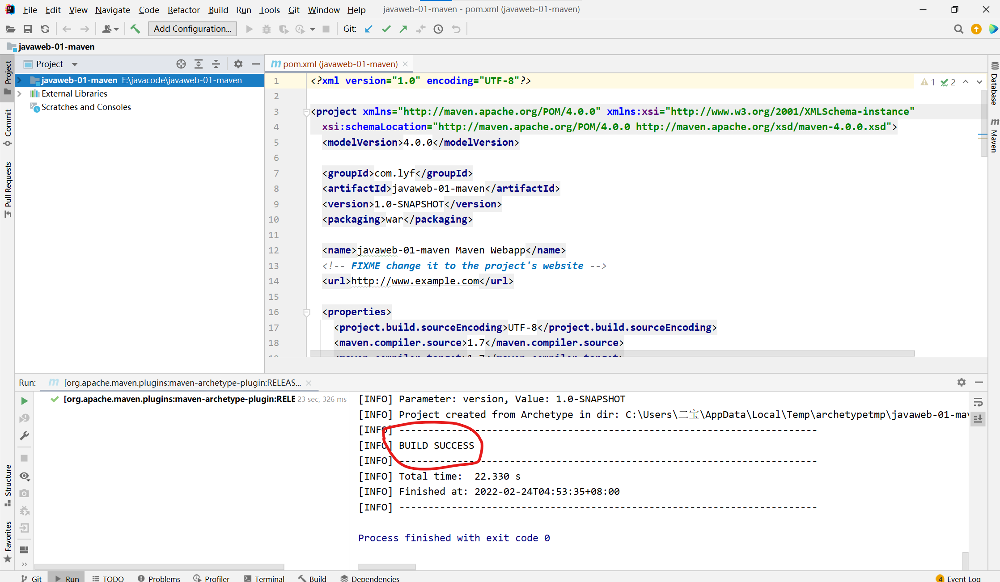
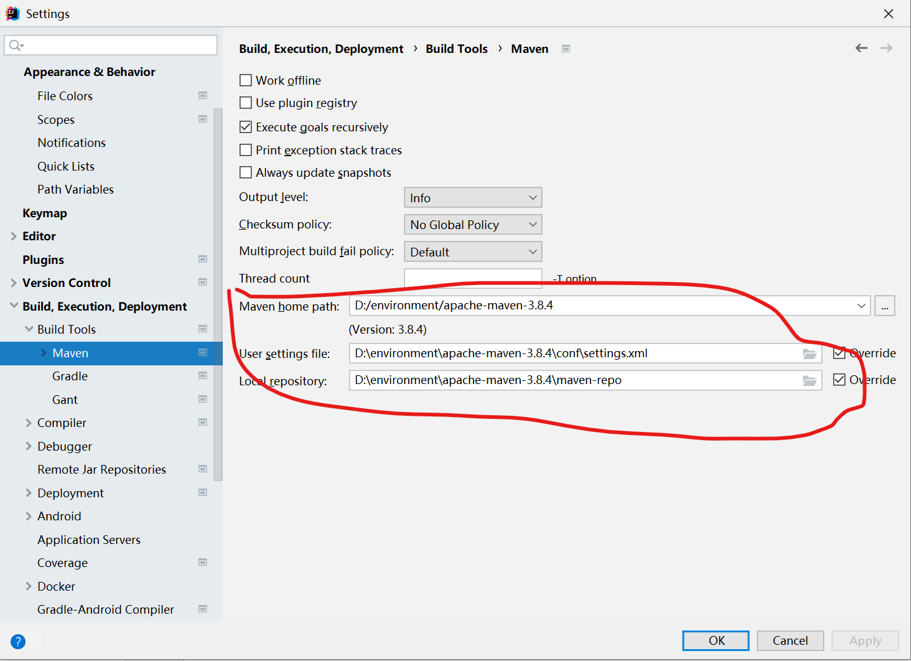
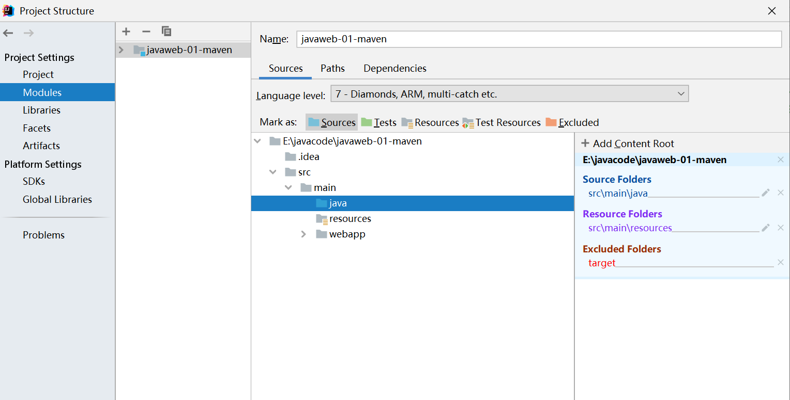

# Maven（架构管理工具）
软件项目管理和理解工具，基于项目对象模型（POM）的概念。   
核心思想：**约定大于配置**。
- 有约束不要违反
- 规定怎么去编写Java代码   

**电脑所有的环境都放在同一个文件夹下，方便管理。**
## Maven配置
1. 配置maven，下载后找到conf中的setting.xml,找到mirrors，配置翻墙镜像链接,国内使用阿里云镜像
2. 配置环境变量
    - M2_HOME ——> D:\environment\apache-maven-3.8.4\bin
    - MAVEN_HOME ——>  D:\environment\apache-maven-3.8.4
3. 配置用户变量path ——> 增加%MAVEN_HOME%\bin

4. 建立本地仓库：localRepository
    - bin下新建maven-repo
    - setting.xml中添加本地仓库中添加该地址 
  ``` <localRepository>D:\environment\apache-maven-3.8.4\maven-repo</localRepository>```
## 在idea中使用maven 
1. 创建一个maven项目  web项目





标记文件夹两种方式：


2. 创建一个普通的maven项目
    - java放代码
    - recourses放配置文件
    - 绿色java测试


## 在idea中配置tomcat

## pom.xml文件