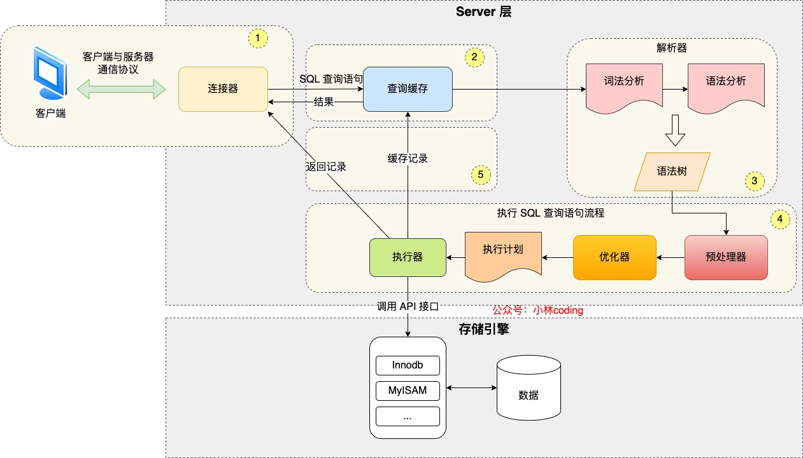
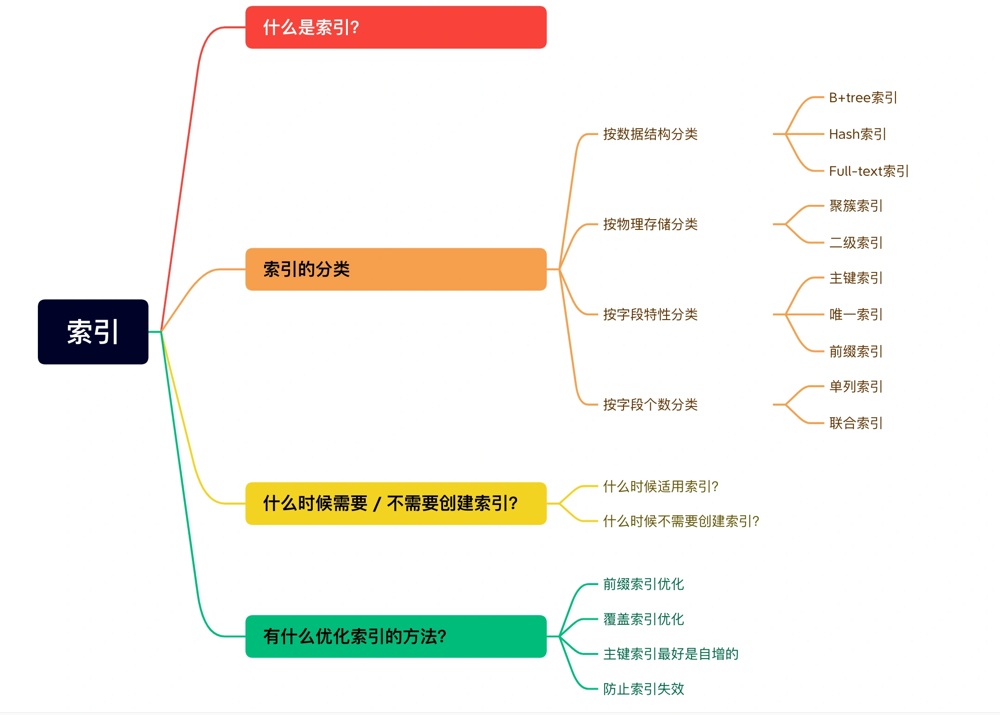
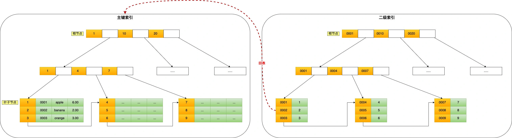
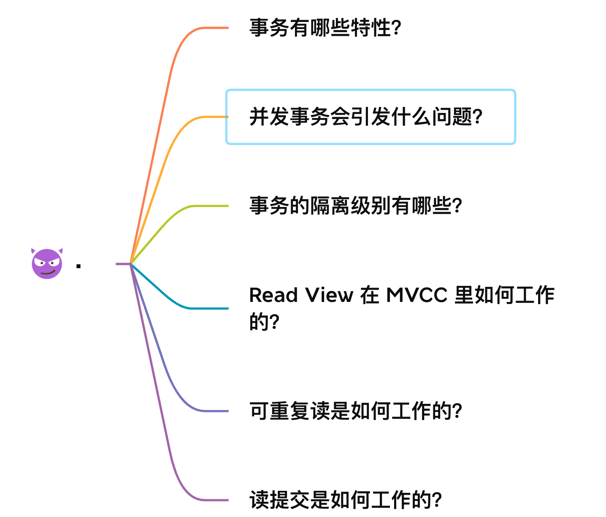
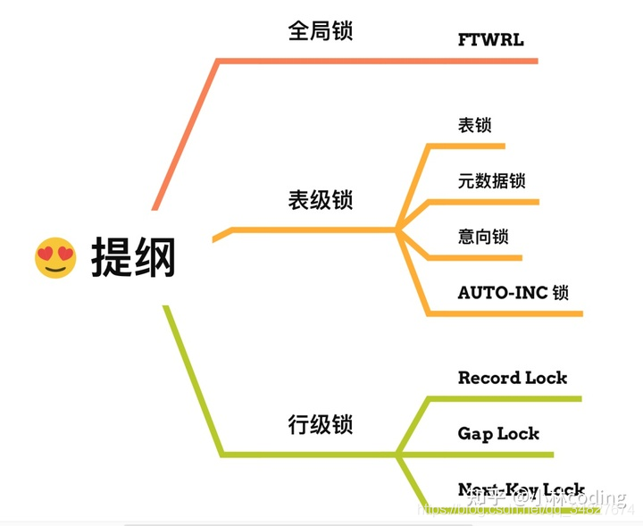

# mySql
## sql语句
### 四种插入 INSERT INTO ... VALUES...
1. 普通插入（全字段）：**INSERT INTO** table_name **VALUES** (value1, value2, ...)
2. 普通插入（限定字段）：INSERT INTO table_name (column1, column2, ...) VALUES (value1, value2, ...)
3. 多条一次性插入：INSERT INTO table_name (column1, column2, ...) VALUES (value1_1, value1_2, ...), (value2_1, value2_2, ...), ...
4. 从另一个表导入：INSERT INTO table_name SELECT * FROM table_name2 [WHERE key=value]
- **replace** 可以代替insert，代表如果发现表中有此数据，则先删除再插入
### 修改 UPDATE ... SET ...
1. 设置为新值：**UPDATE** table_name **SET** column_name=new_value [ column_name2=new_value2] [WHERE column_name3=value3]
2. timestampdiff(minute,start_time,submit_time)计算时间差以分钟形式
### 创建表
1. 不存在再创建
2. 根据 列名 字段属性 约束（主键，外键，非空，唯一，默认等） 增加注释comment
3. **注意最后一行不加,**
4. 从一张表中复制表结构：CREATE TABLE tb_name **LIKE** tb_name_old
5. 从一张表查询结果创建表：CREATE TABLE tb_name **AS** SELECT * FROM 
```
create Table
    if not exists user_info_vip (  
        id int primary key auto_increment comment '自增ID',
        uid int UNIQUE not null comment '用户ID',
        nike_name varchar(64) comment '昵称',
        achievement int default 0 comment '成就值',
        level int comment '用户等级',
        job varchar(32) comment '职业方向',
        register_time datetime default current_timestamp comment '注册时间'
    ) CHARACTER
SET
    utf8 COLLATE utf8_general_ci;


CREATE TABLE
[IF NOT EXISTS] tb_name -- 不存在才创建，存在就跳过
(column_name1 data_type1 -- 列名和类型必选
  [ PRIMARY KEY -- 可选的约束，主键
   | FOREIGN KEY -- 外键，引用其他表的键值
   | AUTO_INCREMENT -- 自增ID
   | COMMENT comment -- 列注释（评论）
   | DEFAULT default_value -- 默认值
   | UNIQUE -- 唯一性约束，不允许两条记录该列值相同
   | NOT NULL -- 该列非空
  ], ...
) [CHARACTER SET charset] -- 字符集编码
[COLLATE collate_value] -- 列排序和比较时的规则（是否区分大小写等）

```
### 修改表 ALTER...ADD/CHANGE/MODIFY
1. alter
```

alter table user_info add school varchar(15) after level;
增加列在某列之后
alter table 增加的表格 add 增加列的名称 数据类型 位置(after level 在level 之后)

alter table user_info change job profession varchar(10);
更换列的名称及数据类型
alter table user_info change 原列名 修改列名 修改数据类型

alter table user_info modify achievement int(11) default 0;
更改数据类型
alter table 表名 modify 修改列名称 数据类型 默认值等
```
### 删除表 DROP 
1. DROP TABLE [IF EXISTS] 表名1 [, 表名2]
2. **TRUNCATE tb_name** 表清空，重记计数器，不删除表结构的定义（ddl）
3. drop table 直接删除表结构，约束，触发器，索引等（ddl数据库定义语言）
4. delete 一行一行删除信息，删除后在日志记录，如有触发器会触发（dml数据库操作语言）
5. 在需要一行一行删除，或者要删除的表中存在外键约束时，用truncate不能激活触发器。
### 创建和删除索引 CREATE UNIQUE FULLTEXT INDEX ... ON 
1. 最左匹配原则
2. 索引失效  !=, like，大量重复数据
3. 为什么创建索引 查询快，空间换时间
4. 索引的种类 主键索引，聚簇索引，hash索引，二级索引，联合索引
```
CREATE 
  [UNIQUE -- 唯一索引
  | FULLTEXT -- 全文索引
  ] INDEX index_name ON table_name -- 不指定唯一或全文时默认普通索引
  (column1[(length) [DESC|ASC]] [,column2,...]) -- 可以对多列建立组合索引  
```
### 聚合分组 
#### 聚合count sum avg 
- round(,1) 保留一位小数
- 求除最高和最低的平均数 ```(sum(score) - max(score) - min(score)) / (count(score) - 2)```
- join ... using ... 等于 join ... on (a.id = b.id)
- [on和where的区别](https://blog.csdn.net/qq_35101027/article/details/78288279)

```
select tag, difficulty, round((sum(score) - max(score) - min(score)) / (count(score) - 2), 1) as clip_avg_score
from exam_record
join examination_info using (exam_id)
where tag = 'SQL' and difficulty = 'hard';
```
- ```distinct case when score is not null then exam_id else null end``` case when 判断 then a else b end
```
select count(uid) as total_pv, 
count(submit_time) as complete_pv, 
count(distinct case when score is not null then exam_id else null end) as complete_exam_cnt
from exam_record;
```
```
select min(e_r.score) as min_score_over_avg
from exam_record e_r join examination_info e_i
on e_r.exam_id = e_i.exam_id
where e_i.tag = 'SQL'
and score >= (select avg(score) 
                from exam_record 
                join examination_info using(exam_id)
                where tag = 'SQL')
```
#### 分组
```
select date_format(submit_time, '%Y%m') as month, 
round((count(distinct uid, date_format(submit_time,'%Y%m'))) / count(distinct uid),2) as avg_active_days, 
count(distinct uid) as mau
from exam_record
where submit_time is not null
and year(submit_time) = 2021
group by date_format(submit_time, '%Y%m')
```
### 多表查询

### 窗口函数

---
## 执行一条sql的流程

  1. 和服务器创建连接，tcp三次握手
  2. 查询缓存，只有select才缓存。缓存key是sql，value是查询结果
  3. 解析Sql,词法解析和语法解析，构建语法树
  4. 执行sql，预处理——>优化（是否使用索引）——>执行
  5. 从innodb中读取数据，返回给客户端
---
## 数据库三范式
第一范式：强调的是列的原子性，即数据库表的每一列都是不可分割的原子数据项。
第二范式：要求实体的属性完全依赖于主关键字。所谓完全 依赖是指不能存在仅依赖主关键字一部分的属性。
第三范式：任何非主属性不依赖于其它非主属性。
BC范式：
## SQL约束
- NOT NULL   
- UNIQUE  
- PRIMARY KEY  
- FOREIGN KEY  
- CHECK
## MySql中varchar和char的区别
char是定长的字段varchar变长的
## [in和exists的区别](https://blog.csdn.net/jinjiniao1/article/details/92666614)
- 关联查询中使用
- exists对外表用loop逐条查询，每次查询都会查看exists的条件语句，逐一对比（**如果A表有n条记录，那么exists查询就是将这n条记录逐条取出，然后判断n遍exists条件。**）
- in查询相当于多个or条件的叠加(**in 的子条件查询只能返回一个结果**)
- 当子查询结果集很大，而外部表较小的时候，exists的loop循环会更好
- 当子查询结果集很小，而外部表很大的时候，in的外表索引优势会更好
## 索引
- 索引就是目录，为了更快的查询。
- 维护索引耗时，并且占用物理空间
### 索引分类
  
- 数据结构分类
  
    1. b+ Tree
    多叉树，叶子节点存放数据，非叶子节点存放索引，每个节点里的数据按照主键顺序存放的。
    2. B+ tree 和 B Tree： B+ Tree只在叶子节点存储数据，并且采取双链表连接，方便查找；读写代价低，IO读写数降低，因为只查索引，
    3. B树因为其分支结点同样存储着数据，我们要找到具体的数据，需要进行一次中序遍历按序来扫；B树因为其分支结点同样存储着数据，我们要找到具体的数据，需要进行一次中序遍历按序来扫
    4. Hash，可以快速定位，但没有顺序，适合等值查询，不适合范围查询，可能存在哈希碰撞
    5. 二叉树，高度不均匀，IO代价大
    6. 红黑树，高度随数据增加，IO代价大
- 物理存储：聚簇索引（主键索引）和二级索引（辅助索引）
    1. 聚簇索引的叶子节点存放的实际数据，所有完整的用户记录都存放在叶子结点
    2. 非聚簇索引叶子结点存放的是主键（行号），一般要回表查询
    3. 二级索引叶子结点存放的是主键值
    4. 所以，在查询时使用了二级索引，如果查询主键后，回表再检查聚簇索引，查询数据。
- 字段特性
    1. 前缀索引。字段特别长的时候
- 字段个数 联合索引
    1. 多个字段同时建立索引，按照顺序挨个使用
    2. 最左前缀原则。where子句中使用最频繁的一列放在最左边。 mysql会一直向右匹配直到遇到范围查询(>、<、between、like)就停止匹配。
---
### 索引使用场景
- 什么时候适用索引？
    1. 字段有唯一属性，商品编号之类的；
    2. 经常使用where
    3. 经常使用group by 和 order by
- 什么时候不使用索引？
    1. 大量重复数据，男女
    2. where group by order by 用不到的数据
    3. 表数据太少
    4. 频繁更新，维护修改
- 索引失效
    1. 使用!=失效
    2. 类型不一致
    3. 计算引起失效
    4. or导致失效
### 为什么采用B+Tree作为索引？
MySql的数据是持久化的，保存在磁盘，磁盘IO非常耗时，因此需要满足以下两个条件：
1. IO越少越好
2. 高效查单值，高效查区间
**二分查找树——>自平衡二叉树——>B树——>B+树**
- 树的高度等于操作IO的次数
- 二分查找树
    1. 插入的元素越多，树越高
    2. 每次插入最大的元素，变成链表
- AVL
    1. 左子树和右子树高度相差不能超过1
    2. 高度难以解决
- B树
    1. 多叉树
    2. 范围查询需要中序遍历
- B+树
    1. 叶子节点（最底部的节点）才会存放实际数据（索引+记录），非叶子节点只会存放索引；
    2. 所有索引都会在叶子节点出现，叶子节点之间构成一个有序链表；
    3. 非叶子节点的索引也会同时存在在子节点中，并且是在子节点中所有索引的最大（或最小）。
    4. 非叶子节点中有多少个子节点，就有多少个索引；
### 最左前缀规则
- 最左优先，在创建多列索引时，要根据业务需求，where子句中使用最频繁的一列放在最左边。 mysql会一直向右匹配直到遇到范围查询(>、<、between、like)就停止匹配
- 比如a = 1 and b = 2 and c > 3 and d = 4 如果建立(a,b,c,d)顺序的索引，d是用不到索引的，如果建立(a,b,d,c)的索引则都可以用到，a,b,d的顺序可以任意调整
### 为什么使用自增主键？
- 结合B+Tree的特点，自增主键是连续的，在插入过程中尽量减少页分裂，即使要进行页分裂，也只会分裂很少一部分。并且能减少数据的移动，每次插入都是插入到最后
### 创建索引的规则
- 最左匹配原则
- 选择区分度高的列作为索引
### 索引失效
- 使用!=
- 运算符
- or语句```SELECT * FROM `user` WHERE `name` = '张三' OR height = '175';```
- 模糊搜索```SELECT * FROM `user` WHERE `name` LIKE '%冰';```
### count性能
**count(*) = count(1) > count(主键) > count(字段)**
统计不为null的记录数
## 事务

原生的mysql引擎mylsam不支持事务，innoDB支持事务。   
### 四大特性
    1. 原子性 一个事务中的操作，要不全部完成，要不全部不完成   **回滚日志**
    2. 一致性 事务操作前后满足完整性约束，数据库保持一致性
    3. 隔离性 多个事务使用同一个数据，并发事务有各自的数据空间    **MVCC多版本并发控制**
    4. 持久性 修改完是持久的，系统故障也不会变    **重做日志**
### 隔离性
#### 三种隔离问题
同时处理多个事务出现脏读，不可重复读，和幻读问题。
- 脏读：一个事务读到了另一个未提交事务修改过的数据
- 不可重复读：在一个事务里，前后两次读取到的数据不一样，A在读B时，B做了修改并提交，A读的几次出现不一致的情况
- 幻读：在一个是事务里多次查询符合某个查询条件的记录数量，如果前后两次的记录数量不一致，发生了幻读
- 严重性排序：脏读>不可重复读>幻读
#### 四种隔离级别 mysql支持可重读
- 读未提交：事务未提交，变更被其他事务看到
- 读提交：提交事务后，才能被其他事务看到    **解决脏读**
- 可重复读：一个事务执行过程中看到的数据，始终是一致的。（innoDB默认的隔离级别） **解决不可重复读**
- 串行化：加读写锁   **解决幻读**
- 隔离水平排序：串行化 > 可重复读 > 读提交 > 读未提交
- 要解决脏读现象，就要升级到「读提交」以上的隔离级别；要解决不可重复读现象，就要升级到「可重复读」的隔离级别。
#### mysql事务日志
- redo log（重做日志）指事务中操作的任何数据，比如更新的数据，将最新的数据备份到磁盘
  Redo log is used to ensure the persistence of transactions, that is, D in acid.
- undo log（回滚日志）指事务开始之前，在操作任何数据之前，首先将需操作的数据备份到一个地方，记录数据的老版本
  The meaning of undo log is to ensure the atomicity of database transactions. in order to roll back，Undo log usually exists in the form of logical log. 
#### 隔离级别实现方式（MVCC:undo log, version chaining, read view）
- 在MVCC多版本控制协议中的实现可重复读级别
- 读提交和可重复读，通过read view实现，read view 相当于数据快照，定格当时的数据。
- **读提交的是每个语句执行前生成read view； 可重复读是在事务开始前生成一个read view。**
- 「读提交」隔离级别是在每个 select 都会生成一个新的 Read View，也意味着，事务期间的多次读取同一条数据，前后两次读的数据可能会出现不一致，因为可能这期间另外一个事务修改了该记录，并提交了事务。
- 「可重复读」隔离级别是启动事务时生成一个 Read View，然后整个事务期间都在用这个 Read View，这样就保证了在事务期间读到的数据都是事务启动前的记录。

- 「幻读」Innodb 引擎为了解决「可重复读」隔离级别使用「当前读」而造成的幻读问题，就引出了 next-key 锁，就是记录锁和间隙锁的组合。**锁的是索引。**
## 锁

### 锁的种类
- 全局锁  使整个数据库处于只读状态  **应用于全库逻辑备份**
- 表级锁  
    1. 表锁   **限制读写**
    2. 元数据锁  
    3. 意向锁
    4. AUTO-INC锁 
- 共享锁: 又叫做读锁。 当用户要进行数据的读取时，对数据加上共享锁。**共享锁可以同时加上多个**。

- 排他锁: 又叫做写锁。 当用户要进行数据的写入时，对数据加上排他锁。**排他锁只可以加一个，他和其他的排他锁，共享锁都相斥**。
### 隔离级别和锁的关系
- 在Read Uncommitted级别下，读取数据不需要加共享锁，这样就不会跟被修改的数据上的排他锁冲突

- 在Read Committed级别下，读操作需要加共享锁，但是在语句执行完以后释放共享锁；

- 在Repeatable Read级别下，读操作需要加共享锁，但是在事务提交之前并不释放共享锁，也就是必须等待事务执行完毕以后才释放共享锁。

- SERIALIZABLE 是限制性最强的隔离级别，因为该级别锁定整个范围的键，并一直持有锁，直到事务完成。
### 大表优化
- 限定查询数据范围
- 读/写分离，主库读，副库写
- 分库分表，垂直分（把一个有很多字段的表给拆分成多个表，或者是多个库上去。每个库表的结构都不一样，每个库表都包含部分字段，按照访问频率），水平分（就是把一个表的数据给弄到多个库的多个表里去，但是每个库的表结构都一样，只不过每个库表放的数据是不同的，所有库表的数据加起来就是全部数据）
## 细节
- INTERSECT运算符比较结果集两个查询并返回是由两个查询输出的不同行
## 数据库引擎
- 如果要提供提交、回滚、崩溃恢复能力的事物安全（ACID兼容）能力，并要求实现并发控制，**InnoDB**是一个好的选择
- 如果数据表主要用来插入和查询记录，则MyISAM引擎能提供较高的处理效率(全文索引)
