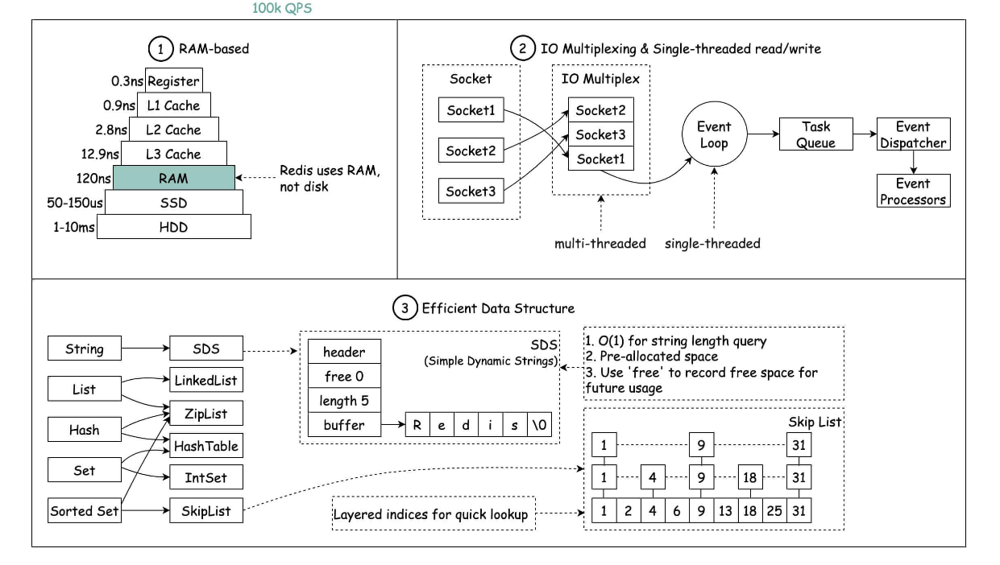

# redis
## NoSql
1. 分布式集群时，不同的登录对象的session到不同的服务器（存到客户端，cookie；复制多个session；NoSql数据库）
2. 解决IO压力。频繁查询的数据放到缓存数据库中。内存读取。
3. 特点：Key-value存储，不遵循SQL， 不支持ACID, 高性能
4. 应用场景：高并发读写（秒发），海量读写，扩展性
5. 不能使用：事务，结构化查询
6. 常见的NoSql数据库： redis， mongdb
## 大数据存储
1. 行式数据库
2. 列式数据库
3. 图关系数据库
## redis的[安装](https://blog.csdn.net/Clozzz/article/details/127650582)
1. 安装vm虚拟机，选自定义，在最后一步删除打印机添加centOS
2. 安装centOS7环境，其中联网配置参考[ip配置](https://blog.csdn.net/u013189545/article/details/122786956?utm_medium=distribute.pc_relevant.none-task-blog-2~default~baidujs_baidulandingword~default-0-122786956-blog-126057062.pc_relevant_3mothn_strategy_and_data_recovery&spm=1001.2101.3001.4242.1&utm_relevant_index=3)
3. 安装gcc
4. centOS中编辑文件用i；保存文件，编辑模式下，先用esc，然后用：，再用wq
```
[liyongfeng@localhost ~]$ su
密码：
[root@localhost liyongfeng]# ls
otp  公共  模板  视频  图片  文档  下载  音乐  桌面
[root@localhost liyongfeng]# cd otp
[root@localhost otp]# ls
redis-6.2.8.tar.gz
[root@localhost otp]# tar -zxvf redis-6.2.8.tar.gz
```
5. 文件互传（两个系统之间）[fz](https://blog.csdn.net/xylitolz/article/details/104425582)
6. 下载[redis](https://www.bilibili.com/read/cv17297124)
7. redis图形化桌面客户端[github](https://github.com/lework/RedisDesktopManager-Windows/releases)
8. 开启多个redis[实例,不同端口](http://t.zoukankan.com/jint-php7-p-12002609.html)
9.  开启相同端口的连接，在客户端
```
备份redis.conf配置文件
cp /etc/redis/redis.conf /etc/redis/redis_6380.conf
修改redis_6380.conf
vim /etc/redis/redis_6380.conf
修改端口号  port
修改     pidfile
修改     logfile
修改     dbfilename
dir /data/redis/redis6389 #指定数据存储路径
启动6380端口实例
redis-server /etc/redis/redis_6380.conf
找进程：ps -ef | grep redis
杀进程：kill -9 进程号
进入文件 cd /  eg. cd /usr/local/bin
进入客户端 redis-cli
退出客户端 exit
删除文件 rm -rf 
修改文件 mv
查看文件 vi
```

1. redis 的后台启动，保存redis.conf到etc文件，修改文件中dame
2. 后台启动方式 ```cd /usr/local/bin; redis-server /etc/redis.conf```

1. 常见操作
```
cd /文件  进入文件
ls  文件夹列表
退出表 exist
vim 编辑文件
查找 /
保存 先:再wq！
插入 i
```
## redis 相关
1. 端口6379
2. 单线程+多路IO复用


## 五大数据类型（String, List, Set, Hash, Zset）
### 一、redis key-value
```
keys * 存在哪些键
exists key
set key value
expire key 10 设置过期时间
select 切换数据库
dbsize 当前的key的数量
```
### 二、字符串String
1. String 二进制安全，可以包含任何数据，value最大为512M
2. String 的数据结构类似于ArrayList，不断扩容。
```
set: 设置相同key，覆盖原来value
get: 
append: 在该键的值后append，返回长度
strlen:
incr: 增
decr：减
incrby: 增步长数据
mset： 设置多个k-v
mget:
msetnx:
getrange: substring[]
serrange: 
setex key time value:


127.0.0.1:6379> flushdb
OK
127.0.0.1:6379> set k1 liyongfeng
OK
127.0.0.1:6379> set k2 zhangqian
OK
127.0.0.1:6379> get k1
"liyongfeng"
127.0.0.1:6379> append k1 222
(integer) 13
127.0.0.1:6379> get k1
"liyongfeng222"
127.0.0.1:6379> strlen k1
(integer) 13
127.0.0.1:6379> set k3 500
OK
127.0.0.1:6379> incr k3
(integer) 501
127.0.0.1:6379> get k3
"501"
127.0.0.1:6379> incrby k3 10
(integer) 511
```
### 三、列表（List）
1. 单键多值
2. 底层双向链表
3. 头尾操作很快
4. 常见命令
```
lpush: 从左边放
lrange:从左边取
lpop：
rpop: 值取完键不存在
lrange:
rpoplpush: 右边的出来，左边进去
lindex:


127.0.0.1:6379> lpush k1 v1 v2 v3 v4
(integer) 4
127.0.0.1:6379> lrange k1 0 -1
1) "v4"
2) "v3"
3) "v2"
4) "v1"
127.0.0.1:6379> rpush k2 v1 v2 v3
(integer) 3
127.0.0.1:6379> lrange k2 0 -1
1) "v1"
2) "v2"
3) "v3"
127.0.0.1:6379> lpop k1
"v4"
```
### 四、集合（set）
1. set是String类型的无序集合
2. 底层字典，哈希表
3. O1复杂度

```
sadd:
smembers:
sismember:成员
scard:个数
smove:
sinter:交集
sunion:并集
sdiff: 两个差集
127.0.0.1:6379> sadd k1 v1 v2 v3
(integer) 3
127.0.0.1:6379> smembers k1
1) "v3"
2) "v2"
3) "v1"
127.0.0.1:6379> sismember k1 v1
(integer) 1
127.0.0.1:6379> scard
(error) ERR wrong number of arguments for 'scard' command
127.0.0.1:6379> scard k1
(integer) 3
127.0.0.1:6379> srem k1 v1
(integer) 1
127.0.0.1:6379> srandmember k1 2
1) "v3"
2) "v2"

```

### 五、哈希（hash）
1. 键值对
2. Map<String, Object>
3. 用来存储对象

```
{id = 1, name = lyf, age = 20}
第一种： 
user:{id = 1, name = lyf, age = 20}
第二种： 
user:id 1; 
user:name lyf; 
user:age 20
第三种：
(key)user  (value) id:1, name:lyf, age:20 
```
```
hset:
hget:
hmset:
hexists:
hkeys:
hvals:

127.0.0.1:6379> hset user:1001 id 1
(integer) 1
127.0.0.1:6379> hset user:1001 name lyf
(integer) 1
127.0.0.1:6379> hset user:1001 age 20
(integer) 1
127.0.0.1:6379> hget user:1001 id
"1"
127.0.0.1:6379> hmset user:1003 id 3  name zq age 18
OK
```
### 六、有序集合（Zset）
1. 集合成员不可以重复
2. 每个成员有个评分，评分可以重复

```
zadd
zrange
zrangebyscore
zrank


127.0.0.1:6379> zadd topn 200 java 300 c++ 400 mysql 500 php
(integer) 4
127.0.0.1:6379> zrange topn 0 -1
1) "java"
2) "c++"
3) "mysql"
4) "php"
127.0.0.1:6379> zrangebyscore topn 300 500
1) "c++"
2) "mysql"
3) "php"
127.0.0.1:6379> zrangebyscore topn 300 500 withscores
1) "c++"
2) "300"
3) "mysql"
4) "400"
5) "php"
6) "500"
127.0.0.1:6379> zincrby topn 50 java
"250"
127.0.0.1:6379> zcount topn 200 300
(integer) 2
127.0.0.1:6379> zrank topn c++
(integer) 1
```

## redis 配置文件
1. /etc/redis.conf

## redis的发布和订阅
发布（pub）和订阅（sub）是一种消息通信模式。发布者server发送消息，订阅者client接收消息。
redis客户端可以订阅任意的频道。
```
subscribe channel1
publish channel1 hello
```

## redis 新的数据类型（Bitmaps, HyperLogLog, Geospatial）

### 一、Bitmaps:
进行位操作的字符串，数据量大时，对活跃用户量节约空间
```
setbit
bitcount
bittop and or no
```
### 二、HyperLogLog
页面访问量，pv(pageview)
基数问题：
mysql： distinct count
redis: hash, set, bitmaps
HyperLogLog
```
pfadd
pfcount 去重后的个数
pfmerge 合并
```
### 三、Geospatial
地图二维坐标
```
geoadd 增
geopos 读
geodist 距离
georadius 范围

127.0.0.1:6379> geoadd china:city 121.47 31.23 shanghai
(integer) 1
127.0.0.1:6379> geoadd china:city 114 29 chongqing
(integer) 1
127.0.0.1:6379> geopos china:city shanghai
1) 1) "121.47000163793563843"
   2) "31.22999903975783553"
127.0.0.1:6379> geodist china:city shanghai chongqing
"760099.4983"
127.0.0.1:6379> georadius china:city 110 30 1000 km
1) "chongqing"
```
## Jedis操作redis
加入jedis依赖
```
public class JedisDemo1 {

    public static void main(String[] args) {
        //创建jedis对象
        Jedis jedis = new Jedis("192.168.138.3",6379);

        // 测试
        String value = jedis.ping();
        System.out.println(value);
    }

    @Test
    public void demo1() {
        Jedis jedis = new Jedis("192.168.138.3",6379);
        jedis.set("name","lyf");
        String name = jedis.get("name");
        System.out.println(name);
    }
}
```
手机验证码：
1. 输入手机号，点击发送，随机生成6位验证码，2分钟有效
2. 输入验证码，点击验证，返回成功或失败
3. 每个手机号每天三次机会

```
1. random
2. 验证码放到redis，设置过期时间
3. redis中获取验证码，和输入比较
4. incr每次发送后+1，当大于2时，不能发送
```

```
public class PhoneCode {

    public static void main(String[] args) {
        // 模拟验证码
        verifyCode("15193042294");
        getRedisCode("15193042294", "330014");
    }
    // 生成6位验证码
    public static String getCode () {
        Random random = new Random();
        String code = "";
        for (int i = 0; i < 6; i++) {
            int rand = random.nextInt(10);
            code += rand;
        }
        return code;
    }

    // 每个手机发三次，验证码放到redis，设置过期时间
    public static void verifyCode (String phone) {
        // 连接redis
        Jedis jedis = new Jedis("192.168.138.3",6379);

        // 拼接发送
        // 手机发送次数key
        String countKey = "VerifyCode" + phone + ":count";
        String codeKey = "VerifyCode" + phone + ":code";

        // 每个手机每天发三次
        String count = jedis.get(countKey);
        if (count == null) {
            // 没有发送次数，第一次发送
            // 设置发送次数是1
            jedis.setex(countKey, 24*60*60, "1");
        } else if (Integer.parseInt(count) <= 2) {
            // 发送次数+1
            jedis.incr(countKey);
        } else if (Integer.parseInt(count) > 2) {
            // 发送次数警告
            System.out.println("今天发送次数超过三次已达上限");
            jedis.close();
            return;
        }

        // 发送验证码放到redis中
        String vcode = getCode();
        jedis.setex(codeKey, 120, vcode);
        jedis.close();
    }

    // 3. 验证码校验
    public static void  getRedisCode (String phone, String code) {

        // 从redis中获得验证码
        Jedis jedis = new Jedis("192.168.138.3",6379);
        String codeKey = "VerifyCode" + phone + ":code";
        String redisCode = jedis.get(codeKey);
        if (redisCode.equals(code)) {
            System.out.println("成功！");
        } else {
            System.out.println("失败！");
        }
        jedis.close();
    }
}
```

## Springboot 整合redis
## redis 事务和锁操作
redis的事务是一个单独的隔离操作：事务中所有命令序列化，按顺序执行。
redis的事务主要是串联多个命令，防止插队。
- 命令
  1. multi 开启事务组队，并不真正执行。如组队有错误，都不执行
  2. exeu 执行组队事务。如执行错误，只跳过该错误
  3. discard 放弃组队，不执行任何
    ```
    127.0.0.1:6379> multi
    OK
    127.0.0.1:6379(TX)> set k1 v1
    QUEUED
    127.0.0.1:6379(TX)> set k2 v2
    QUEUED
    127.0.0.1:6379(TX)> set k3 v3
    QUEUED
    127.0.0.1:6379(TX)> exec
    1) OK
    2) OK
    3) OK
    127.0.0.1:6379> keys *
    1) "k1"
    2) "k2"
    3) "k3"

    ```
- 事务冲突
  1. 悲观锁
    认为一定会发生冲突，每次操作前上锁
  2. 乐观锁
    每次操作前增加版本，修改后，版本号同步更新，每次检查版本号与数据库中的版本号。用于多读：抢票。

    ```
    1redis1:0>set balance 100
    "OK"
    1redis1:0>keys *
    1) "balance"
    1redis1:0>watch balance
    "OK"
    1redis1:0>multi
    "OK"
    1redis1:0>incrby balance 10
    "QUEUED"
    1redis1:0>exec
    1) "OK"
    2) "110"
    3) "OK"
    ```
    ```
    RESP.app Redis Console
    连接中...
    已连接。
    2redis2:0>watch balance
    "OK"
    2redis2:0>multi
    "OK"
    2redis2:0>incrby balance 30
    "QUEUED"
    2redis2:0>exec

    2redis2:0>
    ```
    对于余额balance而言，开启watch监视balance，当执行前，被其他事务改动，则该事务被打断。
    redis事务三特性：
    1. 单独隔离操作
    2. 没有隔离级别
    3. 不保证原子性

### 秒杀事务案例
难点： 商品库存每减1，秒杀成功者加1
```
1.判断用户和库存非空

2.连接redis

3.拼接key
    3.1 库存key
    3.2 秒杀成功用户key

4. 获取库存，如果为null，秒杀未开始
5.判断用户是否重复秒杀操作
6. 判断库存小于1，秒杀结束
7. 秒杀过程
    7.1 库存-1
    7.2 把秒杀成功的用户添加到清单里面

```
## Redis持久化操作
RDB（Redis DataBase）:在指定的时间间隔内将内存中的数据集快照写到硬盘
1. 创建子进程fork，
2. 数据同步到临时区域，
3. 然后将临时区域文件同步到硬盘中文件配置文件中找**dump.rdb** ```vim /etc/reids.conf```
写时复制技术
默认开启
```
stop-writes-on-bgsave-error yes : 关闭写入操作
rdbcompression yes ： 是否压缩
rdbchecksum yes ： 是否检查完整性
save: 写操作次数 save 1000 10 1000s以内至少有10个key发生变化，进行持久化
```
缺点： 最后持久化可能数据丢失
需要内存大，临时文件替换硬盘文件
AOF（Append Only File）：以日志的形式来记录每个写操作，记录每个写的指令（读不记录），只追加但不改写文件。
**appendonly.aof**
1. 客户端请求写命令被append到AOF缓存区
2. AOF缓冲区根据AOF持久化策略[always,everysec,no]同步到硬盘
3. 重启时，加载AOF文件，达到数据恢复
AOF文件可以恢复 ：```redis-check-aof --fix appendonly.aof```
```
默认不开启，开启后遵循aof形式,默认取appendonly.aof中数据
AOF同步频率设置：appendfsync always(每次写) everysec（每秒同步） no(交给操作系统)
AOF压缩操作：重写压缩操作Rewrite
重写条件
```
缺点：更多磁盘空间
## 主从复制
主机数据更新后根据配置和策略，自动同步到备机的机制master/server机制，**Master以写为主，Server以读为主**。
优点：
1. 读写分离
2. 容灾的快速恢复，一台server挂掉，切换另一个server（一主多从）
3. 集群（每个集里都是一主多从）防止主机挂掉

```
1. 创建myredis文件夹 mkdir /myredis 
2. 进入myredis文件夹，复制redis.conf配置文件到文件夹中
3. 配置一主两从，创建三个配置文件 redis6379.conf redis6380.conf redis6381.conf
4. 三个配置文件中写入内容 
include /myredis/redis.conf
pidfile /var/run/redis_6379.pid
port 6379
dbfilename dump6379.rdb

vi reids6379.conf 创建文件
pidfile /var/run/redis_6379.pid pid修改
include/myredis/redis.conf 引入公共部分
port 6379 修改端口号
dbfilename dump6379.rdb 修改rdb文件名
5. 启动三台redis
redis-server redis6380.conf
查看运行状况 
redis-cli -p 6379  
info replication
6. 从机执行 slaveof 主机ip 端口号
```
- 一主二仆
1. 当从服务器挂掉，再次启动，必须重新绑定主服务器，重新绑定后，从服务器复制主服务器的所有数据
2. 主服务器挂掉，从服务器还是认主服务器为大哥，主服务器重新启动后，还是主服务器
- 薪火相传
- 反客为主
  1. 主服务器挂掉，从服务器上位：手动```slave of no one```自动：哨兵模式
- 复制原理
  1. 从服务器连接到主服务器之后，从服务器向主服务器发送数据同步消息
  2. 主服务器接到从服务器同步消息，把主服务器数据进行持久化到rdb文件，把rdb文件发送到从服务器，从服务器拿到rdb文件进行读取
  3. 每次主服务器进行写操作后，和从服务器进行数据同步（主服务器）
- 哨兵模式（反客为主自动版）
  1. 创建文档 vi sentinel.conf
  2. 添加sentinel monitor mymaster 127.0.0.1 6379 1 1代表只需要1个哨兵同意就可以
  3. 启动哨兵 redis-sentinel sentinel.conf
  4. 主机挂掉，选举一个从机上位，主机再次上线，成为从机
  5. 选举规则：priority 值越小优先级越高，偏移量越高优先级越高
  6. 有复制延迟的缺点
## redis集群
容量不够，如何扩容？
并发写操作，redis如何分摊？   
- 无中心化集群 redis实现了对redis的水平扩容，即启动N个redis节点，将整个数据库分布存储到这N个节点中，每个节点存储总数据的1/N。
- 搭建集群
  1. 删除rdb文件```rm -rf dump63*```
  2. 制作6个实例 6379, 6380, 6381, 6389, 6390, 6391
```
include /myredis/redis.conf
pidfile /var/run/redis_6379.pid
port 6379
dbfilename dump6379.rdb
# 打开集群
cluster-enabled yes
# 配置文件名称
cluster-config-file nodes-6379.conf
# 失联时间
cluster-node-timeout 15000
```
  3. 复制其他五个redis  ```cp redis6379.conf redis6380.conf```
  4. 改其他配置中的参数```%s/6379/6380```
  5. 启动6个redis ```redis-server redis6379.conf```
  6. 将6个节点合成一个集群，进入安装redis环境的**src目录**```cd otp``` ```cd redis-6.2.8``` ``` cd src```
  7. 创建集群，用真实ip ```redis-cli --cluster create --cluster-replicas 1 192.168.138.3:6379 192.168.138.3:6380 192.168.138.3:6381 192.168.138.3:6389 192.168.138.3:6390 192.168.138.3:6391```   All 16384 slots covered.
    
  8. 集群方式连接```redis-cli -c -p 6379```
  9. 查看集群状态 ```cluster nodes```

要点
- slots 代表插槽。All 16384 slots covered.一个redis集群包含16384个插槽，每个主服务器有不同的插槽范围，集群先计算key所属插槽的范围，然后存到集群对应的某个主机
  
- 故障恢复
  1. 6379挂掉，6389成为master，如果6379恢复，则成为6389的slave
  
- 集群的优劣
  1. 优点：实现扩容，分摊压力，无中心配置
  2. 缺点：多键操作不支持，复杂
## redis应用问题
- 缓存穿透
    客户端访问服务器，先查redis缓存，查到返回，查不到访问数据库
    - 应用服务器压力变大了，大量请求过来，redis中大量的缓存查不到，导致一直访问数据库（缓存没起作用）
    - 例子：很多无效的url访问，redis中没有缓存，一直访问数据库（恶意攻击）
    - 解决方法：1.对空值做缓存，过期时间短 2.设置白名单 3. 采用布隆过滤器 4. 实时监控redis，设置黑名单
- 缓存击穿
    - 数据库访问压力瞬时增加，redis里并未出现key大量过期，redis正常运行。
    - 原因：redis的某个key过期，大量访问使用这个key
    - 解决方法：1. 预先设置redis热门数据， 2. 实时调整，调整key过期时间 3. 锁
- 缓存雪崩
  数据库压力变大，服务器崩溃
  - 原因：在极少的时间段，查询大量的key的集中过期情况
  - 解决方法：1. 构建多级缓存nginx + redis 2.使用锁或者队列 3.当快过期时，通知其他线程 4. 让缓存失效时间分散开。


# redis 面试问题
## redis为什么快？
1. 基于内存，访问速度快
2. 单线程事件循环和IO多路复用
3. 内置很多数据结构
  
## 为什么用redis？
1. 高性能：一些不经常变，但访问频率高的放到缓存中，直接读取缓存速度快
2. 高并发：直接操作缓存能够承受的数据库请求数量是远远大于直接访问数据库
## redis还可以做什么？
1. 分布式锁，基于 Redisson 来实现分布式锁
2. 限流，基于 Redisson 来实现分布式锁
3. 消息队列，利用redis自带的list
4. 排行榜，sorted set
## redis常用数据结构？
1. 5种基础数据结构：String, List, Set, Hash, Zset(有序集合)
2. 3种特殊数据结构：HyperLogLogs（基数统计）, Bitmap(位存储), Geospatial(地理位置)
## String存储对象还是Hash？
String存的是序列化后的，如果对象某些字段经常变，用Hash存每个字段
购物车用Hash，因为经常变
## Redis 给缓存数据设置过期时间有啥用？
1. 内存是有限的，没有过期会导致 out  of memory
2. Redis 中除了字符串类型有自己独有设置过期时间的命令 setex 外，其他方法都需要依靠 expire 命令来设置过期时间 。另外， persist 命令可以移除一个键的过期时间。
3. 业务场景需要某个数据仅仅存在一定的时间，例如验证码1min，用户登录token 1天等
## redis如何判断数据是否过期？
Redis 通过一个叫做过期字典（可以看作是 hash 表）来保存数据过期的时间。
## 过期的数据的删除策略了解么？
1. 惰性删除 ：只会在取出 key 的时候才对数据进行过期检查。这样对 CPU 最友好，但是可能会造成太多过期 key 没有被删除。
2. 定期删除 ： 每隔一段时间抽取一批 key 执行删除过期 key 操作。并且，Redis 底层会通过限制删除操作执行的时长和频率来减少删除操作对 CPU 时间的影响。
3. Redis 采用的是 定期删除+惰性/懒汉式删除。
## Redis 内存淘汰机制了解么？（MySQL 里有 2000w 数据，Redis 中只存 20w 的数据，如何保证 Redis 中的数据都是热点数据?）
1. 从已设置过期时间的数据集挑选最少使用的数据淘汰
2. 将要过期的数据淘汰
3. 任意淘汰
4. 内存不足时，移除最近最少使用的数据淘汰
## redis持久化机制
- RDB快照
- AOF只追加文件


  
