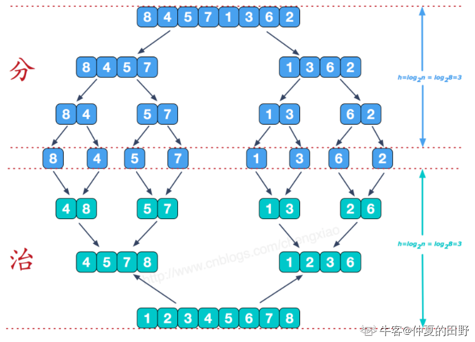
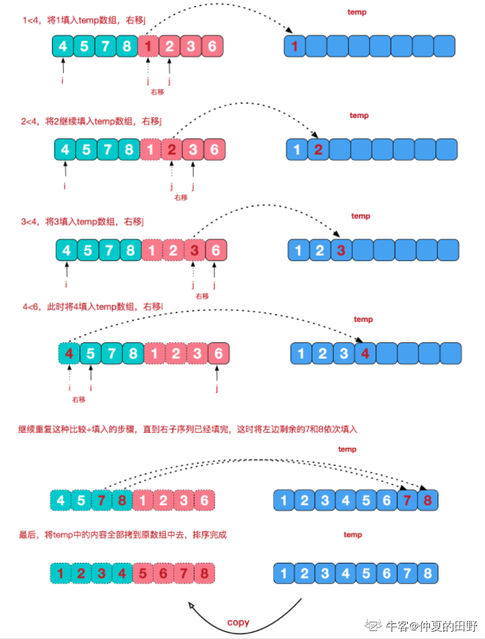

# 排序算法

- 堆排序和大根堆
- 优先队列分为大根堆和小根堆
- 大根堆：
```
PriorityQueue<Integer> q = new PriorityQueue<>((o1, o2)->o2.compareTo(o1));
q.offer();
q.poll();
```  

## 冒泡排序
```
public int[] MySort (int[] arr) {
    // write code here
    for (int i = 0; i < arr.length-1; i++) {  // 每一遍都会将最大的放在最后，也就是每次排一个值
        for (int j = 0; j < arr.length-i-1; j++) {
            if (arr[j] > arr[j+1]) {
                swap(arr, j, j+1);
            }
        }
    }
    return arr;   
}
public void swap(int[] arr, int i, int j) {
    int tmp;
    tmp = arr[i];
    arr[i] = arr[j];
    arr[j] = tmp;
}
```
## 快速排序

挑选一个基准值，将大于该基准的放在右边，小于该基准的放在左边，然后不断递归左右子区间直到排序完成。
1. 挑选基准值
2. 分割数组，找到分割点
3. 合并
```
public int[] MySort (int[] arr) {
    quickSort(arr, 0, arr.length-1);
    return arr;
}

public void quickSort(int[] arr, int left, int right) {
    if (left < right) {
        int pindex = partion(arr, left, right);
        quickSort(arr, left, pindex - 1);
        quickSort(arr, pindex+1, right);
    }
}

public int partion (int[] arr, int left, int right) {
    int pindex = arr[left];
    while (left < right) {
        while (left < right && arr[right] >= pindex) {
            right--;
        }
        swap(arr, left, right);
        
        while (left < right && arr[left] <= pindex) {
            left++;
        }
        swap(arr, left, right);
    }
    return left;
}

public void swap(int[] arr, int left, int right) {
    int temp = arr[left];
    arr[left] = arr[right];
    arr[right] = temp;
}
```


## 归并排序
思想：1. 递归划分整个区间为基本相等的左右两个区间 2. 合并两个有序区间    
特点：稳定排序，速度仅次于快速排序。O(nlogN) 空间复杂度：O(N)    
适用：总体无序，各子项相对有序的数列。 


```
public int[] MySort (int[] arr) {
    divide(arr, 0, arr.length-1);
    return arr;
}

public void divide(int[] arr, int start, int end) {
    if (start >= end) {
        return;
    }
    int mid = start + (end - start)/2;
    // 分: 分成相等的两块，且分到最后只有一个数
    divide(arr, start, mid);
    divide(arr, mid+1, end);
    // 治：中点划分成相等的两块，按大小添加
    merge(arr, start, mid, end);
}

public void merge(int[] arr, int start, int mid, int end) {
    // 临时数组，距离从start——>end
    int[] temp = new int[end-start+1];
    // 临时数据的下标
    int k = 0;
    // 两段的开始，从开始，哪个大就先放到前面
    int i = start, j = mid + 1;
    while (i <= mid && j <= end) {
        if (arr[i] > arr[j]) {
            temp[k++] = arr[j++];
        } else {
            temp[k++] = arr[i++];
        }
    }
    // 未添加的
    while (i <= mid) {
        temp[k++] = arr[i++];
    }
    
    while (j <= end) {
        temp[k++] = arr[j++];
    }
    //因为k已经定义，所以不需要再次定义
    for (k = 0; k < temp.length; k++) {
        arr[start+k] = temp[k];
    }
}
```
## 优先队列排序PriorityQueue
- 优先队列不遵循先入先出：
  1. 最大优先队列，无论入队顺序，当前最大的元素优先出队；
  2. 最小优先队列，无论入队顺序，当前最小的元素优先出队；
- 优先级队列，也叫二叉堆，堆
  1. 大顶堆，每个节点的值都大于或者等于它的左右子节点的值
  2. 小顶堆，每个节点的值都小于或者等于它的左右子节点的值

```
public int[] MySort (int[] arr) {
    PriorityQueue<Integer> queue = new PriorityQueue<>();
    for (int i = 0; i < arr.length; i++) {
        queue.add(arr[i]);
    }
    int newarr[] = new int[arr.length];
    for (int i = 0; i < arr.length; i++) {
        newarr[i] = queue.poll();
    }
    return newarr;
}
```


