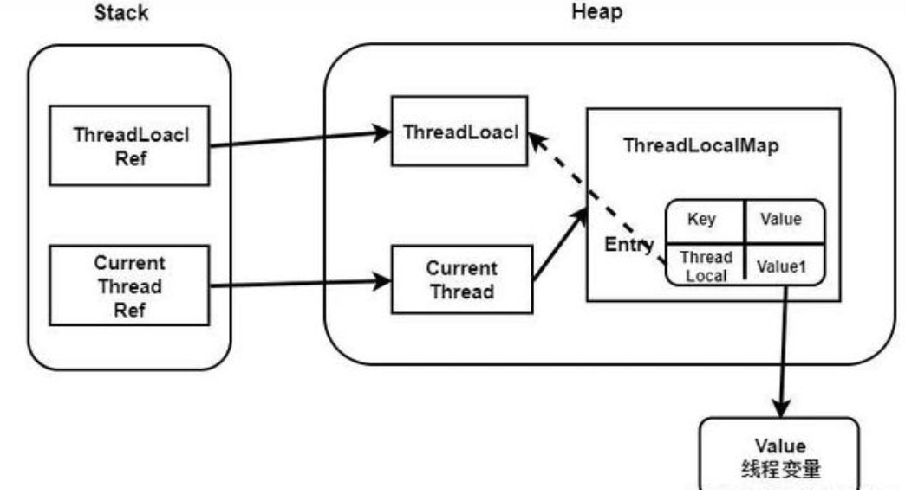

# SpringBoot project
## 项目问题
### maven依赖报红
删掉 pom文件中的 < dependencyManagement >
在内部的依赖不会马上到中央仓库中去下载jar包，而是在子工程引用的时候才会去下载jar包
## 常用注解
### bean
- Bean是被实例的、组装的、及被Spring容器管理的Java对象。
- Spring容器会自动完成Bean对象的实例化。
- 创建应用对象之间的协作关系的行为被称为：装配，这就是依赖注入的本质。
- bean由Spring中一个叫IoC的东西管理（IoC就是一个对象定义其依赖关系而不创建它们的过程。）
1. 一类是使用Bean，即是把已经在xml文件中配置好的Bean拿来用，完成属性、方法的组装；比如@Autowired , @Resource，可以通过byTYPE（@Autowired）、byNAME（@Resource）的方式获取Bean；
2. 一类是注册Bean,@Component , @Repository , @Controller , @Service , @Configration这些注解都是把你要实例化的对象转化成一个Bean，放在IoC容器中，等你要用的时候，它会和上面的@Autowired , @Resource配合到一起，把对象、属性、方法完美组装。
### 常用注解https://segmentfault.com/a/1190000025187511
#### @Autowired 
自动装配，按照byType方式进行bean匹配
@Resource是按照byName的方式进行bean的装配，J2EE的注解
#### @Configration, @Controller, @Service, @Repository
#### @SpringBootApplication, MapperScan, RestController, RequestMapping, PostMapping
## MVC三层架构
1. 实体层：model层：pojo类，表的字段，set，get方法
```
package com.lyf.blog.dao.pojo;

import lombok.Data;

@Data
public class Article {

    public static  int Article_TOP = 1;

    public static  int Article_Common = 0;

    private Long id;

    private String title;

    private String summary;

    private int commentCounts;

    private int viewCounts;

    /**
     * 作者id
     */
    private Long authorId;
    /**
     * 内容id
     */
    private Long bodyId;
    /**
     *类别id
     */
    private Long categoryId;

    /**
     * 置顶
     */
    private int weight = Article_Common;


    /**
     * 创建时间
     */
    private Long createDate;
}
```
2. mapper层：dao层：对数据库进行数据持久化操作。接口对数据库直接操作。与mybatis的xml文件映射
```
package com.lyf.blog.dao.mapper;

import com.baomidou.mybatisplus.core.mapper.BaseMapper;
import com.lyf.blog.dao.pojo.Article;

public interface ArticleMapper extends BaseMapper<Article> {
}
```
3. service层：业务处理逻辑，给controller层的类提供接口进行调用。具体实现再impl实现类中
```
package com.lyf.blog.service;

import com.lyf.blog.vo.Result;
import com.lyf.blog.vo.params.PageParams;

public interface ArticleService {
    /*
    * 分页查询文章列表*/
    Result listArticle(PageParams pageParams);
}
```
```
package com.lyf.blog.service.impl;

import com.baomidou.mybatisplus.core.conditions.query.LambdaQueryWrapper;
import com.baomidou.mybatisplus.extension.plugins.pagination.Page;
import com.lyf.blog.dao.mapper.ArticleMapper;
import com.lyf.blog.dao.pojo.Article;
import com.lyf.blog.service.ArticleService;
import com.lyf.blog.vo.ArticleVo;
import com.lyf.blog.vo.Result;
import com.lyf.blog.vo.params.PageParams;
import org.joda.time.DateTime;
import org.springframework.beans.BeanUtils;
import org.springframework.beans.factory.annotation.Autowired;
import org.springframework.stereotype.Service;

import javax.annotation.Resource;
import java.util.ArrayList;
import java.util.List;

@Service
public class ArticleServiceImpl implements ArticleService {
    @Autowired
    @Resource
    private ArticleMapper articleMapper;
    @Override
    public Result listArticle(PageParams pageParams) {
        /*
        分页查询，得到结果
        */
        Page<Article> page = new Page<>(pageParams.getPage(), pageParams.getPageSize());
        LambdaQueryWrapper<Article> queryWrapper = new LambdaQueryWrapper<>();
        //是否置顶排序，权重为1
        // 按照时间排序order by create_date desc
        System.out.println("nihao");
        queryWrapper.orderByDesc(Article::getWeight,Article::getCreateDate);

        System.out.println("不爱护");
        Page<Article> articlePage = articleMapper.selectPage(page, queryWrapper);
        List<Article> records = articlePage.getRecords();

        System.out.println(records);
        List<ArticleVo> articleVoList = copyList(records);
        return Result.success(articleVoList);
    }

    private List<ArticleVo> copyList(List<Article> records) {
        List<ArticleVo> articleVoList = new ArrayList<>();
        for (Article record: records) {
            articleVoList.add(copy(record));
        }
        return articleVoList;
    }

    private ArticleVo copy(Article article) {
        ArticleVo articleVo = new ArticleVo();
        BeanUtils.copyProperties(article,articleVo);
        articleVo.setCreateDate(new DateTime(article.getCreateDate()).toString("yyyy-MM-dd HH:mm"));
        return articleVo;
    }
}
```
4. controller层： 负责具体模块的业务流程控制，调用service，接收前端数据，对业务操作，并返回结果
Controller层一般都是写接口提供给前端或者后端其他服务使用的，一般后端的接口都是写在 Controller层，Controller层的接口里面不写业务逻辑，主要是调用Service层的业务逻辑方法，service层主要是写业务逻辑方法，service层经常要调用dao层的方法对数据进行增删改查的操作。

## JWT技术登录注册
三部分组成A.B.C
A: header{"type":"jwt", "alg": "HS256"} 固定，不安全
B：playload， 存放信息：用户id，过期时间等，不安全
C：签证： A和B加上秘钥而成，秘钥不丢，认为安全
主要验证C合法性
### 加密token
## postman
用户：liyongfeng1116
密码：2015213478lyf

## ThreadLocal保存用户登录信息
使用ThreadLocal替代Session的好处：
- 可以在同一线程中很方便的获取用户信息，不需要频繁的传递session对象
- 特点
1. ThreadLocal本质是以线程为key存储元素
2. ThreadLocal可以把用户信息保存在线程中，用户的每一次请求，就是一个线程，保存了用户信息，方便我们在后续操作获取用户登录信息。
3. 当请求结束，我们会把保存的用户信息清除掉，防止内存泄漏。
- 为什么会有内存泄漏风险？
- 什么叫内存泄漏？ 不再会被使用的对象或者变量占用的内存不能被回收，就是内存泄露。

ThreadLocal是java的弱引用，每次垃圾回收都回收
当前内存是强引用，内存不足，OutOfMemoryError
每一个Thread维护一个ThreadLocalMap，key为使用弱引用的ThreadLocal实例，value为线程变量的副本
key被垃圾回收后，value因为是强引用，无法被回收，从而堆积
## 线程池解决文章阅读数量更新，和文章查看问题
查看完文章了，新增阅读数，有没有问题呢？
查看完文章之后，本应该直接返回数据了，这时候做了一个更新操作，更新时加写锁，阻塞其他的读操作，性能就会比较低（没办法解决，增加阅读数必然要加锁）
更新增加了此次接口的耗时（考虑减少耗时）如果一旦更新出问题，不能影响查看操作
- 线程池
可以把更新操作扔到 线程池中去执行和主线程就不相关了

