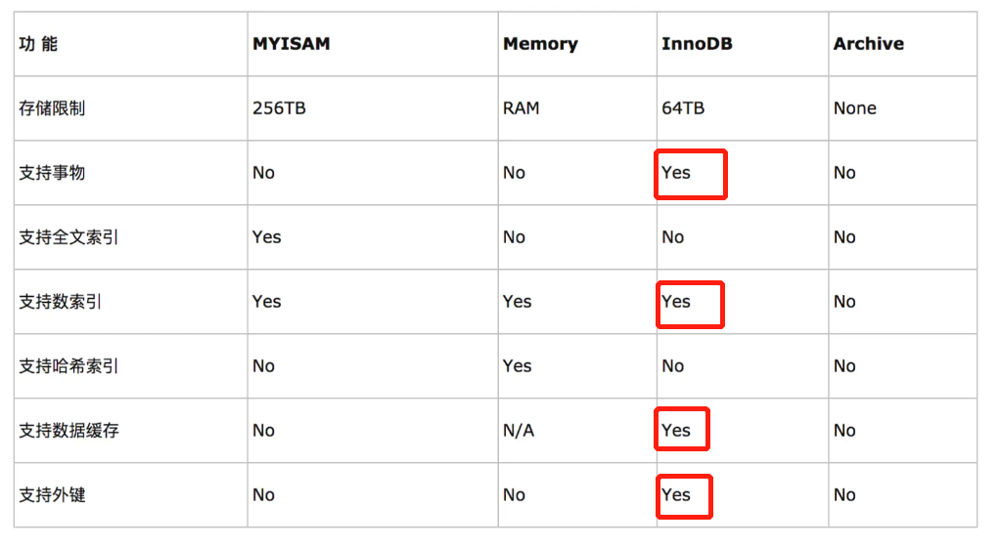

# 笔试
## 中移物联网4.8
#### 4种引用类型
- 强 > 软 > 弱 > 虚
- 不回收，内存不足回收，回收，引用队列
#### forward和redirect的区别
- servlet的两种跳转方式，forward转发，redirect重定向
- 转发是服务器行为，重定向是客户端行为
- 转发地址栏不变，重定向地址栏改变
- 转发是一个request，共享数据；重定向是两个request，不共享数据
- 转发用在登录，根据角色转到相应的模块；重定向注销后返回首页等
#### bean的生命周期
##### 四大步
1. 实例化Instantiation
2. 属性赋值Populate
3. 初始化Initialization
4. 销毁Destruction
##### 十小步
1. bean的建立，实例化
2. 属性注入：ioc注入
3. BeanNameAware的setBeanName()，工厂调用Bean的setBeanName()方法传递Bean的ID
4. BeanFactoryAware的setBeanFactory()，用setBeanFactory()方法传入工厂自身
#### 后置处理器
- 前置处理器是在实例化前后进行干预
- 后置处理器是在初始化前后进行干预
  - 实现BeanPostProcessor接口
  - 重写方法postProcessBeforeInitialization(Object, String)：在bean的初始化之前执行
#### IO
- InputStream、OutputStream 基于字节操作的 IO
- Writer、Reader 基于字符操作的 IO
- File 基于磁盘操作的 IO
- Socket 基于网络操作的 IO
#### bio，nio，aio
- 两个概念：同步/异步(客户端与服务端 相同步调)， 阻塞/非阻塞(客户端与服务端之间是否始终有个东西占据着它们中间的通道)
- BIO（同步阻塞）：
- NIO（同步非阻塞）：
- AIO（异步非阻塞）：

#### aop

#### 自动注入的注解

#### 事务传播特性
- 当系统中存在两个事务方法时（我们暂称为方法A和方法B），如果方法B在方法A中被调用，那么将采用什么样的事务形式，就叫做事务的传播特性
- 配置@Transactional(propagation = Propagation.REQUIRED)
- 七种传播特性
  1. PROPAGATION_REQUIRED：如果不存在外层事务，就主动创建事务；否则使用外层事务
  2. PROPAGATION_SUPPORTS：如果不存在外层事务，就不开启事务；否则使用外层事务
  3. PROPAGATION_MANDATORY：如果不存在外层事务，就抛出异常；否则使用外层事务
  4. PROPAGATION_REQUIRES_NEW：总是主动开启事务；如果存在外层事务，就将外层事务挂起
  5. PROPAGATION_NOT_SUPPORTED：总是不开启事务；如果存在外层事务，就将外层事务挂起
  6. PROPAGATION_NEVER：总是不开启事务；如果存在外层事务，则抛出异常
  7. PROPAGATION_NESTED：如果不存在外层事务，就主动创建事务；否则创建嵌套的子事务


#### java8默认的垃圾回收机制
- GC垃圾回收（分代回收）
- Parallel Scavenge(新生代)+Parallel Old(老年代)
- 老年代的特点是每次垃圾收集时只有少量对象需要被回收，而新生代的特点是每次垃圾回收时都有大量的对象需要被回收
#### 回收器分类
1. 新生代回收器（标记复制）
Serial（单线程）、ParNew（多线程）、Parallel Scavenge（并行）
2. 老年代回收器（标记清除）
Serial Old（标记整理法）、Parallel Old、CMS（并行，标记清除法）
3. 整堆回收
G1（标记整理法）

#### redis持久化的方式
RDB（Redis DataBase）:在指定的时间间隔内将内存中的数据集快照写到硬盘
AOF（Append Only File）：以日志的形式来记录每个写操作，记录每个写的指令（读不记录），只追加但不改写文件。

#### linux命令

#### 排序算法复杂度

#### 联合索引
最左前缀原则。where子句中使用最频繁的一列放在最左边。 mysql会一直向右匹配直到遇到范围查询(>、<、between、like)就停止匹配。
#### InnoDB和ISAM的区别
- 如果要提供提交、回滚、崩溃恢复能力的事物安全（ACID兼容）能力，并要求实现并发控制，**InnoDB**是一个好的选择
- 如果数据表主要用来插入和查询记录，则MyISAM引擎能提供较高的处理效率(全文索引)

#### https的特性
http+ssl(安全套接层)/Tls（传输安全层）
#### ==和equal的区别
==：基本类型比较值，引用类型比较引用
equals是方法，判断两个引用对象是否相等
#### hashmap
在JDK1.8中，有“数组+链表+红黑树”组成。红黑树搜索时间复杂度是O(logn)，而链表是O(n)。
- 当链表超过8且数组长度(数据总量)超过64才会转为红黑树
- 将链表转换成红黑树前会判断，如果当前数组的长度小于64，那么会选择先进行数组扩容，而不是转换为红黑树，以减少搜索时间。
##### jdk1.7和jdk1.8
- JDK7中的数据结构主要是：数组＋链表，数组和链表的节点的实现类是Entry类
- JDK8中的数据结构主要是：数组＋链表/红黑树，当链表的元素个数大于等于8的时候转为红黑树，元素个数小于等于6时，红黑树结构还原成链表,数组和链表的节点的实现类是Node类
#### synchronize和volatile
- volatile 
   java提供的一种轻量型的同步机制。
   java包含两种同步机制：同步方法和volatile变量。
   synchronized是重量级锁，volatile是轻量级，不会引起线程上下文转换。
   volatile三大特性（1.保证可见性，2.**不保证原子性**，3.有序性）
   JMM即java内存模型，只是一种虚拟规范。每个线程创建并非操作主内存，而是将主内存的数据拷贝一份到自己工作内存，由于不同的线程不能访问对方的工作内存。因此一个线程修改了主内存的值，为了保证其他线程能够知道，使用volatile。
   volatile的应用场景：单例模式
   synchronized不加在方法上，因为太重了
   当AB两个线程都创建对象Type时，都通过了第一次检查，A如果先进来，创建对象成功，把该对象同步到主内存；B被放进来，但由于B线程没有及时同步主内存，因此B会又new一个对象。用volatile修饰后，根据可见性即可解决。
   ```
   // 安全的双重检查的单例模式
   public class Type {
        private static volatile Type type; // 类变量，用static和volatile修饰。

        private Type() {} // 构造方法

        public static Type getInstance() {
            if (type == null) {
                synchronized(type.class) { // 不给方法加锁，太重了
                    if (type == null) {
                        type = new Type();
                    }
                }
            }
            return type;
        }

   }
   ```
- java 关键字 synchronized
    synchronized是一个java同步关键字，是**可重入，独享，非公平，悲观**的同步锁。主要用在多线程时数据不安全。
    修饰同步方法：锁对象是当前实例
    修饰静态方法：锁对象是当前类Class对象
    修饰同步代码块：括号后面配置的对象或类
    修饰非静态方法和代码块时，因为同一类的不同对象拥有自己的锁，所以不会阻塞。
#### 多态

#### 构造方法
构造方法的名字必须与类名相同，new调用
Java语言规定构造方法没有返回值，且不用void关键字声明
重载时，参数个数，参数类型，与返回值无关
#### final关键字
- final变量，修饰得变量引用不可变(内容可变)，必须初始化
- final方法，不允许子类重写，子类可以使用该方法（super）
- **final类，不能被继承，所有方法不能被重写**
#### 设计模式
- 设计模式分类
- 创建者模式：单例模式，工厂模式，建造模式，原型模式
- 结构型模式：适配器，装饰器，代理，外观，桥接，组合，亨元
- 行为性模式：迭代器，观察者，解释器，中介者，备忘录，命令，模板方法
#### sleep和wait
- sleep方法：是**Thread类**的静态方法，当前线程将睡眠n毫秒，线程进入阻塞状态。当睡眠时间到了，会解除阻塞，进入可运行状态，等待CPU的到来。睡眠不释放锁（如果有的话）。
- wait方法：是**Object**的方法，必须与synchronized关键字一起使用，线程进入阻塞状态，当notify或者notifyall被调用后，会解除阻塞。但是，只有重新占用互斥锁之后才会进入可运行状态。睡眠时，会释放互斥锁。
区别：
1. sleep 方法没有释放锁，而 wait 方法释放了锁。
2. sleep 通常被用于暂停执行，Wait通常被用于线程间交互/通信
3. sleep() 方法执行完成后，线程会自动苏醒。或者可以使用 wait(long timeout)超时后线程会自动苏醒。wait() 方法被调用后，线程不会自动苏醒，需要别的线程调用同一个对象上的 notify() 或者 notifyAll() 方法 