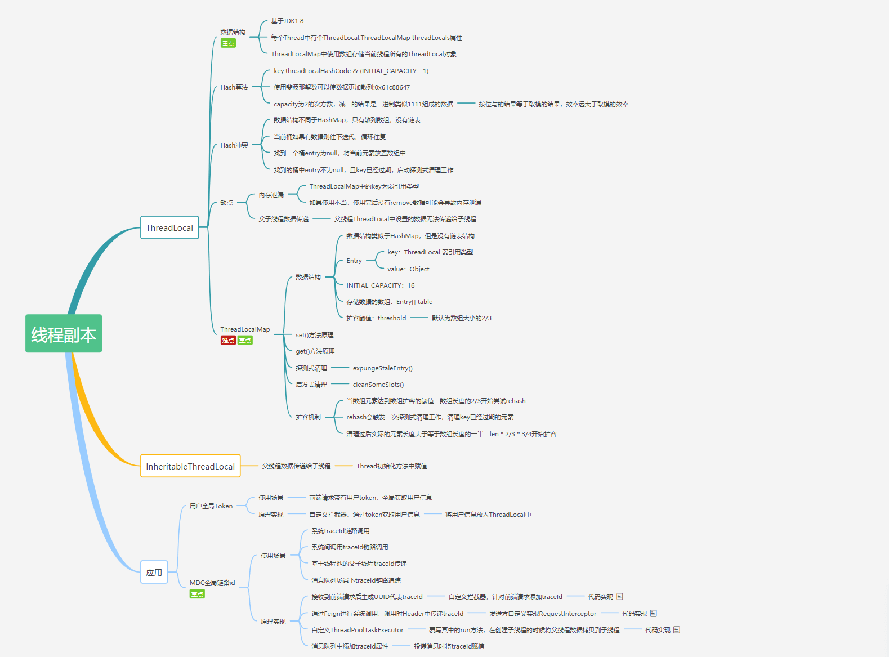

# Java基础
1. 解释三大特性
封装，把客观事务抽象成类，类把自己的数据和方法隐藏
继承
多态，子类继承父类的方法，可以具有不同数据和不同行为。运行时多态：重写（override）类中多态；编译时多态：方法重载，编译时已经确定
    - 实现多态的三个必要条件：继承，重写，向上转型

## java和c++区别
c++有指针，java没有
c++多继承，java单继承
java自动回收垃圾
java不支持操作符重载
java不支持缺省参数函数
1. jdk，jre， jvm
2. 字节码：16进制组成，javac命令编译源码为字节码，一次编译，到处运行
## 修饰符   
   - private : 在同一类内可见。使用对象：变量、方法。 注意：不能修饰类（外部类）
   - protected : 对同一包内的类和所有子类可见。使用对象：变量、方法。 注意：不能修饰类（外部类）。
   - public > protected（**同包和子类**） > 同包（default） > private
## 关键字
   - final 
        - final变量，修饰得变量引用不可变(内容可变)，必须初始化
        - final方法，不允许子类重写，子类可以使用该方法（super）
        - **final类，不能被继承，所有方法不能被重写**
        - final修饰变量，变量的引用（也就是指向的地址）不可变，但是引用的内容可以变（地址中的内容可变）。
   - finally,异常处理的一部分，最终一定会被执行
   - finalize，被回收时调用，这个方法一个对象只能执行一次，只能在第一次进入被回收的队列，而且对象所属于的类重写了finalize方法才会被执行。第二次进入回收队列的时候不会再执行其finalize方法，而是直接被二次标记，在下一次GC的时候被GC。
   static 
   - 在一个类没有用new构造方法创建对象时就可以访问。
   - **static不可以被覆盖**
## 重写（override）和重载（overload）
   - override发生在父类和子类中，方法名称相同，参数的数量，类型，返回值都相同 static，final，private 不能被重写，会被父类隐藏
   - overload发生在同一类，方法名字相同，参数不同，例如多个构造函数。
   - **重载方法不能根据返回值进行区别**
1.  
    方法的重载：
    方法重载的定义：同一个类或与他的派生类中，方法名相同，而参数列表不同的方法。其中参数列表不同指的是**参数的类型，数量，类型的顺序这三种至少有一种不同**。
    方法重载与下列无关：
    **与返回值类型无关；与访问修饰符无关**
    构造方法也可以重载

    方法的重写：
    方法的重写的定义：在继承关系的子类中，定义一个与父类相同的方法
    判断是否重写的方式：在方法之前加上@ Override
    方法重写的特点：
    在继承关系的子类中重写父类的方法
    **重写的方法必须方法名相同，参数列表也相同
    重写的方法的返回值类型应该与父类中被重写方法的返回值类型相同或是他的子类类型
    重写的方法的访问权限应该与父类中被重写方法的访问权限相同或高于它的访问权限
    重写的方法不能抛出比父类更加宽泛的异常**
    方法重写的注意事项：
    构造方法不能被重写，不要问为什么？因为构造方法名必须和类名相同
    private修饰的成员方法不能被重写
    static修饰的方法不能被重写
    final修饰的方法不能被重写
    当子类重写了父类中的方法后，子类对象调用该方法时调用的是子类重写后的方法   
2.  构造器不会被重写，但可以被重载
3.  抽象类和接口区别
    - 抽象类可以提供成员方法的实现细节，接口中只能存在public abstract方法；
    - 抽象类中的成员变量可以是各种类型，接口中只能是public static final类型
    - 抽象类中可以有静态代码块和静态方法，接口中不能有
    - 一个类可以实现多个接口（必须实现接口内的所有抽象方法），只能继承一个抽象类（java单继承，一个类中包含抽象方法，该类必须是抽象类，子类必须重写父类抽象方法） 
    - 抽象类是对类抽象，包括属性，方法，但接口是对行为抽象
    - 抽象类必须被继承，因此不能用final修饰
    - **抽象类可以有非抽象方法**，有抽象方法的类一定是抽象类或者接口
## java创建对象的方式
  - new
  - 反射机制
  - clone机制 浅拷贝和深拷贝
  - 序列化机制 Externalizable，Serializable
## 不可变对象
  - 一旦创建，状态不再改变，任何修改都会创建新的对象，String,Integer。好处是线程安全
## 值传递和引用传递
  - 方法调用时传递的参数是值的拷贝，传递后没有关联
  - 引用传递，传递的参数是引用的地址，变量对应内存空间的地址，传递前后指向一个内存空间
  - java只有值传递，基本数据类型作为参数值传递，引用类型传递是值对应的引用
## 对象相等判断
  - == 和 equals区别
  - == 比较基本数据类型，比较的是值
  - **== 比较引用类型，比较的是两个对象的引用所以```new String("a") != new String("a");```**
  - **equals比较两个对象是否相等，它是一个方法。**
  - 默认情况下，比较内存地址值是否相等。可以按照需求逻辑，重写对象的equals方法
  - 两个对象的 hashCode() 相同， 那么 equals() 也一定为 true吗？ 回答：不一定相同，因为在散列表中，hashCode() 相等即两个键值对的哈希值相等，然而哈希值相等，并不一定能得出键值对相等。
    ```
    public class test1 {
        public static void main(String[] args) {
            String a = new String("ab"); // a 为一个引用
            String b = new String("ab"); // b为另一个引用,对象的内容一样
            String aa = "ab"; // 放在常量池中
            String bb = "ab"; // 从常量池中查找
            if (aa == bb) // true
                System.out.println("aa==bb");
            if (a == b) // false，非同一对象
                System.out.println("a==b");
            if (a.equals(b)) // true
                System.out.println("aEQb");
            if (42 == 42.0) { // true
                System.out.println("true");
            }
        }
    }
    ```
## hashcode()
- 散列码，根据key——value快速读取
- 对象相同，hashcode一定相同，相同的hashcode不一定是相同的对象
- 重写equals必须重写hashcode，因为对象存储时转换为一个哈希值，如果没有重写hashcode()
## String, StringBuffer, StringBuilder 的区别
- String 不可变，线程安全，是final修饰的java类
- StringBuilder 非线程安全
- StringBuffer 加了同步锁，线程安全
- **StringBuilder , StringBuffer ,String 都是 final 的，但是为什么StringBuilder , StringBuffer可以进行修改呢**，因为不可变包括的是，引用不可变以及对象不可变，而这三个都是属于引用不可变，（也就是地址不要变，里面的内容随心所欲），而StringBuilder , StringBuffer 中都包含右append方法，可对对象中的内容进行增加。
而String a="123"+new String("456");实际上底层是用了一个StringBuffer 进行append；
## String为什么不可变？
- 实现String pool，初始化String时，如果已经存在，就立即返回引用
- 多线程安全
- 网络连接url，文件path等安全
- 加快处理速度，因为Stirng不可变，可以保证hashcode唯一性，方便缓存，作为HashMap的key。
- String str="aaa"与 String str = new String("aaa") 不一样，后者创建两个对象
##  包装类型
- 把基本类型转换成包装类型的过程叫做装箱（boxing）；反之，把包装类型转换成基本类型的过程叫做拆箱（unboxing），使得二者可以相互转换。
- 原始类型: boolean，char，byte，short，int，long，float，double

- 包装类型：Boolean，Character，Byte，Short，Integer，Long，Float，Double
- **包装类型可为null，基本类型不可以**
- **包装类型可用于泛型**
- **包装类型不能直接运算，因为是对象，自动拆箱后可以进行运算**
- 
- 局部变量可以和成员变量重名，因为在java中局部变量和成员变量（实例变量）的存放位置不同，因此完全可以同名。
- 成员变量属于类的对象，对象存在，则成员变量存在。this指的就是当前运行时对象。this.变量名访问的就是当前对象的成员变量。
- JAVA访问变量采用就近原则，局部变量与成员变量重名时，局部变量比较近，使用局部变量
##  反射
  - 反射是在**运行状态**中，对于任意一个类，都能够知道这个类的所有属性和方法；对于任意一个对象，都能够调用它的任意一个方法和属性；这种动态获取类信息以及动态调用对象的方法的功能称为 Java 语言的反射机制。
  - Class.forName("类的路径"); 类名.Class; 对象.getClass()
  - 类型：Class类， Field类（获取属性） Method（获取方法） Constructor（获取构造）
  - 使用步骤
```
// 获取类的 Class 对象实例
Class clz = Class.forName("com.zhenai.api.Apple");
// 根据 Class 对象实例获取 Constructor 对象
Constructor appleConstructor = clz.getConstructor();
// 使用 Constructor 对象的 newInstance 方法获取反射类对象
Object appleObj = appleConstructor.newInstance();
//获取方法的 Method 对象
Method setPriceMethod = clz.getMethod("setPrice", int.class);
//利用 invoke 方法调用方法
setPriceMethod.invoke(appleObj, 14);
```
##  泛型
- 为了创建容器类
- 类型安全，消除强制类型转换
- 泛型只存在编译阶段，而不存在于运行阶段
- 非限定通配符List<?>
- 限定通配符 List<? extends T>可以接受任何继承自T的类型的List；List<? super T>可以接受任何T的父类构成的List
##  序列化和反序列化
- 因为对象保存在****jvm内存堆**中，序列化是把java对象转化为字节序列的过程；反序列化是将字节序列转化成对象的过程
- 为了对内存中对象的持久化和网络传输
- Serializable接口，该接口定义了两个抽象方法，writeExternal()和readExternal()
- Externalizable接口继承自Serializable接口
- JVM在序列化和反序列化时仍然都会生成一个serialVersionUID，显式指定serialVersionUID，为了防止序列化运行异常


##  异常
- 所有异常都在java.lang包中的Throwable类中，该类有两个子类，Exception和Error
- Exception：程序本身可以处理的异常，非受检查异常（运行时异常，java编译器不会检查运行时异常）; 受检查异常，java会检查该异常，如IO,SQLException，调用者必须处理受检查异常
- Error:程序无法处理的异常，没办法捕获，**系统崩溃，内存不足，堆栈溢出**
- throw关键字在方法内，只抛出一种异常，throws用在方法申明上，可以抛出多个异常
- try-catch-finally 中**只有catch能省略**，try只适合处理运行时异常，try+catch适合处理运行时异常+普通异常。因为普通异常一旦被捕获，必须被catch处理
- **如果已经在catch中return finally还是会执行,如果finally块中有return语句的话，它将覆盖掉函数中其他return语句。**

- 编译时异常必须显示处理，运行时异常交给虚拟机。
运行时异常可以不处理。当出现这样的异常时，总是由虚拟机接管。比如我们从来没有人去处理过Null Pointer Exception异常，它就是运行时异常，并且这种异常还是最常见的异常之一。出现运行时异常后，系统会把异常一直往上层抛，一直遇到处理代码。如果没有处理块，到最上层，如果是多线程就由Thread.run()抛出，如果是单线程就被main()抛出。抛出之后，如果是线程，这个线程也就退出了。如果是主程序抛出的异常，整个程序也就退出了。运行时异常是Exception的子类，也有一般异常的特点，是可以被Catch块处理的。只不过往往不对它处理罢了。也就是说，如果不对运行时异常进行处理，那么出现运行时异常之后，要么是线程中止，要么是主程序终止。
##  I/O
- 按照功能：输入流和输出流
- 字节流 InputStream，OutputStream， 按照字节读取，适用于所有类型文件，字节流按 8 位传输以字节为单位输入输出数据
- 字符流 Reader，Writer， 按照字符读取，只能处理文本文件，字符流按 16 位传输以字符为单位输入输出数据
- 字节输入流转字符输入流 InputStreamReader
- 字节输出流转字符输出流 OutputStreamWriter
- 适配器模式和装饰器模式
---
## java集合
 
1. 线程安全的集合：
   - Hashtable：比HashMap多了个线程安全。
   - Vector：比Arraylist多了个同步化机制。
   - Stack：栈，也是线程安全的，继承于Vector。
   - ConcurrentHashMap:是一种高效但是线程安全的集合。
2. ArrayList和LinkedList异同点？
   - 是否保证线程安全： ArrayList 和 LinkedList 都是不同步的，也就是不保证线程安全；
   - 底层数据结构： Arraylist 底层使用的是Object数组；LinkedList 底层使用的是双向循环链表数据结构；
   - 插入和删除是否受元素位置的影响： ArrayList 采用数组存储，所以插入和删除元素的时间复杂度受元素位置的影响;  LinkedList 采用链表存储，所以插入，删除元素时间复杂度不受元素位置的影响，都是近似 O（1）而数组为近似 O（n）。
   - 是否支持快速随机访问： LinkedList 不支持高效的随机元素访问，而ArrayList 实现了RandmoAccess 接口，所以有随机访问功能。
   - 内存空间占用： ArrayList的空 间浪费主要体现在在list列表的结尾会预留一定的容量空间，而LinkedList的空间花费体现在前驱和后继的存储
3. ArrayList的扩容机制
   ArrayList扩容的本质就是计算出新的扩容数组的size后实例化，并将原有数组内容复制到新数组中去。默认情况下，新的容量会是原容量的1.5倍。
4. 哈希冲突及解决方法
   - 开放定址法、再哈希法、链地址法（拉链法）、建立公共溢出区。
   - HashMap中采用的是 链地址法
   - 将哈希值相同的元素构成一个同义词的单链表,并将单链表的头指针存放在哈希表的第i个单元中，查找、插入和删除主要在同义词链表中进行。链表法适用于经常进行插入和删除的情况。
5. hashMap的底层数据结构
   - 在JDK1.7 中，由“数组+链表”组成，数组是 HashMap 的主体，链表则是主要为了解决哈希冲突而存在的。
    - 在JDK1.8 中，由“数组+链表+红黑树”组成。当链表过长，则会严重影响 HashMap 的性能，红黑树搜索时间复杂度是 O(logn)，而链表是糟糕的 O(n)。因此，JDK1.8 对数据结构做了进一步的优化，引入了红黑树，链表和红黑树在达到一定条件会进行转换：
    - 当链表超过 8 且数据总量超过 64 才会转红黑树。
    - 将链表转换成红黑树前会判断，如果当前数组的长度小于 64，那么会选择先进行数组扩容，而不是转换为红黑树，以减少搜索时间。
6. hashMap的put流程：
    1. 首先根据 key 的值计算 hash 值，找到该元素在数组中存储的下标；
    2. 如果数组是空的，则调用 resize 进行初始化；
    3. 如果没有哈希冲突直接放在对应的数组下标里；
    4. 如果冲突了，且 key 已经存在，就覆盖掉 value；
    5. 如果冲突后，发现该节点是红黑树，就将这个节点挂在树上；
    6. 如果冲突后是链表，判断该链表是否大于 8 ，如果大于 8 并且数组容量小于 64，就进行扩容；如果链表节点大于 8 并且数组的容量大于 64，则将这个结构转换为红黑树；否则，链表插入键值对，若 key 存在，就覆盖掉 value。
7. 为什么用String作为hashmap的key?
   - 字符串不可变，创建时hashcode被缓存，不需要重新计算
   - 因为获取对象的时候要用到 equals() 和 hashCode() 方法。
8. hashMap为什么线程不安全？
   - 多线程下扩容死循环
   - 多线程下put可能导致元素丢失
   - put和get并发，导致get为null
9. 还知道哪些hash算法？
   - MD4, MD5
10. key可以为null，在第一个位置
---
## java 网络编程

## Java并发
1. 进程和线程的区别
   根本区别：进程是操作系统资源分配的基本单位，线程是处理器任务调动和执行的基本单位
   资源开销：每个进程都有独立的代码和数据空间（程序上下文），程序之间的切换会有较大的开销；线程可以看做轻量级的进程，同一类线程共享代码和数据空间，每个线程都有自己独立的运行栈和程序计数器（PC），线程之间切换的开销小。
   包含关系：一个线程包含多个进程时，多个进程共同完成一个线程，
   内存分配：同一进程的线程共享本进程的地址空间和资源，而进程之间的地址空间和资源是相互独立的
   影响关系：进程崩溃，保护模式下对其他进程无影响，一个线程崩溃，整个进程崩溃。
2. 创建线程的方式：
   1. 实现Runnable或Callable接口，可以继承其他类
   2. 继承Thread方式创建多线程
   3. Runnable和Callable的区别
        - Callable规定（重写）的方法是call()，Runnable规定（重写）的方法是run()。
        - Callable的任务执行后可返回值，而Runnable的任务是不能返回值的。
        - Call方法可以抛出异常，run方法不可以。
3. 为什么使用多线程？
   1. 线程可以比作是轻量级的进程，是程序执行的最小单位,线程间的切换和调度的成本远远小于进程。多核 CPU 时代意味着多个线程可以同时运行，这减少了线程上下文切换的开销。
   2. 多线程并发编程正是开发高并发系统的基础，利用好多线程机制可以大大提高系统整体的并发能力以及性能。
4. 线程的5个状态？
5. 什么是死锁？
   多个线程被同时阻塞，其中的一个或多个都在等待释放资源。
6. 避免死锁？
   破坏四个条件：
   互斥，
   请求与保持（一次申请所有资源），
   不剥夺（占用资源的线程申请不到时，去主动释放它占有的资源）
   循环等待（按找顺序申请资源）
   锁排序 （必须回答出来的点） 指定获取锁的顺序，比如某个线程只有获得A锁和B锁，才能对某资源进行操作，在多线程条件下，如何避免死锁？ 通过指定锁的获取顺序，比如规定，只有获得A锁的线程才有资格获取B锁，按顺序获取锁就可以避免死锁。这通常被认为是解决死锁很好的一种方法。
7. sleep()和wait()的区别
   sleep方法：是Thread类的静态方法，当前线程将睡眠n毫秒，线程进入阻塞状态。当睡眠时间到了，会解除阻塞，进入可运行状态，等待CPU的到来。睡眠不释放锁（如果有的话）。
    wait方法：是Object的方法，必须与synchronized关键字一起使用，线程进入阻塞状态，当notify或者notifyall被调用后，会解除阻塞。但是，只有重新占用互斥锁之后才会进入可运行状态。睡眠时，会释放互斥锁。
    sleep 方法没有释放锁，而 wait 方法释放了锁 。
    sleep 通常被用于暂停执行，Wait通常被用于线程间交互/通信
    sleep() 方法执行完成后，线程会自动苏醒。或者可以使用 wait(long timeout)超时后线程会自动苏醒。wait() 方法被调用后，线程不会自动苏醒，需要别的线程调用同一个对象上的 notify() 或者 notifyAll() 方法
8. yield方法可以暂停当前正在执行的线程对象，让其它有相同优先级的线程执行。
## JVM
1. JVM垃圾回收算法
    1、强引用：一个对象赋给一个引用就是强引用，比如new一个对象，一个对象被赋值一个对象。
    2、软引用：用SoftReference类实现，一般不会轻易回收，只有内存不够才会回收。
    3、弱引用：用WeekReference类实现，一旦垃圾回收已启动，就会回收。
    4、虚引用：不能单独存在，必须和引用队列联合使用。主要作用是跟踪对象被回收的状态。
2. 
    1、jps：查看本机java进程信息。

    2、jstack：打印线程的栈信息，制作线程dump文件。

    3、jmap：打印内存映射，制作堆dump文件

    4、jstat：性能监控工具

    5、jhat：内存分析工具

    6、jconsole：简易的可视化控制台

    7、jvisualvm：功能强大的控制台
## java序列化

# java代码
1. Java 中的 Math. round(-1.5) 等于多少？答：-1，加0.5后向下取整。
2.  String str="i"与 String str=new String("i")一样吗？答：不一样，String str="i"的方式，Java 虚拟机会将其分配到常量池（为了快速读取）中；而 String str=new String("i") 则会被分到堆内存中。
3.  要注意是(short)10/10.2*2，而不是(short) (10/10.2*2)，前者只是把10强转为short，又由于式子中存在浮点数，所以会对结果值进行一个自动类型的提升，浮点数默认为double，所以答案是double；后者是把计算完之后值强转short。
4.  java 浮点数默认double，float后面有个"f",long后面有个"L"
5. 位运算\>>表示右移，如果该数为正，则高位补0，若为负数，则高位补1；相当于除2的位数方
    \>>>表示无符号右移，也叫逻辑右移，即若该数为正，则高位补0，而若该数为负数，则右移后高位同样补0。

## JSP九大内置对象
1、request对象
request 对象是 javax.servlet.httpServletRequest类型的对象。 该对象代表了客户端的请求信息，主要用于接受通过HTTP协议传送到服务器的数据。（包括头信息、系统信息、请求方式以及请求参数等）。request对象的作用域为一次请求。

2、response对象
response 代表的是对客户端的响应，主要是将JSP容器处理过的对象传回到客户端。response对象也具有作用域，它只在JSP页面内有效。

3、session对象
session 对象是由**服务器**自动创建的与用户请求相关的对象。服务器为每个用户都生成一个session对象，用于保存该用户的信息，跟踪用户的操作状态。session对象内部使用Map类来保存数据，因此保存数据的格式为 “Key/value”。 session对象的value可以使复杂的对象类型，而不仅仅局限于字符串类型。

4、application对象
 application 对象可将信息保存在服务器中，直到服务器关闭，否则application对象中保存的信息会在整个应用中都有效。与session对象相比，application对象生命周期更长，类似于系统的“全局变量”。

5、out 对象
out 对象用于在Web浏览器内输出信息，并且管理应用服务器上的输出缓冲区。在使用 out 对象输出数据时，可以对数据缓冲区进行操作，及时清除缓冲区中的残余数据，为其他的输出让出缓冲空间。待数据输出完毕后，要及时关闭输出流。

6、pageContext 对象
pageContext 对象的作用是取得任何范围的参数，通过它可以获取 JSP页面的out、request、reponse、session、application 等对象。pageContext对象的创建和初始化都是由容器来完成的，在JSP页面中可以直接使用 pageContext对象。

7、config 对象
config 对象的主要作用是取得服务器的配置信息。通过 pageConext对象的 getServletConfig() 方法可以获取一个config对象。当一个Servlet 初始化时，容器把某些信息通过 config对象传递给这个 Servlet。 开发者可以在web.xml 文件中为应用程序环境中的Servlet程序和JSP页面提供初始化参数。

8、page 对象
page 对象代表JSP本身，只有在JSP页面内才是合法的。 page隐含对象本质上包含当前 Servlet接口引用的变量，类似于Java编程中的 this 指针。

9、exception 对象
exception 对象的作用是显示异常信息，只有在包含 isErrorPage="true" 的页面中才可以被使用，在一般的JSP页面中使用该对象将无法编译JSP文件。excepation对象和Java的所有对象一样，都具有系统提供的继承结构。exception 对象几乎定义了所有异常情况。在Java程序中，可以使用try/catch关键字来处理异常情况； 如果在JSP页面中出现没有捕获到的异常，就会生成 exception 对象，并把 exception 对象传送到在page指令中设定的错误页面中，然后在错误页面中处理相应的 exception 对象。

## 类
一个.java文件中，可以有多个类，包括内部类和外部类。考虑到内部类的原因，一个.java文件可以中可以有多个public类。
但是对于外部类而言，**一个.java文件必须只能有一个public类**，同时这个类的类名必须和.java的文件名一致（包括大小写）。

## 线程池
线程池一般用于执行多个不相关联的耗时任务，没有多线程的情况下，任务顺序执行，使用了线程池的话可让多个不相关联的任务同时执行。
降低资源消耗，提高响应速度，提高线程的可管理性
线程池重要参数：
1. corePoolSize 线程池的核心线程数量，任务队列未达到队列容量时，最大可以同时运行的线程数量。
2. maximumPoolSize 线程池的最大线程数，任务队列中存放的任务达到队列容量的时候，当前可以同时运行的线程数量变为最大线程数。
3. keepAliveTime 线程池中的线程数量大于 corePoolSize 的时候，如果这时没有新的任务提交，核心线程外的线程不会立即销毁，而是会等待，直到等待的时间超过了 keepAliveTime才会被回收销毁。
4. workQueue 任务队列，用来储存等待执行任务的队列     
Executor框架，主要由三大部分组成：

1. 执行任务需要实现的 Runnable 接口 或 Callable接口。Runnable 接口或 Callable 接口 实现类都可以被 ThreadPoolExecutor 或 ScheduledThreadPoolExecutor 执行。
2. 任务的执行(Executor)
3. 异步计算的结果(Future)
线程池创建方式
1. **通过ThreadPoolExecutor构造函数创建**
2. 通过 Executor 框架的工具类 Executors 来创建。

   1. 如果此时线程池中的数量小于corePoolSize，即使线程池中的线程都处于空闲状态，也要创建新的线程来处理被添加的任务。

   2. 如果此时线程池中的数量等于corePoolSize，但是缓冲队列workQueue未满，那么任务被放入缓冲队列。

   3. **如果此时线程池中的数量大于等于corePoolSize，缓冲队列workQueue满，并且线程池中的数量小于maximumPoolSize，建新的线程来处理被添加的任务。**

   4. 如果此时线程池中的数量大于corePoolSize，缓冲队列workQueue满，并且线程池中的数量等于maximumPoolSize，那么通过 handler所指定的策略来处理此任务。

   5. **当线程池中的线程数量大于 corePoolSize时，如果某线程空闲时间超过keepAliveTime，线程将被终止。这样，线程池可以动态的调整池中的线程数。**

Runnable vs Callable
Runnable 接口不会返回结果或抛出检查异常，但是 Callable 接口可以
- 几种常见线程池
  1. 定长线程池
  2. 定时线程池
  3. 可缓存线程池
  4. 单线程化线程池
- 如何合理设置核心线程数量？

- 线程池的拒绝策略？
  1. AbortPolicy（默认）：丢弃任务并抛出 RejectedExecutionException 异常。
  2. CallerRunsPolicy：由调用线程处理该任务。
  3. DiscardPolicy：丢弃任务，但是不抛出异常。可以配合这种模式进行自定义的处理方式。
  4. DiscardOldestPolicy：丢弃队列最早的未处理任务，然后重新尝试执行任务。
- 终止线程池？（shutdownNow() 和 shutdown() ）
  1. 使用 shutdown() 程序不会报错，也不会立即终止线程，它会等待线程池中的缓存任务执行完之后再退出，执行了 shutdown() 之后就不能给线程池添加新任务了；
  2. shutdownNow() 会试图立马停止任务，如果线程池中还有缓存任务正在执行，则会抛出 java.lang.InterruptedException: sleep interrupted 异常。
- 线程池为什么使用阻塞队列？
  1. 线程若是无限制的创建，可能会导致内存占用过多而产生OOM
  2. 创建线程池的消耗较高。线程池创建线程需要获取mainlock这个全局锁，影响并发效率，阻塞队列可以很好的缓冲
# ThreadLocal 详解

ThreadLocal对象可以提供线程局部变量，每个线程Thread拥有一份自己的副本变量，多个线程互不干扰。
1. ThreadLocal的数据结构
    Thread类有一个类型为ThreadLocal.ThreadLocalMap的实例变量threadLocals
    ThreadLocalMap 类似于hashmap，但是不是拉链法，key是ThreadLocal（弱引用），value是对象
    每个线程往ThreadLocal放值时，都会往自己的ThreadLocalMap中存，以ThreadLocal作为key读取，实现线程隔离
2. GC 之后 key 是否为 null？
   四种引用类型： 强引用（不回收） 软引用（oom时回收）弱引用（gc必被回收）虚引用（虚引用中唯一的作用就是用队列接收对象即将死亡的通知）
   