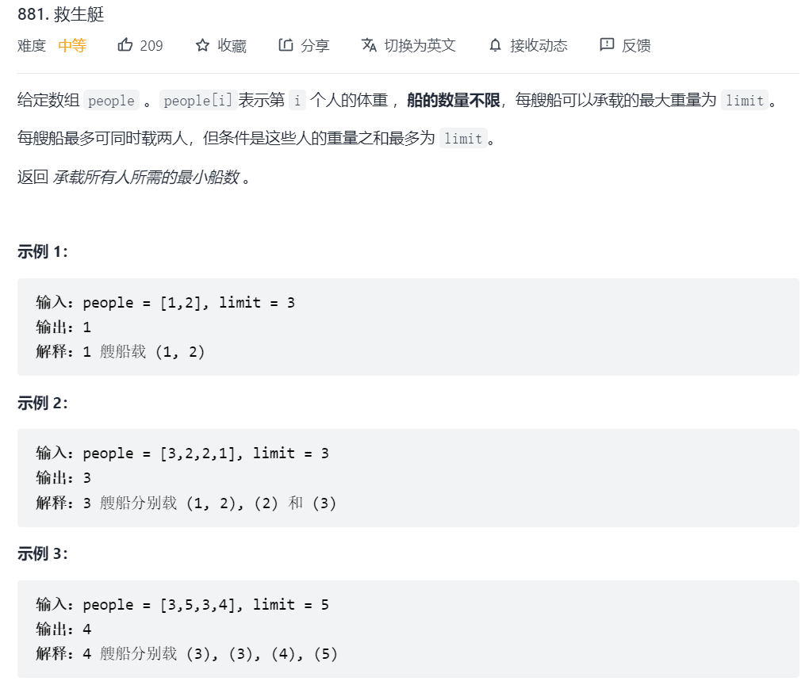
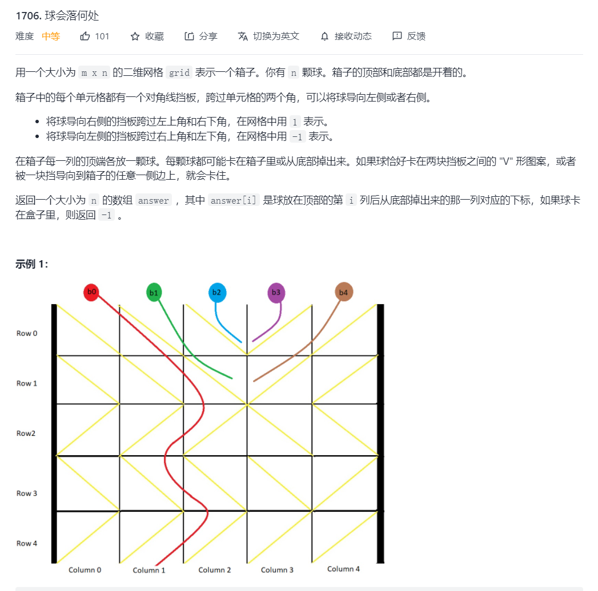
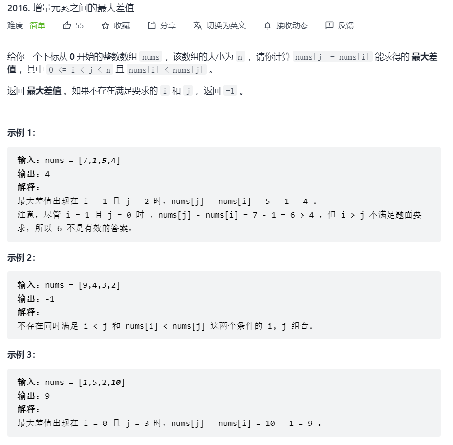
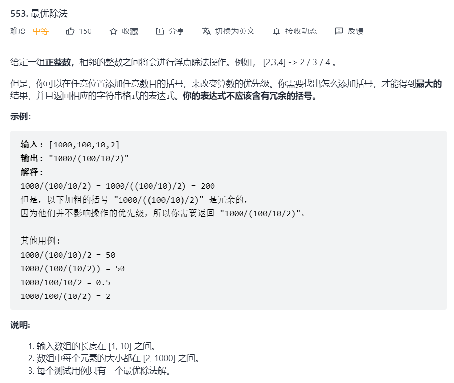

## 2022/2/23 仅仅反转字符串中的字母
1. 双指针，一个从左，一个从右，非字母跳过。
2. 字符串转char 用 char[] c = string.toCharArray();
3. char[] 转字符串用 String.valueOf(c);
```
class Solution {
    public String reverseOnlyLetters(String s) {
        char[] c = s.toCharArray();
        int i = 0;
        int j = c.length - 1;
        while (i < j) {
            if (!ischar(c[i])) {
                i++;
                continue;
            }
            if (!ischar(c[j])) {
                j--;
                continue;
            }
            if (i < j) {
                char temp = c[i];
                c[i] = c[j];
                c[j] = temp; 
                i++;
                j--;
            }
        }
        return String.valueOf(c);
    }
    public boolean ischar (char c) {
        if (((c >= 'a' && c <= 'z') || (c >= 'A' && c <= 'Z'))) {
            return true;
        }
        return false;
    }
}
```
## [加练救生艇 ](https://leetcode-cn.com/problems/boats-to-save-people/)

```
class Solution {
    public int numRescueBoats(int[] people, int limit) {
        Arrays.sort(people);
        int p = 0; // 指向最轻的人
        int q = people.length - 1;  // 指向最重的人
        int res = 0;
        
        while (p <= q) {
            if (people[p] + people[q] <= limit) {
                p++;
                q--;
            } else if (people[q] <= limit) {
                q--;
            }
            res++;
        }
        return res;
    }
}
```
## 2022/2/24 球会落在何处

1. 深度优先遍历
2. 模拟
```
// 模拟
class Solution {
    public int[] findBall(int[][] grid) {
        int m = grid.length;
        int n = grid[0].length;
        int[] res = new int[n];

        for (int i = 0; i < n; i++) {
            int c = i;
            for (int r = 0; r < m; r++) { // 不管怎么样r都会+1
                // 被卡住，不能走
                if (!isGet(r, c, grid)) {  
                    c = -1;
                    break;
                } else { 
                    // 未被卡住，可以往左下可以往右下
                    if (grid[r][c] == -1) {
                        c--;
                    } else {
                        c++;
                    }
                }
            }
            res[i] = c;
        }
        return res;
    }

    public static boolean isGet(int r, int c, int[][] grid) {
        int next_c = c + grid[r][c]; 
        // 下一步不被卡住，不能超过边界，且要同方向
        return next_c >= 0 && next_c < grid[0].length && grid[r][c] + grid[r][next_c] != 0;
    }
}
```
## 2022/2/25 复数乘法

### 要点
1. 分割字符串  
分割字符串：substring(i,j),  
字符串中找某个char：str.charArt(i);  
字符串长度：str.length();  
字符串变char[]: str.toCharArray();  
字符串找索引：str.indexOf("+");  
字符串拼接：String.format("%d+%di",a,b);  
```
class Solution {
    public String complexNumberMultiply(String num1, String num2) {
        int num1_a = firstNum(num1);
        int num1_b = secondNum(num1);
        int num2_a = firstNum(num2);
        int num2_b = secondNum(num2);
        int aa = num1_a * num2_a - num1_b * num2_b;
        int bb = num1_a * num2_b + num1_b * num2_a;
        // return String.format("%d+%di", aa, bb);
        return aa + "+" + bb + "i";
    }
    public int firstNum(String num) {
        int res = 0;
        for (int i = 0; i < num.length(); i++) {
            if (num.charAt(i) == "+".charAt(0)) {
                res = Integer.parseInt(num.substring(0,i));
                break;
            }
        }
        return res;
    }
    public int secondNum(String num) {
        int res = 0;
        for (int i = 0; i < num.length(); i++) {
            if (num.charAt(i) == "+".charAt(0)) {
                res = Integer.parseInt(num.substring(i + 1,num.length() - 1));
                break;
            }
        }
        return res;
    }
}
```
## 2022/2/26 增量元素之间的最大差值

### 要点
1. 双循环可以完成，但是时间复杂度On2;
2. 维护前缀的最小值，因此只需比较当前和前缀最小的大小，并跟新前缀最小 On.
```
class Solution {
    /*
    public int maximumDifference(int[] nums) {
        int res = -1;
        for (int i = 0; i < nums.length; i++) {
            for (int j = i + 1; j < nums.length; j++) {
                res = Math.max(res, nums[j] - nums[i]);
            }
        }
        if (res == 0) {
            return -1;
        }
        return res;
    }
    */
    public int maximumDifference(int[] nums) {
        int res = -1;
        int n = nums.length;
        int pre = nums[0]; // 前面最小的值
        for (int i = 1; i < n; i++) {
            if (pre < nums[i]) {
                res = Math.max(res, nums[i] - pre);
            } else {
                pre = nums[i];
            }
        }
        return res;
    }
}
```
## 2022/2/27 最优除法

### 要点
1. 为保证除法最大，则分子必须尽可能打，分母尽可能小
2. 因为全为正整数[2,1000],所以越除越小，因此分子即为第一位，分母为其余位连除。
### 基础知识
1. StringBuilder sb = new StringBuilder();用来拼接字符最好
2. sb.toString();方法
3. sb.insert(index, char);
4. sb.indexOf("/"); 找索引
```
class Solution {
    public String optimalDivision(int[] nums) {
        int n = nums.length;
        StringBuilder sb = new StringBuilder();
        for (int i = 0; i < n; i++) {
            sb.append(nums[i]);
            if (i+1 < n) {
                sb.append("/");
            }
        }

        if (n > 2) {
            sb.insert(sb.indexOf("/")+1, "(");
            sb.append(")");
        }
        return sb.toString();
    }
}
```
## 2022/3/8 蜡烛之间的盘子
- 前缀和
- 二分查找

