# 计算机网络
# 第一章
# 计算机网络简述
## 互联网和互连网
- 互联网指Internet，基于TCP/IP协议。范围大
- 互连网指几台计算机连接到一起，协议自定。范围小
- 主机之间通信是指主机A的进程和主机B上的另一个进程通信 通信方式：客户-服务器（C/S）和对等方式（P2P）
- 互联网核心：路由——>分组交换
电路交换：建立连接（占用通信资源）——通话（一直占用通信资源）——释放资源（归还通信资源）
报文交换：整个报文在节点间传输，全部存储下来再转发到下一结点
分组交换：储存转发技术。报文被分割成几部分（分组），携带目标地址信息，通过路由寻址，自动找到转发分组的最合适的路径，然后再组合起来。各个分组单独发送接收。  
电路交换面向连接，全程占用信道资源，分组交换无连接，仅在数据传输时占用信道资源   

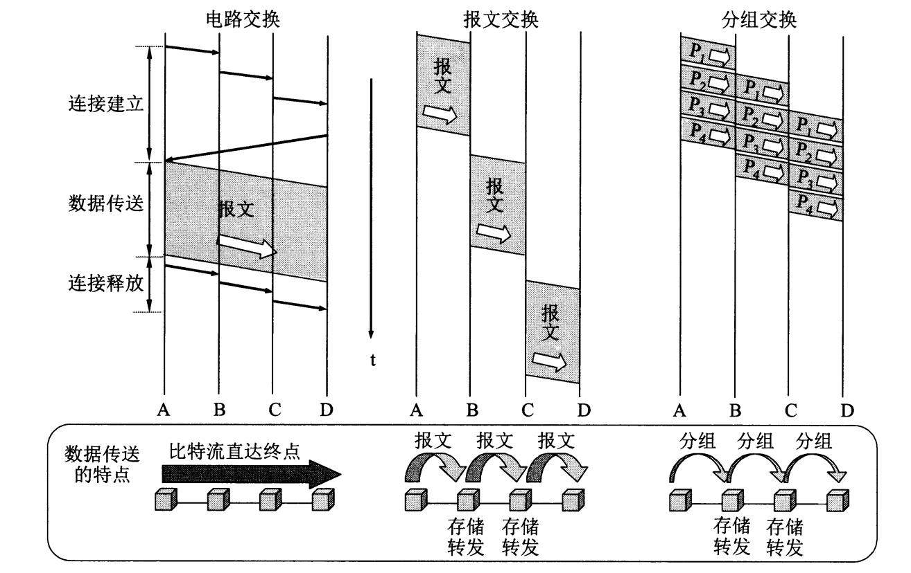
- 不同类型的计算机网络
    1. 广域网WAN (wide area network)
    2. 城域网MAN (metropolitan area network)
    3. 局域网LAN (local area network)
    4. 个人局域网PAN (personal area network)
- 计算机网络性能衡量指标
    1. 速率——比特率（bit/s）
    2. 带宽
    3. 吞吐量
    4. 时延
    5. 时延带宽积 = 传播时延 x 带宽
    6. 往返时间RTT（round trip time）
    7. 利用率（利用率与时延成反比）
- 网络协议
三要素：（1）语法（2）语义（3）同步
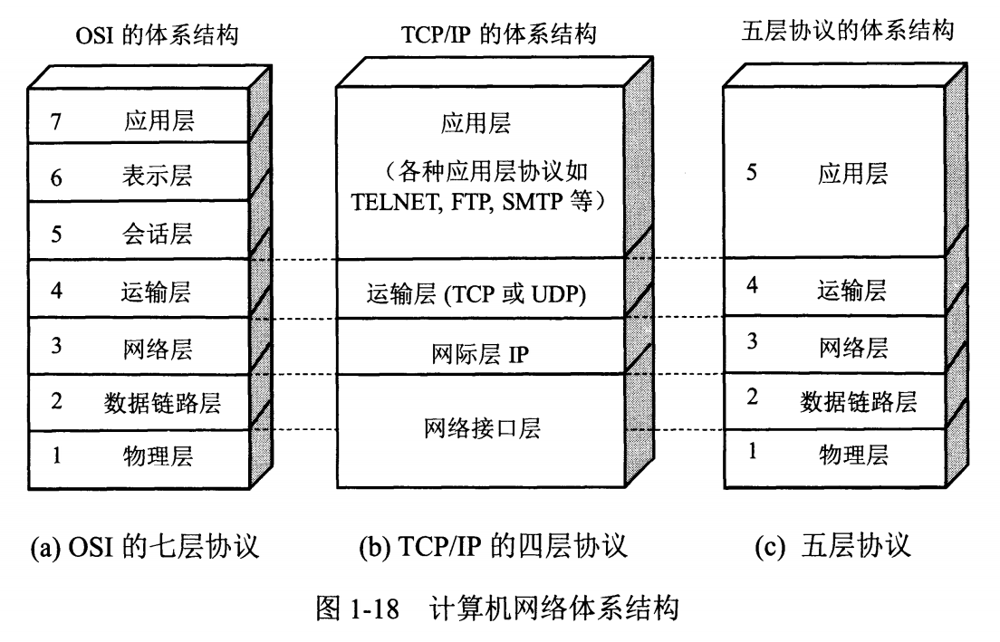
    1. 应用层（最高层）—— 进程(主机程序)交互 数据单元（报文） DNS，HTTP,FTP
    2. 运输层 —— 为进程通信提供通用的数据传输服务。  
    传输控制协议TCP 面向连接，可靠的数据传输服务  报文段  
    用户数据报协议UDP 提供无连接的、尽最大努力的数据传输服务  用户数据报
    1. 网络层（IP层）—— 为分组交换网上的不同主机（路由器）提供通信，无连接 ip数据报（分组） IP协议  路由
    2. 数据链路层 透明传递的是帧（frame） 检错/纠错，如果出错，丢弃或者TCP纠错
    3. 物理层 比特  
   
eg.发送电子邮件，电子邮件协议需要使用面向连接的TCP协议，但TCP 协议需要使用下面无连接的IP 协议，IP协议又使用数据链路层面向连接的PPP协议。  

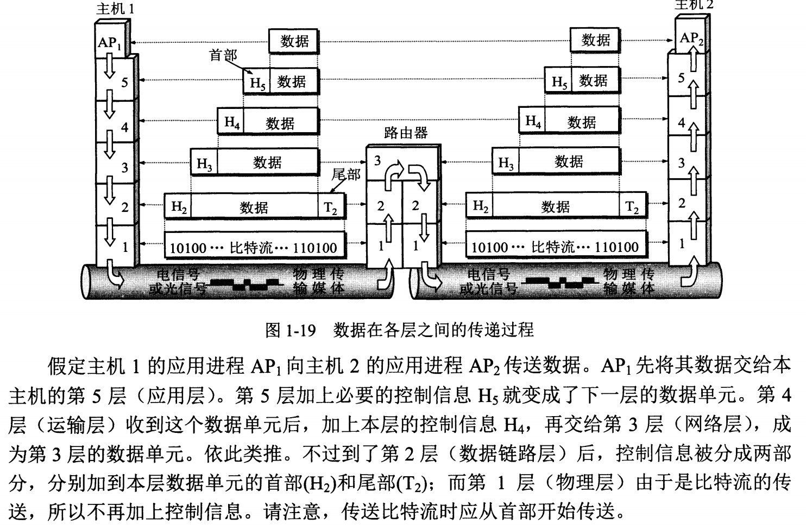

| 应用层 | 运输层 | 网络层 | 数据链路层 | 物理层 | 
| ----- | ----- | ----- | ----- | ----- |
| 报文 | 报文段/用户数据报 | IP数据报 | 帧 | 比特 |

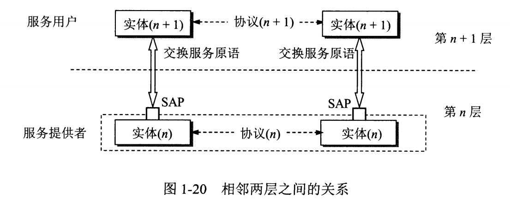
协议是水平的（控制对等实体之间的通信的规则），服务是垂直的（由下层向上层通过层间接口提供）   
在协议的控制下，两个对等实体间的通信使得本层能够向上一层提供服务。要实现本层协议，还需要使用下面一层所提供的服务。
- TCP/IP的体系结构  
  
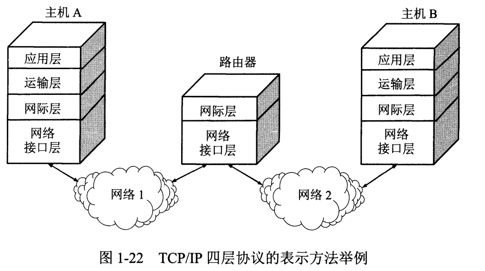  

**IP协议处于中心位置**  

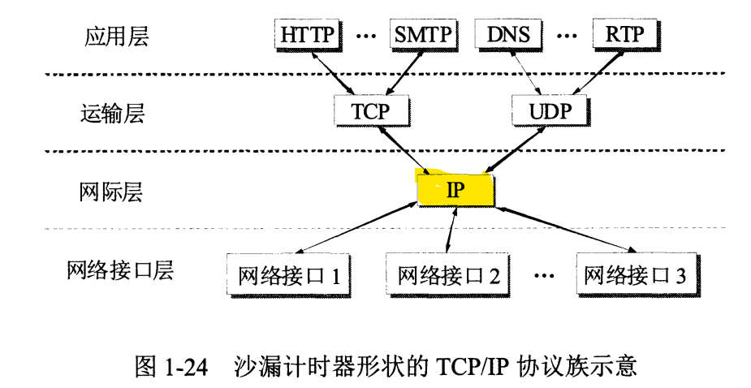  

# 第二章 物理层
1. 物理层的任务
2. 信道复用技术
3. 宽带接入技术（ADSL和FTTx）
- 通信方式：(单工通信[单向交互，广播]；半双工通信[一方发一方收]；双工通信[同时收发])
- 信道复用
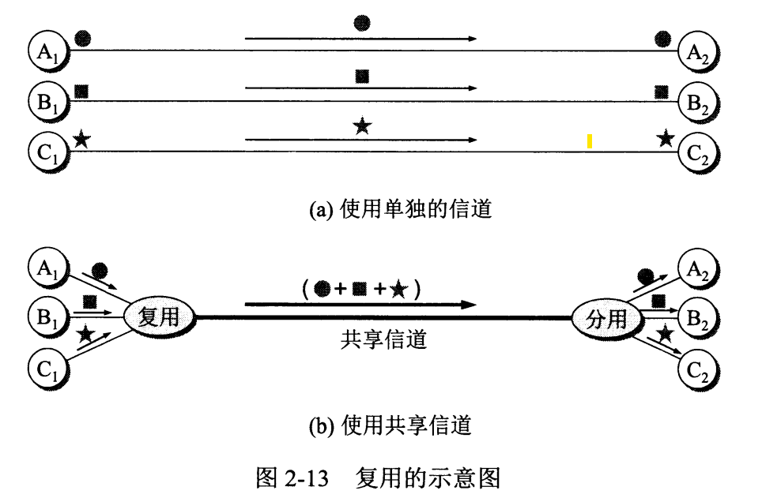  
频分复用，每个用户在通信过程中始终独占一定频带，所有用户在相同时间占用不同的带宽。
时分复用，每个用户在不同的时间占用所有同样的频带宽度，具有周期性。  
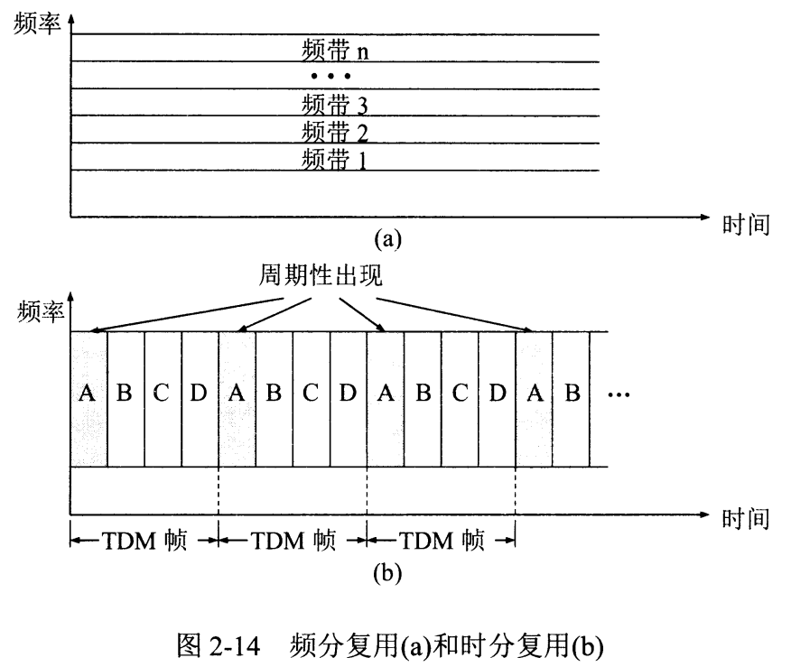
统计时分复用
波分复用即光的频分复用。
码分复用
宽带接入技术
有线宽带接入
    - ADSL非对称数字用户线——电话线为基础
    - HFC光纤同轴混合网——有线电视网为基础
    - FTTx光纤到户
无线宽带接入（）
# 第三章 数据链路层
数据链路层信道：（1）点对点信道（2）广播信道   

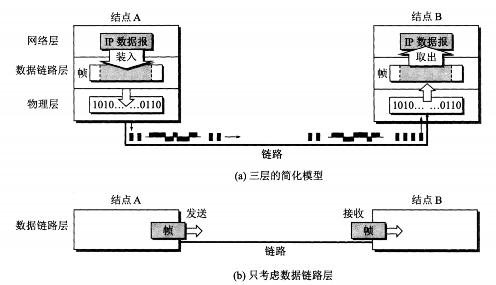  

**封装成帧，透明传输和差错检测(接收端)**

    1. 结点A的数据链路层把网络层的的IP数据报添加首部和尾部封装成帧 
    2. 结点A把封装好的帧发送给结点B的数据链路层
    3. 若结点B收到无差错的帧，则从收到的帧中提取出IP数据报交给上面的网络层；否则丢弃这个帧。

点对点协议PPP(point to point protocol)
广播信道传输（局域网）  
局域网分类：星型网；环形网；总线型；  
局域网的两个子层：逻辑链路控制（logical link control）和媒体接入控制（media access control）  
以太网（**基带总线局域网**）的特点：无连接的工作方式，尽最大努力的交付，差错重传由高层决定
以太网的协议（CSMA/CD）：具有冲突检测的**载波监听多点接入**CSMA/CD。发送前先监听，边发送边监听，一旦发现总线上出现了碰撞，就立即停止发送。然后按照退避算法等待一段时间后再继续发送。因此以太网上各站点平等的争用以太网信道。  
以太网物理上是星型网，逻辑上是总线型

# 第四章 网络层  

    互联网设计之初的两种设计思想:  
    虚电路模式
    简单灵活，无连接，尽最大努力的数据报服务
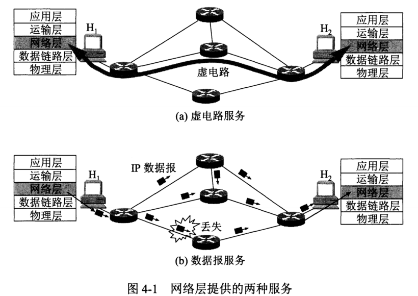
网络互相连接的中间设备：  
物理层 —— 转发器  
数据链路层 —— 网桥
网络层 —— 路由器
网络层以上 —— 网关  
IP地址就是给每一台主机（路由器）的每一个接口分配一个在全世界范围内是**唯一的32位的标识符**。  
包括A类，B类和C类（单播）以及D类（多播）
IP地址 == {网络号，主机号}；每8位分开  

路由器是多归属主机，因为一个路由器最少连接两个网络。不同的网络号必须经由路由器相连。   

IP地址是逻辑地址，物理地址是数据链路层的物理地址  

MAC（media access control address）地址，即**局域网地址**，**以太网地址**或**物理地址**，每个网卡有唯一的MAC地址 eg. 00-16-EA-AE-3C-40

网络层的IP数据报，在发送时添加首部尾部，按照MAC寻址，每次转发添加新的源地址和目标地址，在数据链路层看不见IP地址；反之网络层看到是已经剥离MAC地址的，因此看不到MAC地址    

在实际寻址过程中，利用地址解析协议（ARP）找到MAC地址  

路由表由（目标地址和下一跳地址组成）  

三级IP地址 = {网络号，子网号，主机号} 
分组先找到网络，然后由网络转发到各个子网，子网再找主机（路由表：目的网络地址，子网掩码，下一跳地址）
子网掩码，按照子网掩码与IP地址求与即得到网络号

分组转发示意  
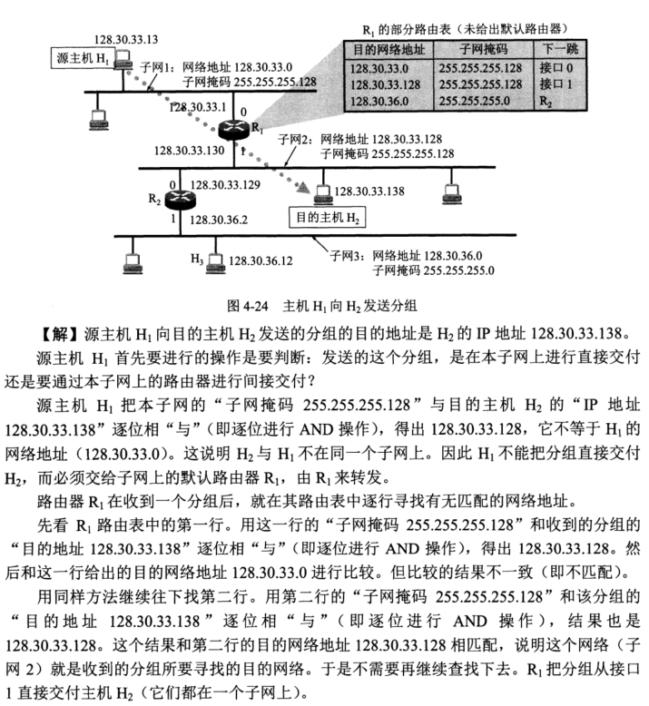
分组网间探测PING(packet interNet Groper)：测试两台主机的联通性

转发和路由选择的区别：  
“转发”是单个路由器的动作。“路由选择”是许多路由器共同协作的过程，这些路由器相互交换信息，目的是生成路由表，再由路由表导出转发表。

路由选择协议：内部网关协议（RIP,OSPF）和外部网关协议BGP-4  
