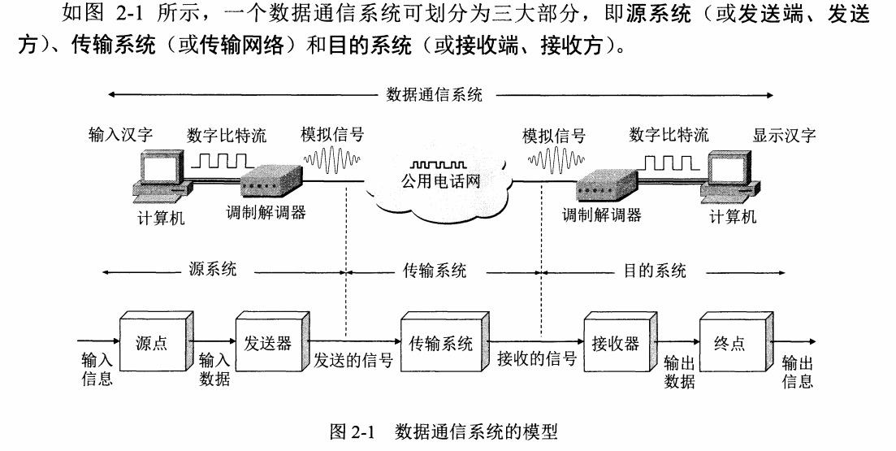
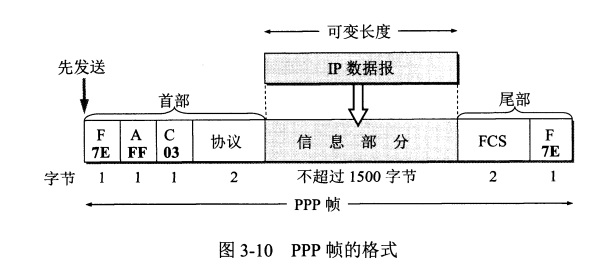
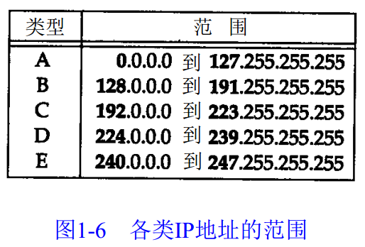
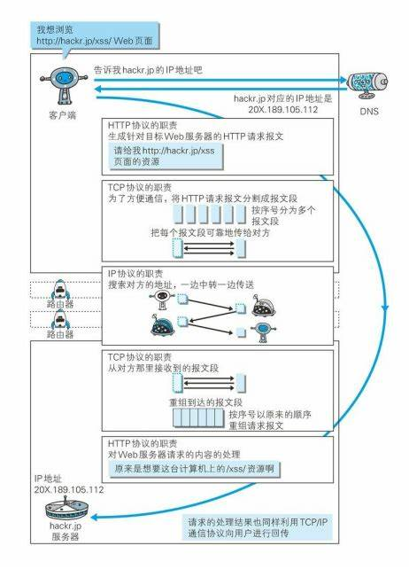
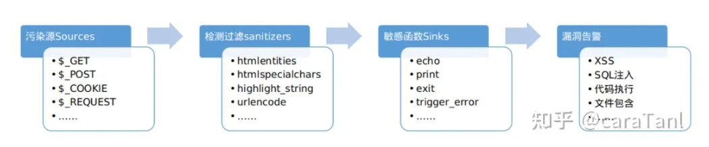

# 计算机网络
# 第一章
# 计算机网络简述
## 互联网和互连网
- 互联网指Internet，基于TCP/IP协议。范围大
- 互连网指几台计算机连接到一起，协议自定。范围小
- 主机之间通信是指主机A的进程和主机B上的另一个进程通信 通信方式：客户-服务器（C/S）和对等方式（P2P）
- 互联网核心：路由——>分组交换，**主要的区分是否一直占用信道（资源）**
电路交换：建立连接（占用通信资源）——通话（一直占用通信资源）——释放资源（归还通信资源）
报文交换：整个报文在节点间传输，全部存储下来再转发到下一结点
分组交换：储存转发技术。报文被分割成几部分（分组），携带目标地址信息，通过路由寻址，自动找到转发分组的最合适的路径，然后再组合起来。各个分组单独发送接收。  
电路交换面向连接，全程占用信道资源，分组交换无连接，仅在数据传输时占用信道资源   


- 不同类型的计算机网络
    1. 广域网WAN (wide area network)
    2. 城域网MAN (metropolitan area network)
    3. 局域网LAN (local area network)
    4. 个人局域网PAN (personal area network)
- 计算机网络性能衡量指标
    1. 速率——比特率（bit/s）
    2. 带宽，信号具有的频带宽度，表示某通道传送数据的能力
    3. 吞吐量
    4. 时延，指数据从一端传递到另一端的时间
        - 发送时延：数据帧长度/发送速率
        - 传播时延：信道长度/电磁波传播速率
        - 处理时延：差错检验等
        - 排队时延：经过路由器时
        - 总时延=发送时延+传播时延+处理时延+排队时延
    5. 传播时延带宽积 = 传播时延 x 带宽
    6. 往返时间RTT（round trip time）
    7. 利用率（利用率与时延成反比）
    8. 根据香农定理，信道的极限传播速率与信道带宽和信道信噪比有关
- 网络协议
三要素：（1）语法（2）语义（3）同步

    1. 应用层（最高层）—— **进程**(主机程序)交互 数据单元（报文） DNS，HTTP,FTP
    2. 表示层：
    3. 会话层：
    4. 运输层 —— 为进程通信提供通用的数据传输服务。  
    传输控制协议TCP 面向连接，可靠的数据传输服务  报文段  
    用户数据报协议UDP 提供无连接的、尽最大努力的数据传输服务  用户数据报
    5. 网络层（IP层）—— 为分组交换网上的不同主机（路由器）提供通信，无连接 ip数据报（分组） IP协议  路由
    6. 数据链路层 透明传递的是帧（frame） 检错/纠错，如果出错，丢弃或者TCP纠错
    7. 物理层 比特  
   
eg.发送电子邮件，电子邮件协议需要使用面向连接的TCP协议，但TCP 协议需要使用下面无连接的IP 协议，IP协议又使用数据链路层面向连接的PPP协议。  


| 应用层 | 运输层 | 网络层 | 数据链路层 | 物理层 | 
| ----- | ----- | ----- | ----- | ----- |
| 报文 | 报文段/用户数据报 | IP数据报 | 帧 | 比特 |


协议是水平的（控制对等实体之间的通信的规则），服务是垂直的（由下层向上层通过层间接口提供）   
在协议的控制下，两个对等实体间的通信使得本层能够向上一层提供服务。要实现本层协议，还需要使用下面一层所提供的服务。
- TCP/IP的体系结构  
  
  

**IP协议处于中心位置**  

  

# 第二章 物理层
1. 物理层的任务
2. 信道复用技术
3. 宽带接入技术（ADSL和FTTx）
- 通信方式：(单工通信[单向交互，广播]；半双工通信[一方发一方收]；双工通信[同时收发])
- 信道复用    

         
  1. 频分复用，每个用户在通信过程中始终独占一定频带，所有用户在相同时间占用不同的带宽。
  2. 时分复用，每个用户在不同的时间占用所有同样的频带宽度，具有周期性。  
    
  3. 统计时分复用
  4. 波分复用即光的频分复用。
  5. 码分复用
- 宽带接入技术
  1. 有线宽带接入
       - ADSL非对称数字用户线——电话线为基础
       - HFC光纤同轴混合网——有线电视网为基础
       - FTTx光纤到户
  2. 无线宽带接入（）
- 通信系统模型
  
- 物理层与传输媒体接口特性：
  1. 机械特性：接线器尺寸等
  2. 电气特性：各条线电压范围
  3. 功能特性：某条线某一电平电压的意义
  4. 过程特性：不同功能出现顺序
# 第三章 数据链路层（PPP,MAC）
数据链路层信道：（1）点对点信道（2）广播信道   

  

**封装成帧，透明传输和差错检测(接收端)**

 1. 结点A的数据链路层把**网络层的的IP数据报**添加首部和尾部封装成**帧** 
 2. 结点A把封装好的帧发送给结点B的数据链路层
 3. 若结点B收到无差错的帧，则从收到的帧中提取出IP数据报交给上面的网络层；否则丢弃这个帧。

### 点对点信道协议PPP(point to point protocol)
#### 定义
**计算机和ISP通信时所使用的数据链路层协议**
#### 组成
1. 一个将IP数据报封装到串行链路的方法，同步链路，异步链路。IP数据报就是PPP帧中的信息部分，长度受限于最大传送单元MTU的限制
2. 用来建立、配置和测试数据链路连接的链路控制协议LCP
3. 网络控制协议NCP，每一个协议支持一个网络层协议，如IP、AppleTalk等
#### ppp帧格式
PPP帧的首部有4个字段，尾部有2个字段。首部的第一个字段和尾部的第二个字段都是标志字段F（Flag），规定为0x7E。标志字段标志着一个帧的开始或结束。

### 广播信道传输（局域网）  
局域网分类：星型网；环形网；总线型；  
局域网的两个子层：**逻辑链路控制**（logical link control）和**媒体接入控制**（media access control）  
以太网（**基带总线局域网**）的特点：无连接的工作方式，尽最大努力的交付，差错重传由高层决定
#### 以太网广播信道的协议（CSMA/CD） 多点接入，载波监听，碰撞检测（半双工形式）
- 具有冲突检测的**载波监听多点接入**CSMA/CD。发送前先监听，边发送边监听，一旦发现总线上出现了碰撞，就立即停止发送。然后按照退避算法等待一段时间后再继续发送。因此以太网上各站点平等的争用以太网信道。  
- 以太网物理上是星型网，逻辑上是总线型
- 以太网发送数据采用曼彻斯特编码
- 10base-T双绞线以太网 Y代表非屏蔽双绞线，10Mbps基带传输
### 以太网的MAC层（硬件地址）
1. 48位
2. 计算机硬件地址
3. 出厂后固化在网卡中
### 中继器，集线器（hub），交换机（switch），路由器（router），网桥（bridge），网关（gateway）
| 物理层 | 数据链路层 | 网络层 | 
| ----- | ----- | ----- | 
| 中继器，集线器 | 网桥，交换机 | 路由器 |
| 连接多台设备 | 信息交换，交换机自动寻址 | 寻址，转发，路由表|
# 第四章 网络层  

    互联网设计之初的两种设计思想:  
    虚电路模式
    简单灵活，无连接，尽最大努力的数据报服务
  

网络互相连接的中间设备：  
物理层 —— 转发器  
数据链路层 —— 网桥
网络层 —— 路由器
网络层以上 —— 网关  
IP地址就是给每一台主机（路由器）的每一个接口分配一个在全世界范围内是**唯一的32位的标识符**。  
包括A类，B类和C类（单播）以及D类（多播）

IP地址 == {网络号，主机号}；每8位分开  

路由器是多归属主机，因为一个路由器最少连接两个网络。不同的网络号必须经由路由器相连。   

IP地址是逻辑地址，物理地址是数据链路层的物理地址  

MAC（media access control address）地址，即**局域网地址**，**以太网地址**或**物理地址**，每个网卡有唯一的MAC地址 eg. 00-16-EA-AE-3C-40

网络层的IP数据报，在发送时添加首部尾部，按照MAC寻址，每次转发添加新的源地址和目标地址，在数据链路层看不见IP地址；反之网络层看到是已经剥离MAC地址的，因此看不到MAC地址    

在实际寻址过程中，利用地址解析协议（ARP）找到MAC地址  

路由表由（目标地址和下一跳地址组成）  

三级IP地址 = {网络号，子网号，主机号} 
子网掩码：
分组先找到网络，然后由网络转发到各个子网，子网再找主机（路由表：目的网络地址，子网掩码，下一跳地址）
子网掩码，按照子网掩码与IP地址求与即得到网络号，为了更快查找路由信息

分组转发示意  

分组网间探测PING(packet interNet Groper)：测试两台主机的联通性(应用程序PING 发出的是 ICMP 请求报文 )

转发和路由选择的区别：  
“转发”是单个路由器的动作。“路由选择”是许多路由器共同协作的过程，这些路由器相互交换信息，目的是生成路由表，再由路由表导出转发表。

路由选择协议：内部网关协议（RIP,OSPF）和外部网关协议BGP-4  

#### ICMP协议(网际控制报文协议)
#### ARP协议（地址解析协议）
- 根据IP地址查询MAC地址
- 每个主机地址解析协议高速缓存
- 找不到mac地址，洪泛

# 第五章 运输层
为什么需要运输层？  
ip层将数据从一台主机转发到另一台主机，但通信的真正的端点并不是主机而是主机中的进程，通信是两个主机的应用进程相互通信。  

  
当运输层采用面向连接的TCP协议时，尽管下面的网络不可靠，当此时的逻辑信道相当于一条全双工的可靠信道。
端口（port）表示本计算机应用层中的各个进程和运输层交互时的层间接口。
计算机进程之间的通信不仅要知道ip地址（找计算机），还要知道端口号（找对方计算机的应用进程）
## UDP用户数据报协议
    无连接的，减少时延和开销  
    尽最大努力交付，  
    面向报文的，  
    没有拥塞控制，对实时应用很有用，视频会议等  
    支持一对一，一对多，多对多  
## 传输控制协议  
    面向连接的运输层协议  
    一对一建立连接  
    提供可靠交付（无差错，不丢失，不重复，按序到达）  
    全双工通信  
    面向字节流
端口拼接到IP地址构成套接字（socket）。如ip地址为192.3.4.5，端口号为80 套接字为192.3.4.5:80  
TCP连接 = {socket1, socket2} = {(ip1:port1),(ip2:port2)}  
### 可靠传输工作原理
1. 停止等待协议：每次发过去分组，需要确认是否收到，当收到后才发下一个，当超过一定时间则重新发送该分组（备份）。
2. 连续滑动窗口ARQ协议   


发送窗口内的5个分组连续发送出去，不需要对方确认，每收到一个确认，把发送窗口往前滑动一个位置。收到对第一个分组的确认，可以发送第6个了。
1. 滑动窗口，超时重传，选择确认，拥塞管理，连接建立。  
***运输连接管理：三次握手：***
建立连接，数据传输，释放连接。采用C/S形式。   
三次握手解决三个问题：
1. 使每一方知道对方的存在
2. 允许双方协商一些参数（最大窗口，时间窗选项等）
3. 对运输实体（缓存大小等）进行分配。  

  

叫三次握手的原因是握手需要在客户端和服务器之间交换三个TCP报文段。每次交换涉及：同步位，初始序号，和确认号  

刚开始客户端和服务器都是关闭的。B的服务器进程先创建传输控制块（TCB）。进入listen状态，得待客户端的请求，一旦接收到连接请求，立刻response。  

A的客户进程也首先创建TCB。向B发送连接请求报文段，首部的同步位为SYN = 1(不能携带数据，消耗一个序号)，初始序号为seq = x;此时，客户进程进入SYN-SENT（同步已发送）状态。  

B收到请求报文段后，同意建立连接，则向A发送确认信息。确认报文段中ACK和SYN位都为1,（不携带数据，消耗一个序号） 确认号是ack = x + 1; 同时为自己选择一个初始序号seq = y; TCP服务器端进入SYN-RCVD（同步收到）状态。  

TCP客户收到B的确认后，还要再向B确认。确认报文段的ACK = 1，确认号ack = y + 1，自己序号为sep = x + 1。（此时ACK可携带数据，不携带数据不消耗序列号）。连接建立。  

1. 为什么最后A还要发给B确认信息呢？  
防止已失效的连接请求发送到B，产生错误。因为A可能因为延误导致请求没到B，但并未丢失，于是会重新发送。如果没有最后一次确认，B收到失效的请求也会建立连接，大大浪费了B的资源。  
2. 为什么三次握手而不是两次或者四次？  
    主要有三个原因：

    - 防止已过期的连接请求报文突然又传送到服务器，因而产生错误和资源浪费。
    - 三次握手才能让双方均确认自己和对方的发送和接收能力都正常。
    - 告知对方自己的初始序号值，并确认收到对方的初始序号值。

    
3. 为什么三次握手而不是四次？ 
第一次握手：服务端确认“自己收、客户端发”报文功能正常。
第二次握手：客户端确认“自己发、自己收、服务端收、客户端发”报文功能正常，客户端认为连接已建立。
第三次握手：服务端确认“自己发、客户端收”报文功能正常，此时双方均建立连接，可以正常通信。
4. 三次握手第三次ack丢失怎么办？
    - 服务端：
    第三次的ACK在网络中丢失，那么服务端该TCP连接的状态为SYN_RECV,并且会根据 TCP的超时重传机制，会等待3秒、6秒、12秒后重新发送SYN+ACK包，以便客户端重新发送ACK包。
    如果重发指定次数之后，仍然未收到 客户端的ACK应答，那么一段时间后，服务端自动关闭这个连接。
    - 客户端：
    客户端认为这个连接已经建立，如果客户端向服务端发送数据，服务端将以RST包（Reset，标示复位，用于异常的关闭连接）响应。此时，客户端知道第三次握手失败。

***连接释放过程（四次挥手）***  


A提出关闭连接，B收到后，确认关闭，应答A。此时A——>B不能发送数据，B——>A还可以发送数据（连接半关闭）
当B没有要发送的数据给A时，应用进程释放连接，B发送释放报文，并等待A的确认。A收到B的报文后，立马确认。B收到A的确认后，立马关闭。
进入到TIME-WAIT状态，连接还没释放，等待2MSL之后，A关闭。 
- 第一次挥手：客户端向服务端发送连接释放报文（FIN=1，ACK=1），主动关闭连接，同时等待服务端的确认。
- 第二次挥手：服务端收到连接释放报文后，立即发出确认报文（ACK=1），序列号 seq = k，确认号 ack = u + 1。
- 第三次挥手：服务端向客户端发送连接释放报文（FIN=1，ACK=1），主动关闭连接，同时等待 A 的确认。
- 第四次挥手：客户端收到服务端的连接释放报文后，立即发出确认报文（ACK=1），序列号 seq = u + 1，确认号为 ack = w + 1。
- **TIME-WAIT** 客户端就进入了 TIME-WAIT 状态。注意此时客户端到 TCP 连接还没有释放，必须经过 2*MSL（最长报文段寿命）的时间后，才进入 CLOSED 状态。而服务端只要收到客户端发出的确认，就立即进入 CLOSED 状态。可以看到，服务端结束 TCP 连接的时间要比客户端早一些。

**为什么等待2MSL时间呢？**  

    确保A的最后一个报文段能到B  
    使本连接时间内的所有报文都消失，防止已失效的连接请求报文段出现在本连接。

## tcp如何保证可靠性？
TCP主要提供了检验和、序列号/确认应答、超时重传、滑动窗口、拥塞控制和 流量控制等方法实现了可靠性传输。

- 检验和：通过检验和的方式，接收端可以检测出来数据是否有差错和异常，假如有差错就会直接丢弃TCP段，重新发送。

- 序列号/确认应答：

序列号的作用不仅仅是应答的作用，有了序列号能够将接收到的数据根据序列号排序，并且去掉重复序列号的数据。

TCP传输的过程中，每次接收方收到数据后，都会对传输方进行确认应答。也就是发送ACK报文，这个ACK报文当中带有对应的确认序列号，告诉发送方，接收到了哪些数据，下一次的数据从哪里发。

- 滑动窗口：滑动窗口既提高了报文传输的效率，也避免了发送方发送过多的数据而导致接收方无法正常处理的异常。

- 超时重传：超时重传是指发送出去的数据包到接收到确认包之间的时间，如果超过了这个时间会被认为是丢包了，需要重传。最大超时时间是动态计算的。

- 拥塞控制：在数据传输过程中，可能由于网络状态的问题，造成网络拥堵，此时引入拥塞控制机制，在保证TCP可靠性的同时，提高性能。

- 流量控制：如果主机A 一直向主机B发送数据，不考虑主机B的接受能力，则可能导致主机B的接受缓冲区满了而无法再接受数据，从而会导致大量的数据丢包，引发重传机制。而在重传的过程中，若主机B的接收缓冲区情况仍未好转，则会将大量的时间浪费在重传数据上，降低传送数据的效率。所以引入流量控制机制，主机B通过告诉主机A自己接收缓冲区的大小，来使主机A控制发送的数据量。流量控制与TCP协议报头中的窗口大小有关。
1. 详解滑动窗口？
- 在进行数据传输时，如果传输的数据比较大，就需要拆分为多个数据包进行发送。TCP 协议需要对数据进行确认后，才可以发送下一个数据包。这样一来，就会在等待确认应答包环节浪费时间。
- 滑动窗口里面也分为两块，一块是已经发送但是未被确认的分组，另一块是窗口内等待发送的分组。随着已发送的分组不断被确认，窗口内等待发送的分组也会不断被发送。整个窗口就会往右移动，让还没轮到的分组进入窗口内。
2. 详解拥塞控制？
## http

- 常见状态码：   
200：服务器已成功处理了请求。 通常，这表示服务器提供了请求的网页。    
301 ： (永久移动) 请求的网页已永久移动到新位置。 服务器返回此响应(对 GET 或 HEAD 请求的响应)时，会自动将请求者转到新位置。   
302：(临时移动) 服务器目前从不同位置的网页响应请求，但请求者应继续使用原有位置来进行以后的请求。     
400 ：客户端请求有语法错误，不能被服务器所理解。   
403 ：服务器收到请求，但是拒绝提供服务。   
404 ：(未找到) 服务器找不到请求的网页。   
500： (服务器内部错误) 服务器遇到错误，无法完成请求。   
- http常用的请求方式？   
PUT：上传文件，向服务器添加数据，可以看作增   
DELETE：删除文件   
POST：传输数据，向服务器提交数据，对服务器数据进行更新。   
GET：获取资源，查询服务器资源   
- get和post的区别？   
   GET使用URL或Cookie传参，而POST将数据放在BODY中”，这个是因为HTTP协议用法的约定。  
   GET方式提交的数据有长度限制，则POST的数据则可以非常大”，这个是因为它们使用的操作系统和浏览器设置的不同引起的区别。  
POST比GET安全，因为数据在地址栏上不可见”，这个说法没毛病，但依然不是GET和POST本身的区别。  
实质区别：get请求是幂等性的。意味着对同一URL的多个请求应该返回同样的结果
- http和https区别?
http采用明文传输，安全性差    
端口：80  443   
安全性：无加密  加密
资源消耗：少  多
证书：    需要 不需要
- https的原理 HTTPS = HTTP + SSL(安全套接字) / TLS（运输安全）
对称加密（公钥加密）：接收双方的加密和解密使用同一个密钥  DES等    
非对称加密（私钥加密）：RSA公钥和私钥一对，公钥公开，拿到公钥的乙方用公钥加密，发送给甲方，甲方用私钥解密。  RSA算法
    
Https结合了对称加密和非对称加密。客户端在拿到服务器的公钥后，会生成一个随机码 (用 KEY 表示，这个 KEY 就是后续双方用于对称加密的密钥)，然后客户端使用公钥把 KEY 加密后再发送给服务器，服务器使用私钥将其解密，这样双方就有了同一个密钥 KEY，然后双方再使用 KEY 进行对称加密交互数据。在非对称加密传输 KEY 的过程中，即便第三方获取了公钥和加密后的 KEY，在没有私钥的情况下也无法破解 KEY (私钥存在服务器，泄露风险极小)，也就保证了接下来对称加密的数据安全

- 在浏览器输入www.baidu.com后的全过程？
1. 域名解析，将域名转化为ip地址
2. 发起tcp三次握手，建立连接。
3. 建立连接后发起http请求
4. 服务器相应http请求，客户端得到html代码
5. 浏览器解析，渲染，呈现给用户。
    

## cookie和session（跟踪浏览器用户身份的会话方式）       
**Cookie通过在客户端记录信息确定用户身份，Session通过在服务器端记录信息确定用户身份。**    
**Cookie机制是通过检查客户身上的“通行证”来确定客户身份的话，那么Session机制就是通过检查服务器上的“客户明细表”来确认客户身份。Session相当于程序在服务器上建立的一份客户档案，客户来访的时候只需要查询客户档案表就可以了**
HTTP协议是无状态的协议。一旦数据交换完毕，客户端与服务器端的连接就会关闭，再次交换数据需要建立新的连接。这就意味着服务器无法从连接上跟踪会话。

- 客户端第一次访问服务器时创建，服务器response给客户端的通行证，保存在客户端（内存或硬盘；再次访问时，先浏览器先查找cookies，如果存在，把该cookie附加到http请求服务器，告知服务器该客户端的身份和状态。
- 作用：   
1. 记住密码，下次自动登录。  
2. 购物车功能。   
3. 记录用户浏览数据，进行商品（广告）推荐。   
- 坏处： 
1. 容易篡改，不安全
2. Cookie存在HTTP请求中，增加流量
3. Cookie有大小限制

session发生在客户端和浏览器的一次会话中。
- 虽然Session保存在服务器，对客户端是透明的，它的正常运行仍然需要客户端浏览器的支持。这是因为Session需要使用Cookie作为识别标志。HTTP协议是无状态的，Session不能依据HTTP连接来判断是否为同一客户，因此服务器向客户端浏览器发送一个名为**JSESSIONID**的Cookie，它的值为该Session的id（也就是HttpSession.getId()的返回值）。Session依据该Cookie来识别是否为同一用户。
- 不支持cookie的浏览器用URL重写将session的id写到URL中
区别：
1. 存储位置：cookie在客户端存，session在服务器端存
2. 生命周期：cookie预先设置，可以存在内存，硬盘； session在浏览器启动到关闭的会话区间
3. 安全性： cookie不是很安全，解析本地cookie可以骗过服务器使用session
## sql注入
用户在输入的字符串中加入了sql语句   
1. 恶意拼接查询
2. 利用注释执行非法命令
3. 传入非法参数

避免sql注入：
1. 限制数据库权限，提供用户满足条件的最低权限
2. 对进入数据库的字符进行转义处理
3. 接口查询，不直接使用原生sql

# 网络安全
网络攻击类型：
- 被动攻击 ——》截获（流量分析）
- 主动攻击
  1. 篡改
  2. 恶意程序： 病毒，蠕虫，特洛伊木马，逻辑炸弹，后门入侵
  3. 拒绝服务：DOS，攻击服务器 DDOS分布式拒绝服务       
   
网络安全目标：
1. 保密性
2. 短点鉴别
3. 信息完整性
4. 运行安全性
   
密码技术：
对称秘钥加密：加密与解密秘钥用相同的密码体制 DES（仅对秘钥保密，算法公开，顺算法加密，逆算法解密）
公钥密码体制：RSA体制：加密公钥公开，算法公开，解密私钥保密
任何加密方法取决于秘钥长度及所需的计算量

数字签名：
数字签名（又称公钥数字签名）是只有信息的发送者才能产生的别人无法伪造的一段数字串，这段数字串同时也是对信息的发送者发送信息真实性的一个有效证明。它是一种类似写在纸上的普通的物理签名，但是在使用了公钥加密领域的技术来实现的，用于鉴别数字信息的方法。一套数字签名通常定义两种互补的运算，一个用于签名，另一个用于验证。数字签名是非对称密钥加密技术与数字摘要技术的应用。
功能：1. 报文鉴别；2.报文完整性；3. 不可否认
A用自己的私钥加密——》B用A的公钥解密
鉴别：识别通信对象及报文完整性
方法：MD5（报文摘要） SHA-1 密码散列函数
报文鉴别码MAC: A利用散列函数H(X)再用K加密形成X+Mac ——》B分离X+MAC，利用K解密，再用H(X)运算
实体鉴别：报文鉴别是每收到一个报文鉴别，实体鉴别在通信持续过程中验证一次

互联网安全协议：
- 网络层 
  1. IPsec
  2. IP安全数据报（运输方式，隧道方式）

- 运输层
  1. 安全套接字层 ssl  应用层和运输层之间 HTTPS 433端口
  2. 运输安全 TLS

# 重点面试题
##TCP/IP常见攻击方式
- **ip欺骗**，伪造某台主机的ip地址     
- **syn flooding** （拒绝服务攻击DOS,和分布式拒绝服务攻击DDOS）：利用三次握手（syn->syn/ack—>ack）伪造大量tcp连接请求,却不做出应答，导致服务器开销过大
- **udp flooding**（DOS）将大量的用户数据报协议（UDP）数据包发送到目标服务器，目的是压倒该设备的处理和响应能力。防火墙保护目标服务器也可能因 UDP泛滥而耗尽，从而导致对合法流量的拒绝服务。
- **模拟攻击**
- **tcp重置攻击** 在 TCP 重置攻击中，攻击者通过向通信的一方或双方发送伪造的消息，告诉它们立即断开连接，从而使通信双方连接中断
- **中间人攻击** 指攻击者与通讯的两端分别创建独立的联系，并交换其所收到的数据，使通讯的两端认为他们正在通过一个私密的连接与对方 直接对话，但事实上整个会话都被攻击者完全控制。 （引入摘要算法MD5和安全散列算法SHA，数字签名，对称DES和非对称加密RSA）客户端不要轻易相信证书：因为这些证书极有可能是中间人。
- DDOS 应对方式：高防服务器（），黑名单（错杀一千，也不放一百），DDOS清理（监控流量，清洗异常流量），
## 四段命名法
- 匈牙利命名法、
- 驼峰式命名法、第一个小写，其他大写
- 帕斯卡命名法（大驼峰）、每个单词第一个字母大写
- 下划线命名法、单词之间用下划线
## XXS漏洞检测
XXS全称**跨站脚本攻击**，自己的网站运行别人的代码。用户浏览网页时，嵌入到Script代码中执行，攻击用户（XSS的漏洞主要成因是后端接收参数时未经过滤，导致参数改变了HTML的结构）。常见漏洞界面，网站搜索界面，留言板等
XXS漏洞类型
- 反射型，alert定义时，url包含Script标签
- 存储型，url中没有script，攻击者将代码传递到服务器，存储到数据库
- DOM型，前端对代码进行节点化时发生的
#### 漏洞挖掘方式
1. 黑盒测试主要是通过发送特意构造攻击字符串来验证漏洞，比如 alert(1)。请求后看是否会弹框，若会则代表存在 XSS，反之则不存在。
在可输入的地方输入"xxx payload"，报括get，post，cookie，http头部，提交数据后看是否解析数据。

1. ​白盒测试是通过分析源代码来检测 XSS 漏洞，根据不同的编程语言采取不同的词法、语法分析方式，然后通过**污点分析**（追踪用户的输入数据是否达到特定的漏洞触发函数）的思路来检测漏洞。


#### 防御XXS
1. 输入检查，白名单限制法，黑名单限制法
2. 输出检查
3. Httponly Cookie
4. Content Security Policy内容安全策略，采用的是白名单机制，告诉浏览器可以加载和执行哪些外部资源，这样就能防止被一些第三方恶意脚本注入执行
## 网络爬虫材料分析（抓包）
#### 抓包定义
将网络传输发送与接收的数据包进行截获、重发、编辑、转存等操作，也用来检查网络安全。
#### 目的
原始数据->过滤->分析,这是数据处理的基本套路,抓包的目的就是为了获取到想要的原始数据，用原始数据做以下的事情：
1. 分析数据传输协议。
2. 定位网络协议的问题。
3. 从数据包中获取想要的信息。
4. 将截取到的数据包进行修改，伪造，重发。
#### 为什么抓包？
1. 从功能测试角度，通过抓包查看隐藏字段
2. 通过抓包工具了解协议内容，方便开展接口和性能测试
3. 需要通过抓包工具，检查数据加密
4. 理解系统bug
#### 常见的抓包工具
httpwatch，Fiddler，wireshark
## 网络延时

网络安全漏洞：
1. A1 注入漏洞   

##### 攻击方式
利用应用程序弱点，通过恶意字符将恶意代码写入数据库，获取敏感数据或进一步在服务器执行命令。
##### 漏洞原因
未审计的数据输入框
使用网址直接传递变量
未过滤的特殊字符
SQL 错误回显
##### 漏洞影响
获取敏感数据或进一步在服务器执行命令接管服务器
SQL 注入
其实注入有很多类型，常见的注入包括：SQL、OS 命令、ORM、LDAP和表达式语言或者 OGNL 注入，对于应用解释器来说这些概念都是相同的。对于最常见的SQL注入，后端开发人员经常会拼接 SQL 查询；在不经意间就引入了 SQL 注入漏洞。
##### 防护
SQL 注入防护
关闭 SQL 错误回显
前端输入字符白名单验证（长度、类型等）
对输入的特殊字符使用转义处理
SQL 操作使用 PreParedStatement
SQL 服务运行于专门的账号，并且使用最小权限
限制 SQL 服务的远程访问，只开放给特定开发人员
代码审计，最有效的检测应用程序的注入风险的方法之一
使用成熟的 waf

2. 失效的身份认证
##### 攻击方式
攻击者利用网站应用程序中的身份认证缺陷获取高权限并进行攻击应用服务
##### 漏洞原因
应用程序身份认证系统认证缺陷
漏洞影响
盗用账号与身份
常见设计缺陷
修改利用网络协议数据包获取使用者账号密码
网站设计不良，可直接绕过验证页面
使用者忘记注销，而让攻击者有可趁之机
弱密码
弱密码攻击
身份认证非常容易受到弱密码攻击，常用的弱密码攻击方式有
常用密码攻击 - 使用泄露的密码字典攻击
使用公司名称缩写、域名、电话号码
全数字、英文的简单密码
账号与密码相同的
不同网站、电脑、APP 使用了相同的密码
##### 漏洞防护
网站的登录页面就使用加密连接
网站应该具体良好的权限控制与管理
网站应该具备超时注销机制        
              
3. 敏感数据泄露
##### 攻击方式
常见的攻击方式主要是扫描应用程序获取到敏感数据
##### 漏洞原因
应用维护或者开发人员无意间上传敏感数据，如 github 文件泄露
敏感数据文件的权限设置错误，如网站目录下的数据库备份文件泄露
网络协议、算法本身的弱点，如 telent、ftp、md5 等
##### 漏洞影响
应用程序、网站被修改
个人资料、公司资料泄露，被用于售卖获利
##### 漏洞防护
对于 github 泄露，定期对仓库扫描
对于应用网站目录定期扫描
使用强壮的网络协议与算法

4. XML 外部实体漏洞
##### 攻击方式
当应用程序解析 XML文件时包含了对外部实体的引用，攻击者传递恶意包含 XML 代码的文件，读取指定的服务器资源。
##### 漏洞原因
XML 协议文档本身的设计特性，可以引入外部的资源；定义 XML 文件时使用的外部实体引入功能
##### 漏洞影响
读取服务器敏感资料，如、/etc/password
读取应用程序源码
##### 漏洞防护
关闭 DTD (Data Type Definition)
禁止外部实体引入

5. 无效的访问控制
##### 攻击方式
没有检查身份，直接导致攻击者绕过权限直接访问
漏洞原因
##### 漏洞影响
绕过路径，如未读取的参数做检查，导致路径绕过读取到敏感文件
权限提升，如未对权限做检查，导致攻击者变更权限
垂直越权，攻击者可以从普通的用户权限提升到管理员的权限访问应用程序
水平越权，攻击者可以从普通用户A的权限提升到普通用户B的权限访问应用程序
##### 漏洞防护
对参数的白名单过滤
对权限的控制管理重新设计与限制
限制下载文件的类型

6. 安全配置错误
  
##### 攻击方式
攻击者利用错误配置攻击，获取敏感数据或者提升权限
##### 漏洞原因
开发或者维护人员设置了错误的配置，如 python 开发中对于 Django 框架在生产环境启用了 Debug 模式
##### 漏洞影响
可让攻击者获取到敏感数据
可让攻击者提升权限，如未修改应用程序配置的默认密码，未删除应用程序安装程序目录文件等

7. 跨站脚本攻击
##### 攻击方式
攻击者使用恶意字符嵌入应用程序代码中并运行，盗取应用程序数据
常见攻击 payload
```
><script>alert(document.cookie)</script>='><script>alert(document.cookie)</script>"><script>alert(document.cookie)</script><script>alert(document.cookie)</script><script>alert (vulnerable)</script>%3Cscript%3Ealert('XSS')%3C/script%3E<script>alert('XSS')</script><div style="height:expression(alert('XSS'),1)"></div>（这个仅于IE7(含)之前有效）
```
##### 漏洞原因
应用程序未对应用输入做过滤与检查，导致用户数据被当作代码执行。
##### 漏洞影响
欺骗使用者点击嵌入了恶意网站的正常网站，获取使用得的敏感数据
盗取使用者 cookie，冒用使用者身份
##### 漏洞防护
验证输入/接收的字符，过滤或者替换非法字符
使用白名单机制

8. 日志记录和监控不足导致的风险         
   
##### 漏洞原因
对于日志记录的监控不足，造成攻击者攻击系统、应用、盗取数据等操作无法被发现和追查。
##### 漏洞影响
无法判断安全事件的发生
无法判断和修复漏洞
导致再次被入侵
##### 漏洞防护
启用日志监控、告警机制
启用异地监控，C/S架构的监制机制
尽可能的完整记录所有日志
